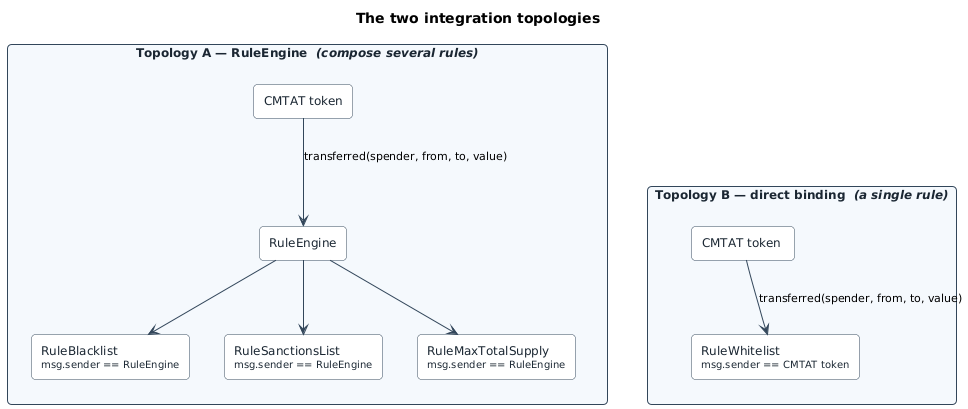
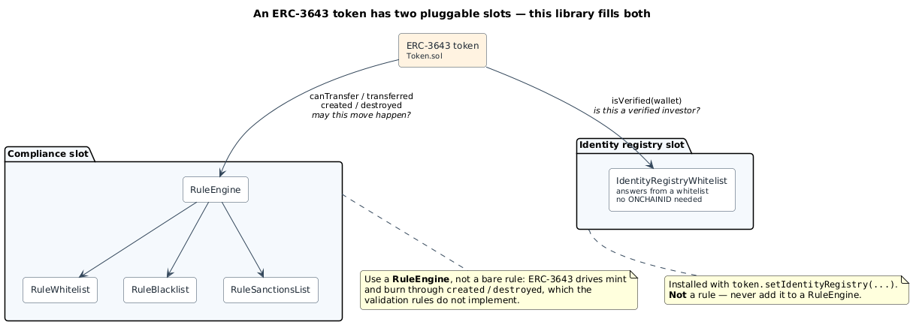
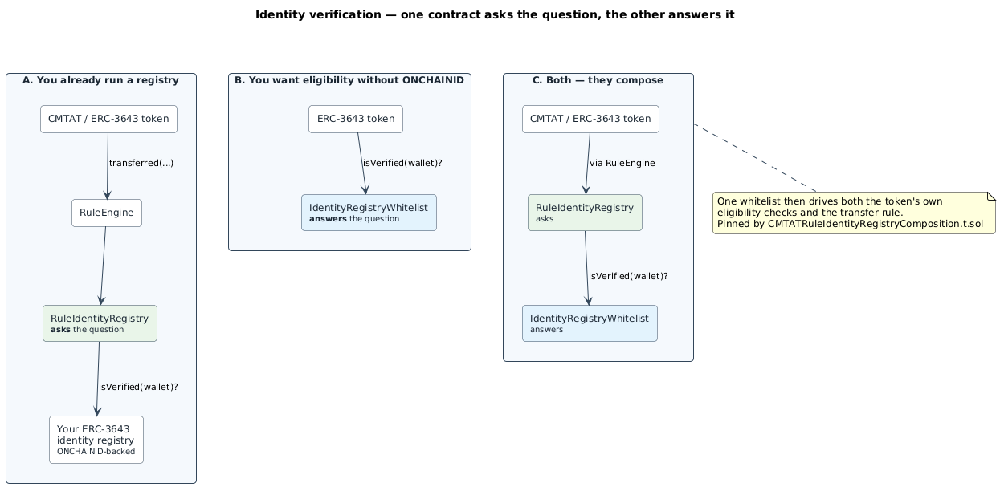

# RuleEngine - Rules

**Rules** is a collection of on-chain compliance and transfer-restriction rules for security tokens built on
the [CMTAT token standard](https://github.com/CMTA/CMTAT) and the [CMTA RuleEngine](https://github.com/CMTA/RuleEngine), including [ERC-3643](https://eips.ethereum.org/EIPS/eip-3643)-compatible tokens.

Each rule enforces one transfer restriction. A rule can be plugged **directly** into a token, or several can be composed behind a **RuleEngine**.

> This project has not undergone an audit and is provided as-is without any warranties.

## Compatibility

| Rules | Contracts report `version()` | CMTAT | RuleEngine | OpenZeppelin |
| --- | --- | --- | --- | --- |
| **v0.5.0** (current) | `"0.5.0"` | **≥ v3.0.0**, validated against `v3.3.0-rc3` | `v3.0.0-rc4` | `v5.6.1` |

One rule needs more than the baseline, because it reads the **spender** the token forwards on mint:

| Rule | Minimum CMTAT | Why |
| --- | --- | --- |
| `RuleMintAllowance` | **v3.3** | Debits the minter's quota from the 4-argument `transferred(spender, from, to, value)` / `canTransferFrom`. A token that does not forward the spender cannot drive it. |
| Every other rule | v3.0.0 | Uses the 3-argument path only. |

The submodules in `lib/` are pinned to the validated versions (CMTAT `v3.3.0-rc3`, RuleEngine `v3.0.0-rc4`), so
a `git submodule update --init --recursive` checkout builds and tests against exactly what this release was verified with.

📖 **[Full documentation →](./doc/README.md)** — the complete reference: every rule in detail, the API, access-control model, restriction codes, deployment guide, and security findings. This page is a summary.

## What a rule does

A rule answers two questions about a proposed token movement.

| Path | Functions | Behaviour |
| --- | --- | --- |
| **Read** | `detectTransferRestriction`, `canTransfer` (and their `…From` variants) | Views returning an ERC-1404 restriction code (`0` = OK). They **must not revert**. |
| **Write** | `transferred`, `created`, `destroyed` | Called by the token *after* it decides to move value. A rule **reverts** to block, and may update state. |

## Architecture

Two integration topologies, and the choice determines what `msg.sender` is inside a rule:



_Diagram source: [`doc/schema/architecture-topologies.puml`](./doc/schema/architecture-topologies.puml)._

Behind a RuleEngine the engine returns the **first non-zero** restriction code, so rule order decides which
code a rejection reports. In direct mode the rule is installed with `token.setRuleEngine(rule)`.

**Operation rules** keep state keyed on the caller, so the two are not interchangeable for them: `RuleConditionalTransferLightMultiToken` is direct-binding only, and `RuleMintAllowance` requires the engine path. Validation rules work under either.

### Layout

| Path | Contents |
| --- | --- |
| `src/rules/validation/` | Read-only rules: no state change during a transfer |
| `src/rules/operation/` | Read-write rules: mutate state on transfer |
| `src/registry/` | Fills a token's **identity registry** slot, not its compliance slot (`IdentityRegistryWhitelist`). Not rules |
| `src/modules/` | Reusable modules (access control, meta-tx, versioning) |
| `script/` | Deployment scripts |
| `test/` | Foundry tests, one folder per rule |

Each rule splits into a `*Base` contract holding the logic and a deployable variant supplying the
access-control policy, in either an `AccessControl` or an `Ownable2Step` flavour.

## The rules

| Rule | Enforces | Codes |
| --- | --- | --- |
| `RuleWhitelist` | Transfers only between whitelisted addresses | 21–25 |
| `RuleReceiverWhitelist` | Receiver only, reproducing ERC-3643 eligibility | 81 |
| `RuleSpenderWhitelist` | `transferFrom` only when the spender is whitelisted | 66 |
| `RuleWhitelistWrapper` | Aggregates several whitelists with OR logic | 21–23 |
| `RuleBlacklist` | Blocks blacklisted participants | 36–38 |
| `RuleSanctionsList` | Blocks sanctioned addresses via a Chainalysis oracle | 30–32 |
| `RuleERC2980` | ERC-2980 whitelist plus frozenlist | 60–65 |
| `RuleIdentityRegistry` | Consults an ERC-3643 identity registry | 55–57 |
| `RuleMaxTotalSupply` | Caps total supply on mint | 50, 51 |
| `RuleChainlinkPoR` | Caps minting at Chainlink Proof of Reserve reserves | 75–79 |
| `RuleConditionalTransferLight` | Requires operator approval per transfer | 46 |
| `RuleMintAllowance` | Per-minter mint quota | 70 |

Codes must stay unique across rules, since a RuleEngine returns the first non-zero one.
Per-rule detail is in [`doc/technical/`](./doc/technical/); the semantics that differ between rules (who is screened, mint/burn handling, unset-oracle behaviour) are tabulated in [`RULE_SEMANTICS.md`](./doc/technical/RULE_SEMANTICS.md).

## ERC-3643

An [ERC-3643](https://eips.ethereum.org/EIPS/eip-3643) token has **two** pluggable slots, and this library fills both, from opposite directions.

| Slot | Filled with | Direction |
| --- | --- | --- |
| **Compliance** (`ICompliance`) | A `RuleEngine` holding rules | The token asks the rules whether a transfer may proceed |
| **Identity registry** (`IIdentityRegistry`) | `IdentityRegistryWhitelist` | The token asks it whether a wallet is a verified investor |



_Diagram source: [`doc/schema/erc3643-slots.puml`](./doc/schema/erc3643-slots.puml)._

### Compliance: go through a RuleEngine

Use `RuleEngine`, not a bare rule. ERC-3643 drives mint and burn through `created` and `destroyed`, which the **validation rules do not implement** — they only expose `canTransfer` / `transferred`. 

`RuleEngine` implements the full `ICompliance` surface and forwards to the rules, so it is the supported path. 

The operation rules do implement `created` / `destroyed`, but they are bound to a single token and are not a compliance contract on
their own.

### Identity verification

ERC-3643 decides who may hold a token by asking an **identity registry** one question:
`isVerified(wallet)` — is this a verified investor? A normal registry answers it by checking the wallet's
on-chain identity contract (ONCHAINID) for the required claims.

This library provides **both sides of that exchange**:

| Contract | What it is | Where it plugs in |
| --- | --- | --- |
| `RuleIdentityRegistry` | The side that **asks the question**: a transfer rule that calls `isVerified` on whatever registry the token uses, and blocks the transfer when the answer is no. | Added to a RuleEngine, like any other rule |
| `IdentityRegistryWhitelist` | The side that **answers it**: a registry implementation that replies from a whitelist instead of reading ONCHAINIDs, so no identity contracts need deploying. | `token.setIdentityRegistry(...)`. It is **not** a rule, implements no `IRule`, and must never be added to a RuleEngine |



_Diagram source: [`doc/schema/erc3643-identity-directions.puml`](./doc/schema/erc3643-identity-directions.puml)._

**Which one you need is decided by the token, not by preference.**

- **On an ERC-3643 token**, plug `IdentityRegistryWhitelist` straight into the identity slot with
  `setIdentityRegistry`. The token screens every transfer itself. Do **not** also add `RuleIdentityRegistry`
  behind a RuleEngine: the token already consults the registry, so the rule would screen the same wallets a
  second time for no added restriction.
- **On a CMTAT token there is no identity slot at all** — `setIdentityRegistry` is an ERC-3643 concept, and
  CMTAT has no equivalent. So `RuleIdentityRegistry` behind a RuleEngine is not one option among several, it
  is the only way to apply identity-registry screening. It consults whichever registry you point it at:
  your own ONCHAINID-backed one, or `IdentityRegistryWhitelist` if you have none.

That second case is why the two contracts compose at all, and it is pinned by
`test/IdentityRegistryWhitelist/CMTATRuleIdentityRegistryComposition.t.sol`. They are wired by interface
rather than inheritance: the rule holds an `IIdentityRegistryVerified` and only ever calls `isVerified`.

### Matching the spec's semantics

`RuleReceiverWhitelist` reproduces ERC-3643 eligibility exactly: **only the receiver** is screened. The spec
checks the receiver alone on purpose, so a de-listed holder can still exit a position; screening the sender
would trap them. `RuleIdentityRegistry` follows the same default, with sender and spender checks available as
explicit opt-ins.

Every rule and the registry implement `IERC3643Version`, so `version()` is queryable on-chain.

### Tested against a real ERC-3643 token

`test/ERC3643Real/` runs against the actual ERC-3643 `Token.sol` and `IdentityRegistry.sol`, not mocks: the
RuleEngine integration, the identity rule against a real registry, and receiver-whitelist parity with the
spec's eligibility. 31 tests, run with `FOUNDRY_PROFILE=erc3643 forge test`.

## Quick start

```bash
forge build                          # compile
forge test                           # run the suite
FOUNDRY_PROFILE=erc3643 forge test   # the real-ERC-3643-token suite
```

Both commands are required: the vendored ERC-3643 `Token.sol` pins solc `0.8.30` exactly and cannot share a
compilation unit with our `0.8.34`, so `test/ERC3643Real/**` builds under its own profile.

Deploying a token with rules attached:

```bash
forge script script/DeployCMTATWithBlacklist.s.sol:DeployCMTATWithBlacklist --rpc-url <RPC> --broadcast
```

Four scripts cover the common combinations. See
[`DEPLOYMENT_SCRIPTS.md`](./doc/technical/DEPLOYMENT_SCRIPTS.md) for configuration and limitations.

## Documentation

| Topic | Document |
| --- | --- |
| Full reference | [`doc/README.md`](./doc/README.md) |
| Per-rule detail | [`doc/technical/`](./doc/technical/) |
| Cross-rule semantics | [`RULE_SEMANTICS.md`](./doc/technical/RULE_SEMANTICS.md) |
| Deployment scripts | [`DEPLOYMENT_SCRIPTS.md`](./doc/technical/DEPLOYMENT_SCRIPTS.md) |
| Invariant tests | [`INVARIANT_TESTS.md`](./doc/technical/INVARIANT_TESTS.md) |
| Audits and static analysis | [`doc/security/audits/`](./doc/security/audits/) |
| Release history | [`CHANGELOG.md`](./CHANGELOG.md) |

## Security

No formal third-party audit has been carried out. The code has had automated static analysis and
AI-assisted review, each triaged by the project team:

| Type | Tool | Latest run |
| --- | --- | --- |
| Static analysis | [Slither](https://github.com/crytic/slither) 0.11.5 | v0.5.0 |
| Static analysis | [Aderyn](https://github.com/Cyfrin/aderyn) 0.6.5 | v0.5.0 |
| AI-assisted review | Claude Code (Anthropic) | v0.5.0 |
| AI-assisted review | Claude + custom security-audit skills | v0.4.0 |
| AI-assisted review | [Wake Arena](https://getwake.io) (Ackee Blockchain Security) | v0.2.0 |

Scope is the production contracts under `src/`; mocks, tests and vendored dependencies are excluded. 

Every finding carries a written triage, including the ones dismissed as false positives or by-design. Nothing was outstanding as of `v0.5.0`.

Reports, triage and the threat model live in [`doc/security/audits/`](./doc/security/audits/), indexed by [`AUDIT_OVERVIEW.md`](./doc/security/audits/AUDIT_OVERVIEW.md).

## Development

Parts of this project were written with the help of AI coding assistants, principally **Claude Code**
(Anthropic) and **Codex** (OpenAI).

## Intellectual property

The code is copyright (c) Capital Market and Technology Association, 2022-2026, and is released under [Mozilla Public License 2.0](https://github.com/CMTA/CMTAT/blob/master/LICENSE.md).
