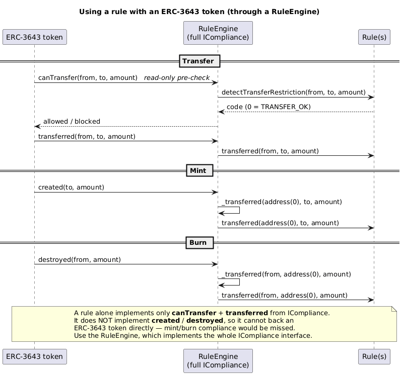
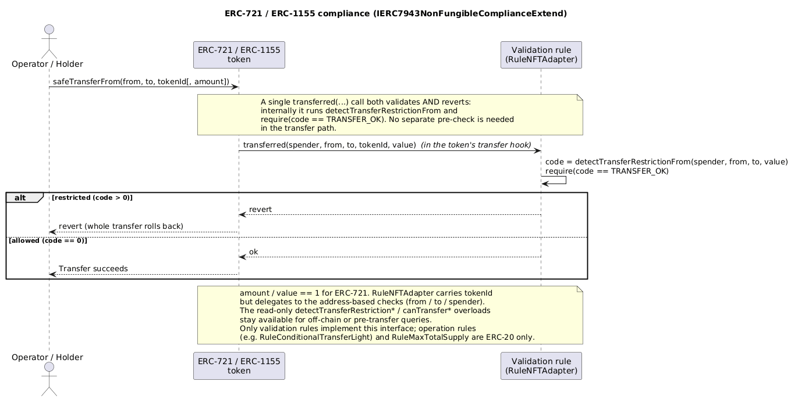
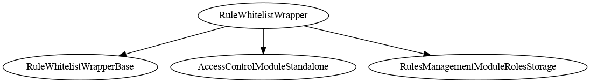
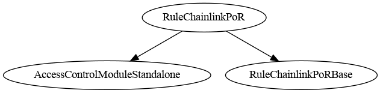
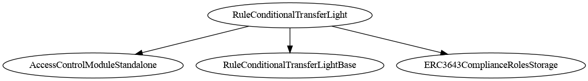

# RuleEngine - Rules

**Rules** is a collection of on-chain compliance and transfer-restriction rules designed for use with the [CMTA RuleEngine](https://github.com/CMTA/RuleEngine) and the [CMTAT token standard](https://github.com/CMTA/CMTAT).

Each rule can be used **standalone**, directly plugged into a CMTAT token, **or** managed collectively via a RuleEngine.

The **RuleEngine** is an external smart contract that applies transfer restrictions to security tokens such as **CMTAT** or [ERC-3643](https://eips.ethereum.org/EIPS/eip-3643)-compatible tokens through a RuleEngine.
Rules are modular validator contracts that the `RuleEngine` or `CMTAT` compatible token can call on every transfer to ensure regulatory and business-logic compliance.

**Current package version:** `v0.5.0` (contracts report `version()` → `"0.5.0"`). Built against CMTAT `v3.3.0-rc1` and RuleEngine `v3.0.0-rc4`; see [Compatibility](#compatibility) for the supported range.

> This project has not undergone an audit and is provided as-is without any warranties.

## Table of Contents

- [Schema](#schema)
- [Overview](#overview)
- [Compatibility](#compatibility)
- [Specifications](#specifications)
- [Architecture](#architecture)
- [Types of Rules](#types-of-rules)
- [Quick Start](#quick-start)
- [Deployment Guide](#deployment-guide)
- [Rules details](#rules-details)
- [Access Control](#access-control)
- [Toolchains and Usage](#toolchains-and-usage)
- [API](#api)
- [Security](#security)
- [Intellectual property](#intellectual-property)

## Schema

- Using rules with CMTAT and ERC-3643 tokens through a [RuleEngine](https://github.com/CMTA/RuleEngine)


- Using a rule directly with CMTAT and ERC-3643 tokens


## Overview

### Key Concepts

- **Rules are controllers** that validate or modify token transfers.
- They can be applied:
  - Directly on **CMTAT** (no RuleEngine required), **or**
  - Through the [**RuleEngine**](https://github.com/CMTA/RuleEngine) (for multi-rule orchestration).
- Rules enforce conditions such as:
  - Whitelisting / blacklisting
  - Sanctions checks
  - Multi-party operator-managed lists
  - Conditional approvals
  - Arbitrary compliance logic

### Integration modes

A rule can be consumed in three ways. All three call the same rule contract; they differ only in who calls it and how much of the compliance interface is required.

| Mode | Caller | What the rule must implement | When to use |
| --- | --- | --- | --- |
| **Direct CMTAT rule** | A CMTAT token calls the rule directly (no RuleEngine) | `IRuleEngine` (`canTransfer` + `transferred`, including the spender-aware overload) | A single rule is enough; no multi-rule orchestration needed |
| **RuleEngine-managed rule** | A `RuleEngine` aggregates one or more rules and calls each on every transfer | `IRule` (`IRuleEngine` + `canReturnTransferRestrictionCode`) | Several rules must be combined, ordered, or share restriction codes |
| **ERC-3643 through RuleEngine** | An ERC-3643 token drives `created` / `destroyed` / transfer hooks on a RuleEngine, which forwards them to the rules | Rules as above; the **RuleEngine** implements the full ERC-3643 `ICompliance` | The token is ERC-3643 and needs full `ICompliance` — a standalone rule cannot back an ERC-3643 token directly |

Interface details for each mode are documented under [Architecture](#architecture); full signatures live in the [API](#api) reference.

## Compatibility

| Component        | Compatible Versions                                        |
| ---------------- | ---------------------------------------------------------- |
| **Rules v0.5.0** | CMTAT ≥ v3.0.0 (tested against v3.3.0-rc1)<br />RuleEngine v3.0.0-rc4 |

Spender-aware paths (e.g. `RuleMintAllowance`) rely on the 4-argument `canTransferFrom` / `transferred(spender, from, to, value)` callbacks, which require a CMTAT / RuleEngine that forwards the spender to the rule; this repository is validated against CMTAT `v3.3.0-rc1`. The other rules only use the 3-argument path and work across the full CMTAT ≥ v3.0.0 range.

Each Rule implements the interface `IRuleEngine` defined in CMTAT.

This interface declares the ERC-3643 functions `transferred` (read-write) and `canTransfer` (read-only) with several other functions related to [ERC-1404](https://github.com/ethereum/eips/issues/1404), [ERC-7551](https://ethereum-magicians.org/t/erc-7551-crypto-security-token-smart-contract-interface-ewpg-reworked/25477) and [ERC-3643](https://eips.ethereum.org/EIPS/eip-3643).

## Specifications

### ERC-3643

Each rule implements the following functions from the ERC-3643 `ICompliance` interface

```solidity
function canTransfer(address _from, address _to, uint256 _amount) external view returns (bool);
function transferred(address _from, address _to, uint256 _amount) external;
```

However, contrary to the RuleEngine, the whole interface is currently not implemented (e.g. `created` and `destroyed`) and as a result, the rule cannot directly support ERC-3643 token.

The alternative to use a Rule with an ERC-3643 token is through the RuleEngine, which implements the whole `ICompliance` interface.

The diagram below shows the recommended integration: the ERC-3643 token drives transfer, mint (`created`) and burn (`destroyed`) compliance hooks on the RuleEngine, which forwards them to the rules. A rule used on its own only implements `canTransfer` + `transferred`, so it cannot back an ERC-3643 token directly.



_Diagram source: doc/img/readme-erc3643-integration.puml._

### ERC-721/ERC-1155

To improve compatibility with [ERC-721](https://eips.ethereum.org/EIPS/eip-721) and [ERC-1155](https://eips.ethereum.org/EIPS/eip-1155), most validation rules implement the interface `IERC7943NonFungibleComplianceExtend` which includes compliance functions with the `tokenId` argument. 

- Operation rules (such as `RuleConditionalTransferLight`) are ERC-20 only and do not expose the ERC-721/1155 interfaces. 
- The two supply-cap validation rules, `RuleMaxTotalSupply` and `RuleChainlinkPoR`, are ERC-20 only as well and do not expose the ERC-721/1155 interfaces. This is deliberate: they cap a fungible supply, so a `tokenId` dimension would be meaningless for them. Both also require the protected token to expose an aggregate `totalSupply()`, which plain ERC-721 does not (only `ERC721Enumerable` does) and which is not per-id for ERC-1155.

The full per-rule overload matrix is in [`doc/technical/RULE_SEMANTICS.md`](./doc/technical/RULE_SEMANTICS.md#3-overload-surface-erc-7943-tokenid--itransfercontext).

While no rules currently apply restriction on the token id, the validation interfaces can be used to implement flexible restriction on ERC-721 or ERC-1155 tokens.

```solidity
// IERC7943NonFungibleCompliance interface
// Read-only functions
function canTransfer(address from, address to, uint256 tokenId, uint256 amount) external view returns (bool allowed)

// IERC7943NonFungibleComplianceExtend interface
// Read-only functions
function detectTransferRestriction(address from, address to, uint256 tokenId, uint256 amount) external view returns (uint8 code);
function detectTransferRestrictionFrom(address spender, address from, address to, uint256 tokenId, uint256 value) external view returns (uint8 code);
function canTransferFrom(address spender, address from, address to, uint256 tokenId, uint256 value) external returns (bool allowed);

// State modifying functions (write)
function transferred(address from, address to, uint256 tokenId, uint256 value) external;
function transferred(address spender, address from, address to, uint256 tokenId, uint256 value) external;
```

The diagram below shows a non-fungible transfer flowing through the `tokenId`-aware compliance signatures. 

For validation rules a single `transferred(...)` call both validates and reverts — it internally runs `detectTransferRestrictionFrom` and requires `TRANSFER_OK` — so no separate pre-check is required in the transfer path; the read-only `detectTransferRestriction*` / `canTransfer*` overloads remain available for off-chain queries. 

The `RuleNFTAdapter` carries the `tokenId` argument but currently delegates to the address-based checks (`from` / `to` / `spender`), so no rule restricts on the token id yet.



_Diagram source: doc/img/readme-erc721-erc1155-compliance.puml._


## Architecture

### Naming Conventions

- `*Base` contracts contain core logic without an access-control policy.
- `*InvariantStorage` contracts group constants, custom errors, and events.
- `*Common` contracts provide shared helper logic across variants (legacy naming retained for compatibility).

### Zero address in batch operations

Every address-list rule (`RuleWhitelist`, `RuleReceiverWhitelist`, `RuleBlacklist`, `RuleSpenderWhitelist`, `RuleERC2980`) offers single and batch write functions. The two differ in exactly one way, and it is worth stating precisely because it is easy to assume otherwise:

| Input | Single (`addAddress`) | Batch (`addAddresses`) |
| --- | --- | --- |
| New address | added | added |
| Already listed | **reverts** | skipped, counted |
| Not listed, on removal | **reverts** | skipped, counted |
| `address(0)` | **reverts** | **reverts — the whole batch** |

So "batch operations are non-reverting" holds for duplicates and missing entries only. `address(0)` is rejected on **every** add path.

That is deliberate, not an oversight. The batch convention skips duplicates because a duplicate is an idempotent no-op that the emitted event still describes truthfully. Silently dropping `address(0)` would not be truthful: `AddAddresses` echoes the input array, so the event would name the zero address as a set member when it is not one, re-polluting the exact off-chain view the guard exists to keep clean. The zero address is the ERC-20 mint/burn sentinel, never a participant — mint and burn permission is governed by the `allowMint` / `allowBurn` flags, never by list membership.

**Operationally:** an operator submitting a batch that happens to contain a zero entry — a truncated CSV column, an unset field in a spreadsheet export — loses the entire batch to a revert rather than having 999 of 1000 addresses applied. Filter the input before submitting.

### Directory Layout

- `src/modules/`: reusable modules shared across rules (`AccessControlModuleStandalone`, `MetaTxModuleStandalone`, `VersionModule`).
- `src/rules/interfaces/`: shared interfaces (`IAddressList`, `IIdentityRegistry`, `ISanctionsList`, `ITransferContext`, `AggregatorV3Interface`, `IDecimals`).
- `src/rules/validation/abstract/`: shared base contracts and invariant storage.
- `src/rules/validation/abstract/base/`: base contracts with core rule logic (no access control).
- `src/rules/validation/abstract/core/`: shared adapters/validation helpers.
- `src/rules/validation/abstract/invariant/`: invariant storage contracts (constants, errors, events).
- `src/rules/validation/deployment/`: deployable validation rules (concrete contracts).
- `src/rules/operation/`: read-write (operation) rules that modify state on transfer.
- `src/registry/`: contracts that plug into a token's **identity registry** slot rather than its compliance slot (`IdentityRegistryWhitelist`).
- `test/`: Foundry tests, one folder per rule.
- `script/`: deployment scripts.

### Rule - Code list

> It is very important that each rule uses a unique code

Here is the list of codes used by the different rules

| Contract                     | Constant name                        | Value |
| ---------------------------- | ------------------------------------ | ----- |
| All                          | TRANSFER_OK (from CMTAT)             | 0     |
| RuleWhitelist                | CODE_ADDRESS_FROM_NOT_WHITELISTED    | 21    |
|                              | CODE_ADDRESS_TO_NOT_WHITELISTED      | 22    |
|                              | CODE_ADDRESS_SPENDER_NOT_WHITELISTED | 23    |
|                              | CODE_MINT_NOT_ALLOWED                | 24    |
|                              | CODE_BURN_NOT_ALLOWED                | 25    |
|                              | Reserved slot                        | 26-29 |
| RuleSanctionsList            | CODE_ADDRESS_FROM_IS_SANCTIONED      | 30    |
|                              | CODE_ADDRESS_TO_IS_SANCTIONED        | 31    |
|                              | CODE_ADDRESS_SPENDER_IS_SANCTIONED   | 32    |
|                              | Reserved slot                        | 33-35 |
| RuleBlacklist                | CODE_ADDRESS_FROM_IS_BLACKLISTED     | 36    |
|                              | CODE_ADDRESS_TO_IS_BLACKLISTED       | 37    |
|                              | CODE_ADDRESS_SPENDER_IS_BLACKLISTED  | 38    |
|                              | Reserved slot                        | 39-45 |
| RuleConditionalTransferLight | CODE_TRANSFER_REQUEST_NOT_APPROVED   | 46    |
|                              | Reserved slot                        | 47-49 |
| RuleMaxTotalSupply           | CODE_MAX_TOTAL_SUPPLY_EXCEEDED       | 50    |
|                              | CODE_SUPPLY_ORACLE_UNAVAILABLE       | 51    |
|                              | Reserved slot                        | 52-54 |
| RuleIdentityRegistry         | CODE_ADDRESS_FROM_NOT_VERIFIED       | 55    |
|                              | CODE_ADDRESS_TO_NOT_VERIFIED         | 56    |
|                              | CODE_ADDRESS_SPENDER_NOT_VERIFIED    | 57    |
|                              | Reserved slot                        | 58-59 |
| RuleERC2980                  | CODE_ADDRESS_FROM_IS_FROZEN          | 60    |
|                              | CODE_ADDRESS_TO_IS_FROZEN            | 61    |
|                              | CODE_ADDRESS_SPENDER_IS_FROZEN       | 62    |
|                              | CODE_ADDRESS_TO_NOT_WHITELISTED      | 63    |
|                              | CODE_MINT_NOT_ALLOWED                | 64    |
|                              | CODE_BURN_NOT_ALLOWED                | 65    |
| RuleSpenderWhitelist         | CODE_ADDRESS_SPENDER_NOT_WHITELISTED | 66    |
|                              | Reserved slot                        | 67-69 |
| RuleMintAllowance            | CODE_MINTER_ALLOWANCE_EXCEEDED       | 70    |
|                              | Reserved slot                        | 71-74 |
| RuleChainlinkPoR             | CODE_RESERVES_EXCEEDED               | 75    |
|                              | CODE_RESERVES_FEED_STALE             | 76    |
|                              | CODE_RESERVES_ANSWER_INVALID         | 77    |
|                              | CODE_TOTAL_SUPPLY_UNAVAILABLE        | 78    |
|                              | CODE_RESERVES_FEED_UNAVAILABLE       | 79    |
|                              | Reserved slot                        | 80    |
| RuleReceiverWhitelist        | CODE_ADDRESS_RECEIVER_NOT_WHITELISTED | 81   |
|                              | Reserved slot                        | 82-84 |

Note: 

- The CMTAT already uses the code 0-6 and the code 7-12 should be left free to allow further additions in the CMTAT.
- If you decide to create your own rules, we encourage you to use code > 100 to leave free the other restriction codes for future rules added in this project.
- Reserved slots are intentionally left unused for future rule expansion (maximum of 3 per rule).
- New rule code blocks should start at codes ending in `1` or `6` (e.g., `21`, `26`), leaving the remaining codes in the previous block for that prior rule’s reserved slots.
- Current allocations are legacy; new rules should follow the start-at-1-or-6 policy without changing existing codes.

### Rules as Standalone Compliance Contracts

Every rule implements the minimal interface expected by **CMTAT**, notably:

```solidity
function transferred(address from, address to, uint256 value)
function transferred(address spender, address from, address to, uint256 value)
```

This makes rules directly pluggable into CMTAT without any intermediary RuleEngine.

### Transfer Context Helper

Rules also expose an optional unified entrypoint using `MultiTokenTransferContext` / `FungibleTransferContext` (see `ITransferContext`) to pass a single struct instead of multiple arguments. 

This is a helper API inspired by [TokenF](https://github.com/dl-tokenf/contracts) and does not replace the standard ERC-3643 / RuleEngine interfaces. 

Validation rules generally expose both the non-fungible and fungible variants. `RuleConditionalTransferLight` and `RuleConditionalTransferLightMultiToken` expose only the fungible variant, and `RuleMaxTotalSupply`, `RuleChainlinkPoR` and `RuleMintAllowance` expose neither — see the per-rule matrix in [`doc/technical/RULE_SEMANTICS.md`](./doc/technical/RULE_SEMANTICS.md#3-overload-surface-erc-7943-tokenid--itransfercontext).

Two struct variants are available:

```solidity
// For ERC-721 / ERC-1155 (includes tokenId)
struct MultiTokenTransferContext {
    bytes4 selector;   // function selector of the original call
    address sender;    // operator/spender (address(0) for direct transfers)
    address from;      // token sender
    address to;        // token recipient
    uint256 value;     // amount transferred
    uint256 tokenId;   // token id (non-fungible)
    bytes data; // Optional token-provided metadata for rules
}

// For ERC-20 (no tokenId)
struct FungibleTransferContext {
    bytes4 selector;   // function selector of the original call
    address sender;    // operator/spender (address(0) for direct transfers)
    address from;      // token sender
    address to;        // token recipient
    uint256 value;     // amount transferred
    bytes data; // Optional token-provided metadata for rules
}
```

Both structs are passed to `transferred(MultiTokenTransferContext calldata ctx)` or `transferred(FungibleTransferContext calldata ctx)`. If `ctx.sender` is non-zero, the spender-aware path is used internally; otherwise the standard two-party path is used. The `data` field is reserved for optional token-provided metadata that rules can interpret.

### Using Rules via RuleEngine

When used through the RuleEngine, a rule must also implement:

```solidity
interface IRule is IRuleEngine {
    function canReturnTransferRestrictionCode(uint8 restrictionCode)
        external
        view
        returns (bool);
}
```

The RuleEngine can then:

- Aggregate multiple rules
- Execute them sequentially on each transfer
- Return restriction codes
- Mutate rule state (operation rules)

The same rule can also be plugged **directly** into a CMTAT token (see [Rules as Standalone Compliance Contracts](#rules-as-standalone-compliance-contracts) above): the direct-CMTAT path only requires `IRuleEngine`, while the RuleEngine-managed path additionally requires `IRule`. Full signatures for both interfaces are documented in the [API](#api) reference (`IRuleEngine`, `IERC1404Extend`, `IERC7551Compliance`, `IERC3643IComplianceContract`).

## Types of Rules

There are two categories of rules: validation rules (read-only) and operation rules (read-write).

Separately, `src/registry/` holds [`IdentityRegistryWhitelist`](./doc/technical/IdentityRegistryWhitelist.md) — **not a rule**. It plugs into an ERC-3643 token's *identity registry* slot (`token.setIdentityRegistry(...)`) and answers `isVerified` from a whitelist, so no ONCHAINID deployment is needed. It implements no `IRule` surface and must not be added to a `RuleEngine`. Note the direction: `RuleIdentityRegistry` *consults* an identity registry, whereas `IdentityRegistryWhitelist` *is* one.

### Which rule should I use?

| Need | Rule |
| --- | --- |
| Only approved holders can send/receive | `RuleWhitelist` |
| Only approved holders can **receive** (ERC-3643 semantics; a de-listed holder can still exit) | `RuleReceiverWhitelist` |
| Combine several whitelists (OR logic) | `RuleWhitelistWrapper` |
| Restrict `transferFrom` operators (spenders) | `RuleSpenderWhitelist` |
| Block known bad addresses | `RuleBlacklist` |
| Block sanctioned addresses (Chainalysis oracle) | `RuleSanctionsList` |
| Cap total token supply | `RuleMaxTotalSupply` |
| Cap total supply at the reserves reported by a Chainlink Proof of Reserve feed | `RuleChainlinkPoR` |
| Require identity-registry verification (ERC-3643) | `RuleIdentityRegistry` |
| ERC-2980 Swiss compliance (whitelist + frozenlist) | `RuleERC2980` |
| Require operator approval per transfer | `RuleConditionalTransferLight` |
| Per-transfer approval across several **directly-bound** tokens (not behind a RuleEngine) | `RuleConditionalTransferLightMultiToken` |
| Limit mint quota per minter | `RuleMintAllowance` |

Each rule is also available in `Ownable2Step` and `AccessControl` variants; see [Choosing a Rule Variant](#choosing-a-rule-variant). Stateful rules have binding constraints — see the [Binding model](#binding-model) table.

### How rules differ (semantics comparison)

Rules do **not** all treat the spender, mint/burn, or an unset oracle the same way. The full side-by-side table — who each rule screens (`from` / `to` / spender on `transferFrom` / mint / burn), how it behaves when its oracle/registry is unset, whether it is stateful, and which pre-flight view is authoritative — is in **[RULE_SEMANTICS.md](./doc/technical/RULE_SEMANTICS.md)**. The differences most likely to surprise an integrator:

- **Spender on mint.** `RuleWhitelist` / `RuleWhitelistWrapper` / `RuleSpenderWhitelist` **exempt** the minter; `RuleBlacklist` / `RuleSanctionsList` **screen** it (deny-list, by design); `RuleIdentityRegistry` also screens it, so the minter must itself be identity-verified; `RuleMintAllowance` **debits the minter's quota**.
- **Unset oracle/registry.** `RuleSanctionsList` (oracle unset) and `RuleIdentityRegistry` (registry unset) **fail open** — all transfers pass. An empty `RuleWhitelistWrapper` **fails closed**. `RuleChainlinkPoR` cannot be left unset, and a broken or stale feed **fails closed for mints only** — transfers and burns still pass.
- **Authoritative pre-flight view.** For `RuleMintAllowance`, `canTransfer` is not authoritative — use `canTransferFrom`. For `RuleConditionalTransferLightMultiToken`, `detectTransferRestriction` is `msg.sender`-dependent. Both are detailed below.

### Views that are not authoritative

Two rules answer the standard ERC-1404 / ERC-3643 read views with something other than the real answer. In both cases the reason is structural — the 3-argument signature cannot carry the information the rule needs — and in both cases a correct alternative exists. **The important part is that the misleading answer is not confined to the rule: it propagates through the `RuleEngine` to the token's own public views**, which is the API an integrator actually calls.

| Rule | Not authoritative | Why | Use instead |
| --- | --- | --- | --- |
| `RuleMintAllowance` | `canTransfer` / `detectTransferRestriction` — hardcoded to allowed | The 3-arg signature carries no minter identity, and the quota is keyed on the minter | `canTransferFrom(minter, address(0), to, value)` or `detectTransferRestrictionFrom(...)` |
| `RuleConditionalTransferLightMultiToken` | `canTransfer` / `detectTransferRestriction` — caller-dependent | The token key is derived from `msg.sender`, so any off-chain `eth_call` reads "not approved" even for an approved transfer | `canTransferForToken(token, from, to, value)` or `detectTransferRestrictionForToken(...)` |

**Propagation.** `RuleEngineBase._detectTransferRestriction` aggregates by calling each rule's **3-argument** view and returning the first non-zero code, and CMTAT's `ValidationModuleERC1404` forwards the token's ERC-1404 views to the engine. So a `RuleMintAllowance` that returns `0` makes `ruleEngine.canTransfer(...)` **and** `cmtat.canTransfer(...)` report every mint as allowed, regardless of quota. The 4-argument chain (`detectTransferRestrictionFrom`) is unaffected at every level and carries the real answer.

Neither is a defect to be fixed by returning a restriction code instead: ERC-1404 has no "cannot answer" value, so any non-zero code reads as *blocked*, and the token would then report every mint as forbidden — including the ones that will succeed. See [`doc/technical/RuleMintAllowance.md`](./doc/technical/RuleMintAllowance.md#eligibility-views-which-one-is-authoritative) and [`doc/technical/RuleConditionalTransferLightMultiToken.md`](./doc/technical/RuleConditionalTransferLightMultiToken.md).

### Validation Rules (Read-Only)

Validation rules only read blockchain state — they never modify it during a transfer. They implement `transferred()` as a `view` function: it re-runs the same restriction check and reverts if the transfer would be blocked, but writes nothing to storage.

All validation rules implement `IRuleEngine` to be usable both standalone (plugged directly into CMTAT) and via the RuleEngine.

Available validation rules: `RuleWhitelist`, `RuleReceiverWhitelist`, `RuleWhitelistWrapper`, `RuleSpenderWhitelist`, `RuleBlacklist`, `RuleSanctionsList`, `RuleMaxTotalSupply`, `RuleChainlinkPoR`, `RuleIdentityRegistry`, `RuleERC2980`.

 A community made project, [RuleSelf](https://github.com/rya-sge/ruleself), which uses [Self](https://self.xyz), a zero-knowledge identity is also available but is not developed or maintained by CMTA.

### Operation Rules (Read-Write)

Operation rules modify blockchain state during transfer execution. Their `transferred()` function is state-mutating: it consumes or updates stored data as part of the transfer flow.

Available operation rules: `RuleConditionalTransferLight`, `RuleConditionalTransferLightMultiToken`, `RuleMintAllowance`.

A full-featured variant, `RuleConditionalTransfer`, is maintained as a separate experimental repository at [CMTA/RuleConditionalTransfer](https://github.com/CMTA/RuleConditionalTransfer).

## Quick Start

```bash
# 1. Clone the repository
git clone <repo-url>
cd Rules

# 2. Install Foundry (if not already installed)
# https://book.getfoundry.sh/getting-started/installation

# 3. Install submodule dependencies
forge install

# 4. Compile
forge build

# 5. Run tests
forge test
```

## Deployment Guide

> ⚠️ **Before production deployment:** this project has [not undergone an audit](#ruleengine---rules). Review the unaudited status, configure roles with least privilege (grant only the roles each operator needs, and prefer the `Ownable2Step` variants for single-owner setups), and run an end-to-end transfer test on the target token setup.

1. Deploy the rule contract(s) with the desired admin and optional module addresses.
2. Configure the rule state and roles, including whitelist/blacklist entries and oracle or registry addresses.
3. Add rules to the RuleEngine, or set the rule directly on the CMTAT token.
4. Verify the transfer flow end-to-end with a small test transfer before enabling production flows.

Deployment scripts:
- `script/DeployCMTATWithWhitelist.s.sol`
- `script/DeployCMTATWithBlacklist.s.sol`
- `script/DeployCMTATWithBlacklistAndSanctionsList.s.sol` — CMTAT + RuleEngine with blacklist and sanctions rules

### Choosing a Rule Variant

Several rules are available in multiple access-control variants. Use the simplest one that fits your needs:

- `AccessControl` variants: use when you need multi-operator roles or delegated administration.
- `Ownable2Step` variants: use when you want a safer two-step ownership transfer.

### Validation Rules (Read-Only)

- Cannot modify blockchain state during transfers.
- Used for simple eligibility checks.
- Examples:
  - Whitelist
  - Whitelist Wrapper
  - Spender Whitelist
  - Blacklist
  - Sanction list (Chainalysis)
  - ERC-2980 (whitelist + frozenlist)

### Operation Rules (Read-Write)

- Can update state during transfer calls.
- Example:
  - Conditional Transfer (approval-based)

## Rules details

### Summary tab

| Rule                                                         | Type <br />[read-only / read-write] | ERC-721 / ERC-1155 | ERC-3643 via RuleEngine / CMTAT path <sup>*</sup> | Security Audit planned in the roadmap | Description                                                  |
| ------------------------------------------------------------ | ------------------------------------ | ------------------ | -------- | ------------------------------------- | ------------------------------------------------------------ |
| RuleWhitelist                                                | Read-only                          | <strong><span style="color: #1e7e34;">&#x2714;</span></strong> | <strong><span style="color: #1e7e34;">&#x2714;</span></strong> | <strong><span style="color: #1e7e34;">&#x2714;</span></strong> | This rule can be used to restrict transfers from/to only addresses inside a whitelist. |
| RuleWhitelistWrapper                                         | Read-Only                           | <strong><span style="color: #1e7e34;">&#x2714;</span></strong> | <strong><span style="color: #1e7e34;">&#x2714;</span></strong> | <strong><span style="color: #1e7e34;">&#x2714;</span></strong> | This rule can be used to restrict transfers from/to only addresses inside a group of whitelist rules managed by different operators. |
| RuleBlacklist                                                | Read-Only                           | <strong><span style="color: #1e7e34;">&#x2714;</span></strong> | <strong><span style="color: #1e7e34;">&#x2714;</span></strong> | <strong><span style="color: #1e7e34;">&#x2714;</span></strong> | This rule can be used to forbid transfer from/to addresses in the blacklist |
| RuleSanctionsList                                            | Read-Only                           | <strong><span style="color: #1e7e34;">&#x2714;</span></strong> | <strong><span style="color: #1e7e34;">&#x2714;</span></strong> | <strong><span style="color: #1e7e34;">&#x2714;</span></strong> | The purpose of this contract is to use the oracle contract from [Chainalysis](https://go.chainalysis.com/chainalysis-oracle-docs.html) to forbid transfer from/to an address included in a sanctions designation (US, EU, or UN). |
| RuleMaxTotalSupply                                           | Read-Only                          | <strong><span style="color: #b00020;">&#x2718;</span></strong> | <strong><span style="color: #1e7e34;">&#x2714;</span></strong> | <strong><span style="color: #1e7e34;">&#x2714;</span></strong> | This rule limits minting so that the total supply never exceeds a configured maximum. |
| RuleChainlinkPoR                                             | Read-Only                          | <strong><span style="color: #b00020;">&#x2718;</span></strong> | <strong><span style="color: #1e7e34;">&#x2714;</span></strong> | <strong><span style="color: #1e7e34;">&#x2714;</span></strong> | This rule limits minting so that the total supply never exceeds the reserves reported by a [Chainlink Proof of Reserve](https://docs.chain.link/data-feeds/proof-of-reserve) data feed. |
| RuleIdentityRegistry                                         | Read-Only                          | <strong><span style="color: #1e7e34;">&#x2714;</span></strong> | <strong><span style="color: #1e7e34;">&#x2714;</span></strong> | <strong><span style="color: #1e7e34;">&#x2714;</span></strong> | This rule checks the ERC-3643 Identity Registry for transfer participants when configured. |
| RuleSpenderWhitelist                                         | Read-Only                          | <strong><span style="color: #1e7e34;">&#x2714;</span></strong> | <strong><span style="color: #1e7e34;">&#x2714;</span></strong> | <strong><span style="color: #1e7e34;">&#x2714;</span></strong> | This rule blocks `transferFrom` when the spender is not in the whitelist. Direct transfers are always allowed. |
| RuleReceiverWhitelist                                        | Read-Only                          | <strong><span style="color: #1e7e34;">&#x2714;</span></strong> | <strong><span style="color: #1e7e34;">&#x2714;</span></strong> | <strong><span style="color: #1e7e34;">&#x2714;</span></strong> | This rule screens **only the receiver**, reproducing ERC-3643's eligibility rule (`transferFrom` works the same way; `mint` checks the receiver; `burn` is exempt). The sender and spender are never checked, so a de-listed holder can still exit. |
| RuleERC2980                                                  | Read-Only                          | <strong><span style="color: #1e7e34;">&#x2714;</span></strong> | <strong><span style="color: #1e7e34;">&#x2714;</span></strong> | <strong><span style="color: #1e7e34;">&#x2714;</span></strong> | ERC-2980 Swiss Compliant rule combining a whitelist (recipient-only) and a frozenlist (blocks sender, recipient, and spender for `transferFrom`). Frozenlist takes priority over whitelist. |
| RuleConditionalTransferLight                                | Read-Write                          | <strong><span style="color: #b00020;">&#x2718;</span></strong> | <strong><span style="color: #1e7e34;">&#x2714;</span></strong> | <strong><span style="color: #1e7e34;">&#x2714;</span></strong> | This rule requires that transfers have to be approved by an operator before being executed. Each approval is consumed once and the same transfer can be approved multiple times. |
| RuleConditionalTransferLightMultiToken                      | Read-Write                          | <strong><span style="color: #b00020;">&#x2718;</span></strong> | <strong><span style="color: #1e7e34;">&#x2714;</span></strong> | <strong><span style="color: #1e7e34;">&#x2714;</span></strong> | Multi-token variant of ConditionalTransferLight. Approvals are token-scoped with key `(token, from, to, value)` so one token cannot consume another token's approvals. |
| RuleMintAllowance                                           | Read-Write                          | <strong><span style="color: #b00020;">&#x2718;</span></strong> | <strong><span style="color: #b8860b;">Partial <sup>&#x2020;</sup></span></strong> | <strong><span style="color: #1e7e34;">&#x2714;</span></strong> | Enforces a per-minter mint quota managed by an operator; each mint reduces the minter's allowance. Regular transfers and burns are not restricted. |
| [RuleConditionalTransfer](https://github.com/CMTA/RuleConditionalTransfer) (external) | Read-Write | <strong><span style="color: #b00020;">&#x2718;</span></strong> | <strong><span style="color: #1e7e34;">&#x2714;</span></strong> | <strong><span style="color: #b00020;">&#x2718;</span></strong><br /> (experimental rule) | Full-featured approval-based transfer rule implementing Swiss law *Vinkulierung*. Supports automatic approval after three months, automatic transfer execution, and a conditional whitelist for address pairs that bypass approval. Maintained in a separate repository. |
| [RuleSelf](https://github.com/rya-sge/ruleself) (community) | — | <strong><span style="color: #b00020;">&#x2718;</span></strong> | — | <strong><span style="color: #b00020;">&#x2718;</span></strong><br /> (community project) | Use [Self](https://self.xyz), a zero-knowledge identity  solution to determine which is allowed to interact with the token.<br />Community-maintained rule project. Not developed or maintained by CMTA. |

All rules implement the CMTAT rule interfaces needed by their supported transfer paths. Some operation rules require the spender-aware callback, as documented in their rule-specific notes.

<sup>*</sup> A checkmark in this column means the rule enforces compliance for ERC-3643 tokens **through a RuleEngine or the CMTAT transfer path** — it does **not** mean the rule is itself a full ERC-3643 `ICompliance` contract. A standalone rule implements only `canTransfer` + `transferred`, so it cannot back an ERC-3643 token directly; use it through a RuleEngine, which implements the full `ICompliance` interface (see [Integration modes](#integration-modes)).

<sup>&#x2020;</sup> `RuleMintAllowance` is **Partial**: it does not advertise the full ERC-3643 `ICompliance` interface via ERC-165 because its per-minter mint quota requires the spender-aware mint callback to identify the minter, which the 3-argument ERC-3643 mint callback cannot provide.

### Technical documentation

Detailed technical documentation for each rule is available in [`doc/technical/`](doc/technical/):

| Rule | Document |
| ---- | -------- |
| RuleWhitelist | [RuleWhitelist.md](./doc/technical/RuleWhitelist.md) |
| RuleWhitelistWrapper | [RuleWhitelistWrapper.md](./doc/technical/RuleWhitelistWrapper.md) |
| RuleBlacklist | [RuleBlacklist.md](./doc/technical/RuleBlacklist.md) |
| RuleSanctionsList | [RuleSanctionsList.md](./doc/technical/RuleSanctionsList.md) |
| RuleMaxTotalSupply | [RuleMaxTotalSupply.md](./doc/technical/RuleMaxTotalSupply.md) |
| RuleChainlinkPoR | [RuleChainlinkPoR.md](./doc/technical/RuleChainlinkPoR.md) |
| IdentityRegistryWhitelist | [IdentityRegistryWhitelist.md](./doc/technical/IdentityRegistryWhitelist.md) |
| RuleIdentityRegistry | [RuleIdentityRegistry.md](./doc/technical/RuleIdentityRegistry.md) |
| RuleSpenderWhitelist | [RuleSpenderWhitelist.md](./doc/technical/RuleSpenderWhitelist.md) |
| RuleReceiverWhitelist | [RuleReceiverWhitelist.md](./doc/technical/RuleReceiverWhitelist.md) |
| RuleERC2980 | [RuleERC2980.md](./doc/technical/RuleERC2980.md) |
| RuleConditionalTransferLight | [RuleConditionalTransferLight.md](./doc/technical/RuleConditionalTransferLight.md) |
| RuleConditionalTransferLightMultiToken | [RuleConditionalTransferLightMultiToken.md](./doc/technical/RuleConditionalTransferLightMultiToken.md) |
| RuleMintAllowance | [RuleMintAllowance.md](./doc/technical/RuleMintAllowance.md) |

### Operational Notes

#### Binding model

Stateful (operation) rules restrict which caller may consume their state via `transferred()`, so the target must be explicitly bound with `bindToken`. The binding model differs per rule:

| Rule | Binding model | Notes |
| --- | --- | --- |
| `RuleConditionalTransferLight` | Single token **+ optional RuleEngine** | Two independent bindings: `bindToken(token)` sets the ERC-20 this rule acts on, `bindRuleEngine(engine)` authorises the engine to call `transferred`. `transferred` accepts either. Behind a RuleEngine, bind **both** — then `approveAndTransferIfAllowed` works too. Rebind only after `unbindToken` / `unbindRuleEngine`. See [Binding: token vs RuleEngine](./doc/technical/RuleConditionalTransferLight.md#binding-token-vs-ruleengine) |
| `RuleConditionalTransferLightMultiToken` | **Multiple direct tokens only** | Approvals keyed by `(token, from, to, value)` but *consumed* under `msg.sender`. ⚠️ **Do not add this rule to a `RuleEngine`** — bind each token directly (`CMTAT.setRuleEngine(rule)`). Behind an engine the rule either reverts or silently loses all per-token isolation; see [Deployment topology](./doc/technical/RuleConditionalTransferLightMultiToken.md#deployment-topology--why-a-ruleengine-does-not-work) |
| `RuleMintAllowance` | Single RuleEngine/token | Bind the RuleEngine address in a CMTAT + RuleEngine setup; rebind only after `unbindToken`. Requires the spender-aware mint callback |

Validation (read-only) rules have no binding requirement: they hold no per-transfer state and can be shared across tokens and RuleEngines freely.

#### RuleIdentityRegistry

- `RuleIdentityRegistry`: allows burns (`to == address(0)`) even if the sender is not verified. This matters only if the token allows self-burn.
- `RuleIdentityRegistry`: can be disabled with `clearIdentityRegistry()`, which allows all transfers to pass this rule.
- `RuleIdentityRegistry`: constructor accepts `address(0)` to start in a disabled state.

#### RuleSanctionsList

- `RuleSanctionsList`: rejects zero address in `setSanctionListOracle`. Use `clearSanctionListOracle()` to disable checks.
- `RuleSanctionsList`: constructor accepts `address(0)` to start in a disabled state.

#### RuleMaxTotalSupply

- `RuleMaxTotalSupply`: trusts the configured `tokenContract` to report an **accurate** `totalSupply()`, but not to stay callable — a reverting or codeless token yields code 51 instead of breaking the MUST-NOT-revert views. Configuration rejects a non-contract token and probes that `totalSupply()` is callable.
- `RuleMaxTotalSupply`: does not allow clearing the token contract; disable the rule by removing it from the RuleEngine or token.

#### RuleChainlinkPoR

- `RuleChainlinkPoR`: trusts the configured `tokenContract` to report an **accurate** `totalSupply()`, but not to stay callable — a reverting or codeless token yields code 78 instead of breaking the MUST-NOT-revert views. Configuration rejects a non-contract token and probes that `totalSupply()` is callable.
- `RuleChainlinkPoR`: the feed's `decimals()` is read **live on every check**, never cached. Caching would save ~2,900 gas per mint but a feed that changed its decimals would then be mis-scaled by `10 ** delta` with no on-chain signal, overstating reserves and authorising unbacked minting. See [the rationale](./doc/technical/RuleChainlinkPoR.md#why-the-decimals-are-read-live-and-what-it-costs).
- `RuleChainlinkPoR`: feed problems block **mints only**, reported by kind — `79` when no usable response could be obtained (`decimals()` / `latestRoundData()` reverted, or decimals above the bound), `77` when a round was returned but is unusable (negative reserve, incomplete round), `76` when the answer is stale. Transfers and burns short-circuit before any feed access, so a lapsed feed never traps holders and costs them nothing.
- `RuleChainlinkPoR`: **one instance protects exactly one token, and nothing on-chain enforces that.** The rule always reads `totalSupply()` from the configured `tokenContract`, never from whichever token triggered the check — it cannot learn that identity, since behind a RuleEngine the caller is the engine and the callback carries no token address. Adding one instance to two RuleEngines therefore evaluates *both* tokens against the first token's supply and feed, which can silently over-mint the second one or freeze it, with no revert or event to signal it. Deploy one instance per protected token. `RuleMaxTotalSupply` has the same exposure. See [One instance per protected token](./doc/technical/RuleChainlinkPoR.md#one-instance-per-protected-token).
- `RuleChainlinkPoR`: the feed cannot be cleared and cannot be the zero address; disable the rule by removing it from the RuleEngine or token.
- `RuleChainlinkPoR`: set `maxStalenessSeconds` from the feed's **heartbeat**; `0` disables the staleness check entirely.
- `RuleChainlinkPoR`: the mint ceiling equals the reported reserves exactly — there is no margin parameter. Compose with `RuleMaxTotalSupply` if you also want a static cap, or report conservative reserves upstream for a cushion.
- `RuleChainlinkPoR`: for a token that does not expose `decimals()`, the configured value is trusted as-is — a wrong value allows over-minting or blocks valid mints.

#### RuleWhitelistWrapper

- `RuleWhitelistWrapper`: requires child rules that implement `IAddressList`. A wrapper with zero rules rejects all transfers (fail-closed).
- **Scan cost is paid on every transfer, by the transferring user.** The wrapper makes one external `STATICCALL` per child rule — **~8.8k gas each** — and the scan runs during transfer *execution*, not only in views. At the default cap of 10 children the worst case is ~90k gas per transfer (~121k with `checkSpender = true`).
- **Two amplifiers:** a transfer that is going to be *rejected* never resolves its target addresses, so it never early-exits and always scans **all** children — the failing path is the most expensive one. And `checkSpender = true` adds a third address that must also be found, lowering the early-exit rate.
- **Operator responsibility:** keep the child list at or below the default `maxRules = 10`, and order children by expected hit rate so the early exit fires sooner. The scan is linear (~8.8k gas/child, measured flat up to 200 children), so `setMaxRules` accepts any non-zero value and raising the cap to 100 makes every transfer cost ~884k gas. That is a permanent tax on holders rather than a broken token — transfers still fit in a block until ~3,400 children — but it cannot be undone for transfers already paid. Full cost model and guidance: [RuleWhitelistWrapper.md](./doc/technical/RuleWhitelistWrapper.md#gas-cost-of-the-child-rule-scan).

#### RuleSpenderWhitelist

- `RuleSpenderWhitelist`: only checks the spender in `transferFrom`; direct transfers always pass this rule.

#### RuleReceiverWhitelist

- `RuleReceiverWhitelist`: screens **only the receiver**, reproducing ERC-3643's eligibility rule. The sender and the spender are never checked — deliberately, so a de-listed holder can still exit their position rather than being trapped. Use `RuleWhitelist` if you want both parties screened.
- `RuleReceiverWhitelist`: **burn is always allowed** (`to == address(0)` is exempt, since the zero address can never be listed), and mint is screened on the receiver like any other transfer — there is no `allowMint`/`allowBurn` flag. Compose with `RuleMaxTotalSupply` or `RuleChainlinkPoR` to cap issuance.

#### RuleERC2980

- `RuleERC2980`: frozenlist takes priority over whitelist; an address that is both whitelisted and frozen is rejected.
- `RuleERC2980`: a frozen address acting as `transferFrom` spender is also blocked (code 62), even if `from` and `to` are not frozen.
- `RuleERC2980`: sender (`from`) does not need to be whitelisted; only recipient (`to`) must be whitelisted.

#### RuleConditionalTransferLight

- `RuleConditionalTransferLight`: approvals are keyed by `(from, to, value)` and are not nonce-based.
- `RuleConditionalTransferLight`: `approveAndTransferIfAllowed` approves and immediately executes `transferFrom` when this rule has allowance; it assumes token callback to `transferred()`.
- `RuleConditionalTransferLight`: `transferred()` is restricted to the single token bound via `bindToken`; second bind reverts with `RuleConditionalTransferLight_TokenAlreadyBound` until `unbindToken`.
- `RuleConditionalTransferLight`: mints (`from == address(0)`) and burns (`to == address(0)`) are exempt from approval checks; `created` and `destroyed` delegate to `_transferred`.

#### RuleConditionalTransferLightMultiToken

- `RuleConditionalTransferLightMultiToken`: approvals are keyed by `(token, from, to, value)` and are not nonce-based.
- `RuleConditionalTransferLightMultiToken`: operator functions are token-scoped (`approveTransfer(token, ...)`, `cancelTransferApproval(token, ...)`, `approvedCount(token, ...)`, `approveAndTransferIfAllowed(token, ...)`).
- `RuleConditionalTransferLightMultiToken`: execution is restricted to bound tokens; only the calling bound token can consume approvals for its own key space.
- `RuleConditionalTransferLightMultiToken`: mints (`from == address(0)`) and burns (`to == address(0)`) are exempt from approval checks; `created` and `destroyed` delegate to `_transferred`.
- `RuleConditionalTransferLightMultiToken`: with a shared `RuleEngine`, the caller seen by the rule is the engine address (not the underlying token). In that topology, token-scoped approvals are not visible unless approvals are keyed to the engine address, which is not per-token scoping.
- **Warning**: `RuleConditionalTransferLightMultiToken` supports several tokens when integrated directly with each token contract. It must not be used for per-token approval isolation through a shared `RuleEngine`.

#### General notes

- All validation rules: read-only rules still implement `transferred()` for ERC-3643 and RuleEngine compatibility, but do not change state.
- All AccessControl variants: use `onlyRole(ROLE)` in `_authorize*()` and mark internal helpers `virtual`.
- All AccessControl variants: use `AccessControlEnumerable`, so role members can be enumerated with `getRoleMember` / `getRoleMemberCount`; default admin is treated as having all roles via `hasRole`, but may not appear in role member lists unless explicitly granted.
- All meta-tx-enabled rules: `forwarderIrrevocable` is accepted as-is (including `address(0)`) and is not validated against ERC-165 because some forwarders do not implement it.
- All rules: implement `IERC3643Version` via `VersionModule` and expose `version()` returning `"0.5.0"`.

### Read-only (validation) rule

Currently, there are eight validation rules: whitelist, whitelist wrapper, spender whitelist, blacklist, sanctions list, max total supply, identity registry, and ERC-2980.

#### Whitelist

Only whitelisted addresses may hold or receive tokens.
 Transfers are rejected if:

- `from` is not whitelisted
- `to` is not whitelisted

The rule is read-only: it only checks stored state.
- Constructor parameter `allowMintBurn` sets **both** `allowMint` and `allowBurn` — the common case. Use `setAllowMint(bool)` / `setAllowBurn(bool)` afterwards for independent control (e.g. permanently close issuance while keeping redemptions open).
- Mint/burn permission is an **explicit flag**, never list membership of `address(0)`. The zero address can never enter the list (`addAddress(address(0))` reverts), so `isVerified(address(0))` / `contains(address(0))` stay `false`, as ERC-3643 requires.
- The flag gates the **operation only**: a permitted mint still requires a whitelisted *recipient*; a permitted burn still requires a whitelisted *sender*.
- Blocked mint/burn return dedicated codes `24` / `25` (not the misleading "sender not whitelisted").

**Example**

During a transfer, this rule, called by the RuleEngine, will check if the address concerned is in the list, applying a read operation on the blockchain.

**Usage scenario**

An operator configures CMTAT to use `RuleWhitelist`. The issuer tries to mint to Alice via `mint`/`transfer` and the token calls `detectTransferRestriction`/`transferred`; Alice is not listed so the call reverts. The operator calls `addAddress(Alice)`. The issuer retries the mint and it succeeds.


#### Spender whitelist

This rule only checks `transferFrom` spender authorization:

- Direct transfers (`transfer`) are always allowed by this rule.
- `transferFrom` is rejected when `spender` is not listed.
- Restriction code: `66` (`CODE_ADDRESS_SPENDER_NOT_WHITELISTED`).

**Usage scenario**

The operator deploys `RuleSpenderWhitelist` and sets it in the token or `RuleEngine`. Alice calls `transfer` to Bob and it passes this rule. Bob then tries `transferFrom(Alice, Bob, amount)` and it is rejected until the operator calls `addAddress(Bob)` (or whichever spender account should be authorized).


#### Whitelist wrapper

Allows independent whitelist groups managed by different operators.

- Each operator manages a dedicated whitelist.
- A transfer is allowed only if both addresses belong to *at least one* operator-managed list.
- Enables multi-party compliance

**Usage scenario**

Two operators maintain separate whitelists using `addRule`/`setRules` and each child rule’s `addAddress`. A transfer between Alice and Bob is allowed if at least one child whitelist returns `true` for both via `areAddressesListed`; otherwise `detectTransferRestriction` rejects it.


##### Architecture

This rule inherits from `RuleEngineValidationCommon`. Thus the whitelist rules are managed with the same architecture and code than for the ruleEngine. For example, rules are added with the functions `setRules` or `addRule`.





#### Blacklist

Opposite of whitelist:

- Transfer fails if **either** address is blacklisted.

**Usage scenario**

The operator sets `RuleBlacklist` on the token. The issuer tries to transfer to Bob; `detectTransferRestriction` passes. The operator calls `addAddress(Bob)`. A subsequent transfer to Bob is rejected until `removeAddress(Bob)` is called.


#### ERC-2980 (Whitelist + Frozenlist)

Implements the [ERC-2980](https://eips.ethereum.org/EIPS/eip-2980) Swiss Compliant Asset Token transfer restriction using two independent address lists managed in a single rule:

- **Whitelist**: only whitelisted addresses may *receive* tokens. Senders do not need to be whitelisted and may freely transfer tokens they already hold.
- **Frozenlist**: frozen addresses are completely blocked — they can neither send nor receive tokens. Additionally, a frozen address acting as a `transferFrom` spender will have the transfer rejected (code 62), even if `from` and `to` are not frozen.
- **Priority**: frozenlist is checked first. If `from`, `to`, or `spender` is frozen, the transfer is rejected regardless of whitelist membership.
- **Mint/burn handling**: governed by the explicit `allowMint` / `allowBurn` flags, never by whitelisting `address(0)`. The zero address can never enter either list, so the **mandatory ERC-2980 getters** `whitelist(address(0))` / `frozenlist(address(0))` always return `false`.
  - `allowMintBurn = false` (default-safe): mint is refused with code **64**, burn with code **65**.
  - `allowMintBurn = true`: both permitted. A permitted mint still requires the recipient to be whitelisted and not frozen; a permitted burn still requires the sender not to be frozen.
  - Independently settable afterwards via `setAllowMint(bool)` / `setAllowBurn(bool)`.
- Constructors:
  - `RuleERC2980(address admin, address forwarderIrrevocable, bool allowMintBurn)`
  - `RuleERC2980Ownable2Step(address owner, address forwarderIrrevocable, bool allowMintBurn)`


Restriction codes:

| Constant | Code | Meaning |
| --- | --- | --- |
| `CODE_ADDRESS_FROM_IS_FROZEN` | 60 | Sender is frozen |
| `CODE_ADDRESS_TO_IS_FROZEN` | 61 | Recipient is frozen |
| `CODE_ADDRESS_SPENDER_IS_FROZEN` | 62 | Spender is frozen |
| `CODE_ADDRESS_TO_NOT_WHITELISTED` | 63 | Recipient is not whitelisted |
| `CODE_MINT_NOT_ALLOWED` | 64 | Minting is disabled (`allowMint == false`) |
| `CODE_BURN_NOT_ALLOWED` | 65 | Burning is disabled (`allowBurn == false`) |

**Deviation from spec**: the ERC-2980 `Whitelistable` / `Freezable` example interfaces define single-address management functions that return `bool` and do not revert on duplicates or missing entries. This implementation reverts on invalid single-item operations, consistent with the codebase convention. Batch operations remain non-reverting **for duplicates and missing entries**, which are skipped — but **`address(0)` reverts the whole batch**, as it does on every add path in the library (see [Zero address in batch operations](#zero-address-in-batch-operations)).

**Usage scenario**

The operator deploys `RuleERC2980` and chooses `allowBurn` according to the redemption policy. The issuer whitelists Alice with `addWhitelistAddress(Alice)`. A transfer to Alice succeeds. The compliance officer freezes Bob with `addFrozenlistAddress(Bob)`. Any transfer from or to Bob is now rejected even if Bob was previously whitelisted.

#### Sanction list with Chainalysis

Uses the [Chainalysis](https://www.chainalysis.com/) Oracle to reject transfers involving sanctioned addresses.

- Checks lists for: **US**, **EU**, and **UN** sanctions.
- Documentation: *Chainalysis Oracle for sanctions screening*
- If `from` or `to` is sanctioned, transfer is rejected.

The documentation and contract addresses are available here: [Chainalysis oracle for sanctions screening](https://go.chainalysis.com/chainalysis-oracle-docs.html).


**Example**

During a transfer, if either address (from or to) is in the sanction list of the Oracle, the rule will return false, and the transfer will be rejected by the CMTAT.

**Usage scenario**

The operator sets the Chainalysis oracle with `setSanctionListOracle`. The token’s transfer path calls `detectTransferRestriction`; if the oracle flags `from` or `to`, the transfer is rejected. Calling `clearSanctionListOracle` disables checks.

#### Max total supply

Limits minting so that total supply never exceeds a configured maximum. Transfers and burns are not affected; only mints (`from == address(0)`) are checked.


**Usage scenario**

The operator deploys `RuleMaxTotalSupply` with `setMaxTotalSupply(1_000_000)` and sets the token with `setTokenContract`. When the issuer mints and `totalSupply + amount` exceeds the limit, `detectTransferRestriction` rejects the mint. Transfers between holders still pass.

#### Chainlink Proof of Reserve

Limits minting so that the total supply never exceeds the reserves actually backing the token. Before every mint the rule reads the latest reserve value from a [Chainlink Proof of Reserve](https://docs.chain.link/data-feeds/proof-of-reserve) data feed (any `AggregatorV3Interface`), scales it from the feed's decimals to the token's, and rejects the mint if `totalSupply + amount` would exceed it.

The rule is modelled on Chainlink's [`SecureMintPolicy`](https://docs.chain.link/ace/reference/policy-library/secure-mint-policy) from the ACE policy library, re-expressed as an ERC-1404 / ERC-3643 compliance rule and deliberately simplified: the ACE policy's configurable reserve margin is not carried over.

- **Limit = reserves, exactly** — no margin, buffer or headroom parameter. For a safety cushion, report conservative reserves on the feed or compose with `RuleMaxTotalSupply`.
- **Staleness threshold** — `maxStalenessSeconds` rejects mints when the feed has not been updated recently; pick it from the feed's heartbeat. `0` disables the check.
- **Mints only** — transfers and burns always pass, including while the feed is stale or unavailable, so a lapsed feed never traps holders.
- **Views never revert** — an unreadable feed returns code 79, an unusable answer 77, a stale feed 76, and a token whose `totalSupply()` reverts 78.

Use `maxBackedSupply()` to preview the current limit without simulating a mint.



**Usage scenario**

The operator deploys `RuleChainlinkPoR` with the token, its decimals, the Proof of Reserve feed and a staleness threshold slightly above the feed heartbeat. With reserves reported at 1 000 units, at most 1 000 tokens may exist; a mint beyond that is rejected with code 75. When the custodian deposits more and the feed updates, the headroom reopens with no rule reconfiguration. Full details in [RuleChainlinkPoR.md](./doc/technical/RuleChainlinkPoR.md).

#### Identity registry

**ERC-3643 conformant: only the RECEIVER is verified.** The specification mandates exactly one identity check — *"The receiver MUST be whitelisted on the Identity Registry and verified"* — and states that `transferFrom` "works the same way", that `mint` "only require[s] the receiver", and that `burn` "bypasses all checks on eligibility". The **sender**, the **spender** and the **minter** are therefore **not** verified by default.

Checking the sender is deliberately avoided: ERC-3643 screens only the receiver precisely so that an investor whose identity lapses can still **exit their position** by sending to a verified counterparty. Screening the sender would trap them — unable to receive *and* unable to send.

Stricter screening is available as an **explicit opt-in**, never a silent default:
- `checkSender` — also verify the sender (stricter than ERC-3643).
- `checkSpender` — also verify the spender on `transferFrom` (stricter than ERC-3643). Mint and burn stay exempt regardless.

Constructors: `RuleIdentityRegistry(address admin, address identityRegistry, bool checkSender, bool checkSpender)` — pass `false, false` for the conformant default. Both flags are settable afterwards via `setCheckSender(bool)` / `setCheckSpender(bool)`.


**Usage scenario**

The operator calls `setIdentityRegistry(registry)`. The issuer attempts a transfer to Alice; `detectTransferRestriction` consults `isVerified` and rejects if Alice is unverified. After the registry marks Alice verified, the transfer succeeds. Calling `clearIdentityRegistry` disables checks.

### Read-Write (Operation) rule

There are three operation rules available: `RuleConditionalTransferLight`, `RuleConditionalTransferLightMultiToken`, and `RuleMintAllowance`.

#### Conditional transfer (light)

This rule requires that transfers must be approved by an operator before being executed. It hashes `(from, to, value)` to track approvals and allows the same transfer to be approved multiple times. Each successful transfer consumes one approval, applying a write operation on the blockchain. Mints (`from == address(0)`) and burns (`to == address(0)`) are exempt and always pass without requiring approval.



**Usage scenario**

An operator calls `approveTransfer(from, to, value)`. The compliance manager binds exactly one token with `bindToken(token)`; attempting to bind a second token reverts. The token calls `detectTransferRestriction` (passes) and later `transferred` to consume the approval. Without approval, `detectTransferRestriction` returns code 46 and the transfer is rejected. The operator can revoke with `cancelTransferApproval`. To migrate to a different token, the compliance manager must first call `unbindToken` before binding the new one.

#### Mint allowance

This rule enforces a per-minter mint quota for one bound RuleEngine/token at a time. An operator sets the number of tokens each minter address is allowed to mint via `setMintAllowance(minter, amount)`. Every successful mint reduces the minter's remaining quota. The operator can adjust quotas at any time with `increaseMintAllowance` / `decreaseMintAllowance`. Regular transfers and burns are not restricted.

Compatibility warning: `RuleMintAllowance` does not enforce quotas for a token that only calls the standard ERC-3643 3-arg compliance functions. It requires the CMTAT/RuleEngine spender-aware path so the minter address is passed as `spender`.

For the same reason, it does not advertise the full ERC-3643 `ICompliance` interface through ERC-165; the 3-arg callbacks alone cannot enforce the mint quota.

> ⚠️ **`canTransfer` / `detectTransferRestriction` are not authoritative for this rule** — they are hardcoded to "allowed" because the 3-arg signature has no minter identity, so they disagree with enforcement. Pre-flight a mint with the spender-aware view `canTransferFrom(minter, address(0), to, value)` (or `detectTransferRestrictionFrom`). See [RuleMintAllowance.md](./doc/technical/RuleMintAllowance.md#eligibility-views-which-one-is-authoritative).

**Usage scenario**

The compliance manager binds the rule to the RuleEngine with `bindToken(ruleEngine)`. Attempting to bind a second RuleEngine/token reverts until the current binding is removed with `unbindToken`. The operator assigns `setMintAllowance(alice, 100_000e18)`. Alice's mints deduct from her quota through `transferred(alice, address(0), recipient, amount)`; once exhausted, further mints revert with code 70 until the operator increases the quota.

#### Conditional transfer (light, multi-token)

This variant scopes approvals by token address. It hashes `(token, from, to, value)` and supports multiple bound tokens in a single rule instance. Each successful transfer consumes one approval in the calling token namespace. Mints (`from == address(0)`) and burns (`to == address(0)`) remain exempt.

**Usage scenario**

An operator calls `approveTransfer(tokenA, from, to, value)` for `tokenA`. A transfer on `tokenA` succeeds and consumes the approval. The same `(from, to, value)` transfer on `tokenB` is still rejected until separately approved with `approveTransfer(tokenB, from, to, value)`.

## Access Control

The module `AccessControlModuleStandalone` implements RBAC access control by inheriting from OpenZeppelin's `AccessControlEnumerable`.

Each rule implements its own access control by inheriting from `AccessControlModuleStandalone`. The default admin is the address passed as `admin` to the constructor at deployment.

#### `DEFAULT_ADMIN_ROLE` implicit role behaviour

`AccessControlModuleStandalone` overrides OpenZeppelin's `hasRole` so that any account holding `DEFAULT_ADMIN_ROLE` returns `true` for **every** role check. This is intentional: the OpenZeppelin `DEFAULT_ADMIN_ROLE` holder can already grant itself any role at any time, so treating it as implicitly holding all roles from the start removes unnecessary ceremony and makes access management easier in practice.

Practical consequences integrators must be aware of:

- **`grantRole` to a default admin is a no-op.** `_grantRole` checks `!hasRole(role, account)` before writing storage; since the admin already returns `true` via the override, the storage write and the `RoleGranted` event are skipped. The admin will **not** appear in `getRoleMember` / `getRoleMemberCount` enumerations for non-default roles unless the role was explicitly granted before the admin was set.
- **`revokeRole` / `renounceRole`** on a non-default role for a default admin are misleading. They emit `RoleRevoked` and clear the storage flag, but `hasRole` continues to return `true` because the account still holds `DEFAULT_ADMIN_ROLE`. The effective privilege is unchanged. To fully remove access, `DEFAULT_ADMIN_ROLE` itself must be revoked.
- **Off-chain monitoring** should use `hasRole` queries, not role-membership events or enumeration, to determine the effective privileges of admin accounts.

See also [docs.openzeppelin.com - AccessControl](https://docs.openzeppelin.com/contracts/5.x/api/access#AccessControl)

### Role Summary

| Role | Hash | Functions (by rule) |
| --- | --- | --- |
| `DEFAULT_ADMIN_ROLE` | `0x0000000000000000000000000000000000000000000000000000000000000000` | `grantRole`, `revokeRole`, `renounceRole` (all AccessControl rules); `setCheckSpender` (RuleWhitelist, RuleWhitelistWrapper); `setMaxTotalSupply`, `setTokenContract` (RuleMaxTotalSupply); `setReservesFeed`, `setTokenMetadata`, `setMaxStalenessSeconds` (RuleChainlinkPoR); `setIdentityRegistry`, `clearIdentityRegistry` (RuleIdentityRegistry) |
| `ADDRESS_LIST_ADD_ROLE` | `0x1b03c849816e077359373cf0a8d6d8f741d643bc1e95273ffe11515f83bebf61` | `addAddress`, `addAddresses` (RuleWhitelist, RuleBlacklist) |
| `ADDRESS_LIST_REMOVE_ROLE` | `0x1b94c92b564251ed6b49246d9a82eb7a486b6490f3b3a3bf3b28d2e99801f3ec` | `removeAddress`, `removeAddresses` (RuleWhitelist, RuleBlacklist) |
| `SANCTIONLIST_ROLE` | `0x30842281ac34bdc7d568c7ab276f84ba6fc1a1de1ae858b0afd35e716fb0650d` | `setSanctionListOracle`, `clearSanctionListOracle` (RuleSanctionsList) |
| `RULES_MANAGEMENT_ROLE` | `0xea5f4eb72290e50c32abd6c23e45de3d8300b3286e1cbc2e293114b92e034e5e` | `setRules`, `clearRules`, `addRule`, `removeRule` (RuleWhitelistWrapper) |
| `OPERATOR_ROLE` | `0x97667070c54ef182b0f5858b034beac1b6f3089aa2d3188bb1e8929f4fa9b929` | `approveTransfer`, `cancelTransferApproval` (RuleConditionalTransferLight / RuleConditionalTransferLightMultiToken) |
| `COMPLIANCE_MANAGER_ROLE` | `0xe5c50d0927e06141e032cb9a67e1d7092dc85c0b0825191f7e1cede600028568` | `bindToken`, `unbindToken` (RuleConditionalTransferLight / RuleConditionalTransferLightMultiToken / RuleMintAllowance) |
| `ALLOWANCE_OPERATOR_ROLE` | `0x86a2482724302deea267bc1ca14032806c318aeaf8d1e0d445a6fb7e7c997beb` | `setMintAllowance`, `increaseMintAllowance`, `decreaseMintAllowance` (RuleMintAllowance) |
| `WHITELIST_ADD_ROLE` | `0x77c0b4c0975a0b0417d8ce295502737b95fee8923755fed0cce952907a1861ed` | `addWhitelistAddress`, `addWhitelistAddresses` (RuleERC2980) |
| `WHITELIST_REMOVE_ROLE` | `0xf4d11a530c5b90f459c6ab1e335d3d77156b8ff3093308e4fca6d100ee87ade9` | `removeWhitelistAddress`, `removeWhitelistAddresses` (RuleERC2980) |
| `FROZENLIST_ADD_ROLE` | `0xc52c49807a071974b9260f4b553ee09bd9fd85f687d8d4cc3232de7104ff7835` | `addFrozenlistAddress`, `addFrozenlistAddresses` (RuleERC2980) |
| `FROZENLIST_REMOVE_ROLE` | `0x8be92b33a413d98540bfb0edc9129253db6d924f6c2e32c4b7809d237f7b2aaa` | `removeFrozenlistAddress`, `removeFrozenlistAddresses` (RuleERC2980) |

### Ownable2Step variants

For simpler ownership-based control, `Ownable2Step` variants (two-step ownership transfer) are available:

- `RuleWhitelistOwnable2Step`
- `RuleReceiverWhitelistOwnable2Step`
- `RuleBlacklistOwnable2Step`
- `RuleWhitelistWrapperOwnable2Step`
- `RuleSanctionsListOwnable2Step`
- `RuleIdentityRegistryOwnable2Step`
- `RuleMaxTotalSupplyOwnable2Step`
- `RuleChainlinkPoROwnable2Step`
- `RuleERC2980Ownable2Step`
- `RuleConditionalTransferLightOwnable2Step`
- `RuleConditionalTransferLightMultiTokenOwnable2Step`
- `RuleMintAllowanceOwnable2Step`

`RuleConditionalTransferLightOwnable2Step` now grants approval and execution permissions exclusively to the owner.
All `Ownable2Step` variants enforce access using OpenZeppelin's `onlyOwner` modifier.
All `Ownable2Step` variants also advertise ERC-165 support for `IERC165` (`0x01ffc9a7`), ERC-173 ownership (`0x7f5828d0`), and Ownable2Step handover (`0x9ab669ef`).

### Address List

Common access control between the blacklist rule and whitelist rule.

These roles are listed above in the Role Summary table.

## Toolchains and Usage

This repository is developed and tested with [Foundry](https://book.getfoundry.sh); a Hardhat config is also present for compilation and a small smoke test. Build settings (`foundry.toml` / `hardhat.config.js`): solc `v0.8.34`, EVM `Prague`, optimizer on (200 runs).

### Main commands

| Task | Command |
| --- | --- |
| Install / update submodules | `forge install` · `forge update` |
| Build | `forge build` |
| Contract sizes | `forge compile --sizes` |
| Run all tests | `forge test` |
| Run one test | `forge test --match-contract <name> --match-test <fn>` |
| Gas report | `forge test --gas-report` |
| Gas snapshot | `forge snapshot` (check only: `forge snapshot --check`) |
| Coverage | `forge coverage` |
| Coverage report ([`doc/coverage`](./doc/coverage/)) | `forge coverage --no-match-coverage "(script\|mocks\|test)" --report lcov && genhtml lcov.info --branch-coverage --prefix "$PWD/" --output-dir coverage` |
| Invariant suite only | `forge test --match-path "test/invariant/*"` |
| Format | `forge fmt` |
| Deploy a script | `forge script script/<Deploy...>.s.sol --rpc-url <url> --account <keystore>` |

### Invariant testing

The two **stateful (operation) rules** — `RuleConditionalTransferLight` and `RuleMintAllowance` — are covered by a handler-driven `StdInvariant` suite in [`test/invariant/`](./test/invariant/), which fuzzes long randomly-ordered call sequences and re-checks four invariants after every step (8 192 calls each, `fail_on_revert = true`):

| Invariant | Asserts |
| --- | --- |
| `invariant_approvalConservation` | `totalApproved − totalCancelled − totalExecuted == Σ approvalCounts` — approvals are never double-spent or lost |
| `invariant_noApprovalExceedsTotalRecorded` | `Σ approvalCounts ≤ totalApproved` |
| `invariant_allowanceMatchesGhost` | the on-chain mint quota exactly matches an independently-computed ghost mirror, after any interleaving |
| `invariant_mintedNeverExceedsCredited` | `Σ minted ≤ Σ credited` |

Both suites are **mutation-verified**: injecting an approval double-spend or an off-by-one quota deduction makes them fail. Validation rules are read-only and hold no per-transfer state, so they are covered by unit and fuzz tests instead.

Full details — handler architecture, ghost variables, the negative controls, the coverage map against the threat-model invariants, and how to add a new one — are in **[doc/technical/INVARIANT_TESTS.md](./doc/technical/INVARIANT_TESTS.md)**.

Deployment scripts: `script/DeployCMTATWithWhitelist.s.sol`, `script/DeployCMTATWithBlacklist.s.sol`, `script/DeployCMTATWithBlacklistAndSanctionsList.s.sol`.

> **Deployment key security:** avoid passing `--private-key` on the command line (visible in shell history and to any process that can read `/proc`). Prefer hardware wallets (`--ledger`, `--trezor`) or encrypted keystores (`--account <keystore>`). See [Foundry best practices](https://www.getfoundry.sh/best-practices).

For the full toolchain guide — dependency versions, Hardhat commands, HTML coverage generation, the gas-benchmark workflow, and the generic Forge / Cast / Anvil / Chisel reference — see **[doc/FOUNDRY.md](./doc/FOUNDRY.md)** and the [Foundry book](https://book.getfoundry.sh/).

## API

### IRuleEngine

All rules implement `IRuleEngine`. The behaviour of `transferred()` differs by rule type:

- **Validation rules** implement `transferred()` as `view`: it re-runs the restriction check and reverts if the transfer would be blocked, but does not modify state.
- **Operation rules** implement `transferred()` as a state-mutating function: it updates storage as part of the transfer (e.g. consuming an approval in `RuleConditionalTransferLight`).

#### transferred

```
function transferred(address spender, address from, address to, uint256 value)
    external;
```

Called by a token or RuleEngine after a transfer. For validation rules, enforces the restriction check. For operation rules, mutates internal state.

##### Parameters

| Name      | Type      | Description                                                  |
| --------- | --------- | ------------------------------------------------------------ |
| `spender` | `address` | Address executing the transfer (owner, operator, or approved). |
| `from`    | `address` | Current token holder.                                        |
| `to`      | `address` | Recipient address.                                           |
| `value`   | `uint256` | Amount transferred.                                          |

------

### IERC1404

#### detectTransferRestriction

```
function detectTransferRestriction(address from, address to, uint256 value)
    external
    view
    returns (uint8);
```

Returns a restriction code describing why a transfer is blocked.

##### Parameters

| Name    | Type      | Description               |
| ------- | --------- | ------------------------- |
| `from`  | `address` | Sender address.           |
| `to`    | `address` | Recipient address.        |
| `value` | `uint256` | Amount being transferred. |

##### Returns

| Name  | Type    | Description                              |
| ----- | ------- | ---------------------------------------- |
| `0`   | `uint8` | Transfer allowed.                        |
| other | `uint8` | Implementation-defined restriction code. |

------

#### messageForTransferRestriction

```
function messageForTransferRestriction(uint8 restrictionCode)
    external
    view
    returns (string memory);
```

Returns a human-readable message associated with a restriction code.

##### Parameters

| Name              | Type    | Description                                               |
| ----------------- | ------- | --------------------------------------------------------- |
| `restrictionCode` | `uint8` | Restriction code returned by `detectTransferRestriction`. |

##### Returns

| Name      | Type     | Description                           |
| --------- | -------- | ------------------------------------- |
| `message` | `string` | Explanation for the restriction code. |

------

### IERC1404Extend

#### REJECTED_CODE_BASE

```
enum REJECTED_CODE_BASE {
    TRANSFER_OK,
    TRANSFER_REJECTED_DEACTIVATED,
    TRANSFER_REJECTED_PAUSED,
    TRANSFER_REJECTED_FROM_FROZEN,
    TRANSFER_REJECTED_TO_FROZEN,
    TRANSFER_REJECTED_SPENDER_FROZEN,
    TRANSFER_REJECTED_FROM_INSUFFICIENT_ACTIVE_BALANCE
}
```

Base transfer restriction codes used by ERC-1404 extensions.

------

#### detectTransferRestrictionFrom

```
function detectTransferRestrictionFrom(
    address spender,
    address from,
    address to,
    uint256 value
)
    external
    view
    returns (uint8);
```

Restriction code for transfers performed by a spender (approved operator).

##### Parameters

| Name      | Type      | Description                      |
| --------- | --------- | -------------------------------- |
| `spender` | `address` | Address performing the transfer. |
| `from`    | `address` | Current token owner.             |
| `to`      | `address` | Recipient address.               |
| `value`   | `uint256` | Transfer amount.                 |

##### Returns

| Name   | Type    | Description                                          |
| ------ | ------- | ---------------------------------------------------- |
| `code` | `uint8` | 0 if transfer allowed, otherwise a restriction code. |

------

### IERC7551Compliance

#### canTransferFrom

```
function canTransferFrom(address spender, address from, address to, uint256 value)
    external
    view
    returns (bool);
```

Determines if a spender-initiated transfer is permitted.

##### Parameters

| Name      | Type      | Description                |
| --------- | --------- | -------------------------- |
| `spender` | `address` | Caller executing transfer. |
| `from`    | `address` | Token owner.               |
| `to`      | `address` | Recipient.                 |
| `value`   | `uint256` | Amount.                    |

##### Returns

| Name      | Type   | Description                   |
| --------- | ------ | ----------------------------- |
| `allowed` | `bool` | `true` if transfer permitted. |

------

### IERC3643ComplianceRead

#### canTransfer

```
function canTransfer(address from, address to, uint256 value)
    external
    view
    returns (bool isValid);
```

Returns whether a transfer is compliant.

##### Parameters

| Name    | Type      | Description      |
| ------- | --------- | ---------------- |
| `from`  | `address` | Sender.          |
| `to`    | `address` | Receiver.        |
| `value` | `uint256` | Transfer amount. |

##### Returns

| Name      | Type   | Description          |
| --------- | ------ | -------------------- |
| `isValid` | `bool` | `true` if compliant. |

------

### IERC3643IComplianceContract

#### transferred

```
function transferred(address from, address to, uint256 value)
    external;
```

Hook invoked during an ERC-20 token transfer.

##### Parameters

| Name    | Type      | Description         |
| ------- | --------- | ------------------- |
| `from`  | `address` | Previous owner.     |
| `to`    | `address` | New owner.          |
| `value` | `uint256` | Amount transferred. |

### Address List Management

> This API is common to whitelist and blacklist rules

#### addAddresses

```
function addAddresses(address[] calldata targetAddresses)
    public
    onlyAddressListAdd
```

##### Description

Adds multiple addresses to the internal address set.

##### Details

- Does **not** revert if one or more addresses are already listed.
- Restricted by the rule's access control policy (role- or owner-based).
- Emits `AddAddresses`. Skipped/added counts are not emitted to keep gas cost minimal.

##### Parameters

| Name              | Type        | Description                                |
| ----------------- | ----------- | ------------------------------------------ |
| `targetAddresses` | `address[]` | Array of addresses to be added to the set. |

------

#### removeAddresses

```
function removeAddresses(address[] calldata targetAddresses)
    public
    onlyAddressListRemove
```

##### Description

Removes multiple addresses from the internal set.

##### Details

- Does **not** revert if an address is not currently listed.
- Restricted by the rule's access control policy (role- or owner-based).
- Emits `RemoveAddresses`. Skipped/removed counts are not emitted to keep gas cost minimal.

##### Parameters

| Name              | Type        | Description                       |
| ----------------- | ----------- | --------------------------------- |
| `targetAddresses` | `address[]` | Array of addresses to be removed. |

------

#### addAddress

```
function addAddress(address targetAddress)
    public
    onlyAddressListAdd
```

##### Description

Adds a **single** address to the set.

##### Details

- **Reverts** if the address is already listed.
- Restricted by the rule's access control policy (role- or owner-based).
- Emits an `AddAddress` event.

##### Parameters

| Name            | Type      | Description     |
| --------------- | --------- | --------------- |
| `targetAddress` | `address` | Address to add. |

------

#### removeAddress

```
function removeAddress(address targetAddress)
    public
    onlyAddressListRemove
```

##### Description

Removes a **single** address from the set.

##### Details

- **Reverts** if the address is not listed.
- Restricted by the rule's access control policy (role- or owner-based).
- Emits a `RemoveAddress` event.

##### Parameters

| Name            | Type      | Description        |
| --------------- | --------- | ------------------ |
| `targetAddress` | `address` | Address to remove. |

------

#### listedAddressCount

```
function listedAddressCount() public view returns (uint256 count)
```

##### Description

Returns the total number of addresses currently listed in the internal set.

##### Returns

| Name    | Type      | Description                       |
| ------- | --------- | --------------------------------- |
| `count` | `uint256` | Total number of listed addresses. |

------

##### contains

```
function contains(address targetAddress)
    public
    view
    override(IIdentityRegistryContains)
    returns (bool isListed)
```

##### Description

Checks whether a specific address is listed.
 Implements `IIdentityRegistryContains`.

##### Parameters

| Name            | Type      | Description       |
| --------------- | --------- | ----------------- |
| `targetAddress` | `address` | Address to check. |

##### Returns

| Name       | Type   | Description                                         |
| ---------- | ------ | --------------------------------------------------- |
| `isListed` | `bool` | `true` if the address is listed, otherwise `false`. |

------

#### isAddressListed

```
function isAddressListed(address targetAddress)
    public
    view
    returns (bool isListed)
```

##### Description

Returns whether a given address is included in the internal set.

##### Parameters

| Name            | Type      | Description       |
| --------------- | --------- | ----------------- |
| `targetAddress` | `address` | Address to check. |

##### Returns

| Name       | Type   | Description     |
| ---------- | ------ | --------------- |
| `isListed` | `bool` | Listing status. |

------

#### areAddressesListed

```
function areAddressesListed(address[] memory targetAddresses)
    public
    view
    returns (bool[] memory results)
```

##### Description

Checks the listing status of multiple addresses in a single call.

##### Parameters

| Name              | Type        | Description                  |
| ----------------- | ----------- | ---------------------------- |
| `targetAddresses` | `address[]` | Array of addresses to check. |

##### Returns

| Name      | Type     | Description                                         |
| --------- | -------- | --------------------------------------------------- |
| `results` | `bool[]` | Array of boolean listing results, aligned by index. |

#### Details

##### Null address

It is possible to add the null address (0x0) to the address list. In a whitelist, this enables mint/burn flows (since `from`/`to` can be zero). In a blacklist, adding `0x0` blocks mint/burn.
For `RuleWhitelist`, you can also pre-list `0x0` at deployment using the constructor parameter `allowMintBurn=true`.

##### Duplicate address

**addAddress**
If the address already exists, the transaction is reverted to save gas.
**addAddresses**
If one of the addresses already exist, there is no change for this address. The transaction remains valid (no revert).

##### NonExistent Address

**removeAddress**
If the address does not exist in the whitelist, the transaction is reverted to save gas.
**removeAddresses**
If the address does not exist in the whitelist, there is no change for this address. The transaction remains valid (no revert).


### IERC7943NonFungibleCompliance

Compliance interface for ERC-721 / ERC-1155–style non-fungible assets. It is implemented by the address-screening validation rules only: the operation rules (such as `RuleConditionalTransferLight`) and the supply-cap rules `RuleMaxTotalSupply` and `RuleChainlinkPoR` are ERC-20 only and do not implement this interface.
 For ERC-721, `amount` must always be `1`.

------

#### Functions

| Name            | Description                                                  |
| --------------- | ------------------------------------------------------------ |
| **canTransfer** | Verifies whether a transfer is permitted according to the token’s compliance rules. |

------

#### canTransfer

```
function canTransfer(
    address from,
    address to,
    uint256 tokenId,
    uint256 amount
) external view returns (bool allowed)
```

##### Description

Verifies whether a token transfer is permitted according to the rule-based compliance logic.

##### Details

- Must not modify state.
- May enforce checks such as allowlists, blocklists, freezing, transfer limits, regulatory rules.
- Must return `false` if the transfer is not permitted.

##### Parameters

| Name      | Type      | Description                               |
| --------- | --------- | ----------------------------------------- |
| `from`    | `address` | Current token owner.                      |
| `to`      | `address` | Receiving address.                        |
| `tokenId` | `uint256` | Token ID.                                 |
| `amount`  | `uint256` | Transfer amount (always `1` for ERC-721). |

##### Returns

| Name      | Type   | Description                                       |
| --------- | ------ | ------------------------------------------------- |
| `allowed` | `bool` | `true` if transfer is allowed; otherwise `false`. |

------

### IERC7943NonFungibleComplianceExtend

Extended compliance interface for ERC-721 / ERC-1155 non-fungible assets. It is implemented by the address-screening validation rules only: the operation rules (such as `RuleConditionalTransferLight`) and the supply-cap rules `RuleMaxTotalSupply` and `RuleChainlinkPoR` are ERC-20 only and do not implement this interface.
 Adds restriction-code reporting, spender-aware checks, and a post-transfer hook.

For ERC-721, `amount` / `value` must always be `1`.

------

#### Functions

| Name                              | Description                                                  |
| --------------------------------- | ------------------------------------------------------------ |
| **detectTransferRestriction**     | Returns a restriction code indicating why a transfer is blocked. |
| **detectTransferRestrictionFrom** | Returns a restriction code for a spender-initiated transfer. |
| **canTransferFrom**               | Checks whether a spender-initiated transfer is allowed.      |
| **transferred**                   | Notifies the compliance engine that a transfer has occurred. |

------

#### detectTransferRestriction

```
function detectTransferRestriction(
    address from,
    address to,
    uint256 tokenId,
    uint256 amount
) external view returns (uint8 code)
```

##### Description

Returns a restriction code describing whether and why a transfer is blocked.

##### Details

- Must not modify state.
- Must return `0` when the transfer is allowed.
- Non-zero codes should follow ERC-1404 or similar standards.

##### Parameters

| Name      | Type      | Description                        |
| --------- | --------- | ---------------------------------- |
| `from`    | `address` | Current token holder.              |
| `to`      | `address` | Receiving address.                 |
| `tokenId` | `uint256` | Token ID.                          |
| `amount`  | `uint256` | Transfer amount (`1` for ERC-721). |

##### Returns

| Name   | Type    | Description                                   |
| ------ | ------- | --------------------------------------------- |
| `code` | `uint8` | `0` if allowed; otherwise a restriction code. |

------

#### detectTransferRestrictionFrom

```
function detectTransferRestrictionFrom(
    address spender,
    address from,
    address to,
    uint256 tokenId,
    uint256 value
) external view returns (uint8 code)
```

##### Description

Returns a restriction code for a transfer initiated by a spender (approved operator or owner).

##### Details

- Must not modify state.
- Must return `0` when the transfer is permitted.

##### Parameters

| Name      | Type      | Description                        |
| --------- | --------- | ---------------------------------- |
| `spender` | `address` | Address performing the transfer.   |
| `from`    | `address` | Current owner.                     |
| `to`      | `address` | Recipient address.                 |
| `tokenId` | `uint256` | Token ID being checked.            |
| `value`   | `uint256` | Transfer amount (`1` for ERC-721). |

##### Returns

| Name   | Type    | Description                                 |
| ------ | ------- | ------------------------------------------- |
| `code` | `uint8` | `0` if allowed; otherwise restriction code. |

------

#### canTransferFrom

```
function canTransferFrom(
    address spender,
    address from,
    address to,
    uint256 tokenId,
    uint256 value
) external view returns (bool allowed)
```

##### Description

Checks whether a spender-initiated transfer is allowed under the compliance rules.

##### Details

- Must not modify state.
- Should internally use `detectTransferRestrictionFrom`.

##### Parameters

| Name      | Type      | Description                              |
| --------- | --------- | ---------------------------------------- |
| `spender` | `address` | Address executing the transfer.          |
| `from`    | `address` | Current owner.                           |
| `to`      | `address` | Recipient.                               |
| `tokenId` | `uint256` | Token ID.                                |
| `value`   | `uint256` | Transfer amount (`1` for ERC-721 token). |

##### Returns

| Name      | Type   | Description                    |
| --------- | ------ | ------------------------------ |
| `allowed` | `bool` | `true` if transfer is allowed. |

------

#### transferred

```
function transferred(
    address spender,
    address from,
    address to,
    uint256 tokenId,
    uint256 value
) external
```

##### Description

Signals to the compliance engine that a transfer has successfully occurred.

##### Details

- May modify compliance state.
- For stateful rules, should be called by the token contract or RuleEngine after a successful transfer.
- Rules may enforce access control on callers depending on their policy.

##### Parameters

| Name      | Type      | Description                              |
| --------- | --------- | ---------------------------------------- |
| `spender` | `address` | Address executing the transfer.          |
| `from`    | `address` | Previous owner.                          |
| `to`      | `address` | New owner.                               |
| `tokenId` | `uint256` | Token transferred.                       |
| `value`   | `uint256` | Transfer amount (`1` for ERC-721 token). |

### RuleSanctionsList

Compliance rule enforcing sanctions-screening for token transfers.
 Integrates a sanctions-oracle (e.g., Chainalysis) to block transfers when the sender, recipient, or spender is sanctioned.

------

#### Constructor

```solidity
constructor(address admin, address forwarderIrrevocable, ISanctionsList sanctionContractOracle_)
```

Initializes access control, meta-transaction forwarder, and optionally the sanctions oracle.

#### setSanctionListOracle

```solidity
function setSanctionListOracle(ISanctionsList sanctionContractOracle_) 
    public 
    virtual 
    onlyRole(SANCTIONLIST_ROLE)
```

Set the sanctions-oracle contract used for transfer-restriction checks.

##### Parameters

| Name                      | Type             | Description                                                  |
| ------------------------- | ---------------- | ------------------------------------------------------------ |
| `sanctionContractOracle_` | `ISanctionsList` | Address of the sanctions-oracle. Zero address is not allowed; use `clearSanctionListOracle`. |

##### Description

Updates the sanctions-oracle contract reference.
 This function may only be called by accounts granted the `SANCTIONLIST_ROLE`.
 Passing the zero address reverts; use `clearSanctionListOracle` to disable checks.

##### Emits

| Event                            | Description                                           |
| -------------------------------- | ----------------------------------------------------- |
| `SetSanctionListOracle(address)` | Emitted when the sanctions-oracle address is updated. |

### RuleMaxTotalSupply

Compliance rule that caps total token supply; only mints (`from == address(0)`) are restricted.

------

#### Constructor

```solidity
constructor(address admin, address tokenContract_, uint256 maxTotalSupply_)
```

Initializes access control, the token contract, and the max supply.

#### setMaxTotalSupply

```solidity
function setMaxTotalSupply(uint256 newMaxTotalSupply)
    public
    virtual
    onlyRole(DEFAULT_ADMIN_ROLE)
```

Updates the configured maximum supply.

#### setTokenContract

```solidity
function setTokenContract(address tokenContract_)
    public
    virtual
    onlyRole(DEFAULT_ADMIN_ROLE)
```

Sets the token contract used to read `totalSupply()`.

### RuleChainlinkPoR

Compliance rule that caps total token supply at the reserves reported by a Chainlink Proof of Reserve data feed; only mints (`from == address(0)`) are restricted.

------

#### Constructor

```solidity
constructor(
    address admin,
    address tokenContract_,
    uint8 tokenDecimals_,
    AggregatorV3Interface reservesFeed_,
    uint256 maxStalenessSeconds_
)
```

Initializes access control, the protected token and its decimals, the reserve feed (whose `decimals()` is cached) and the staleness threshold.

#### setReservesFeed

```solidity
function setReservesFeed(AggregatorV3Interface newReservesFeed)
    public
    virtual
    onlyRole(DEFAULT_ADMIN_ROLE)
```

Replaces the Proof of Reserve data feed. Reverts on the zero address, an address with no code, a reverting `decimals()`, or decimals above 36 — validation only, since the decimals are read live on every check rather than stored.

#### setTokenMetadata

```solidity
function setTokenMetadata(address newTokenContract, uint8 newTokenDecimals)
    public
    virtual
    onlyRole(DEFAULT_ADMIN_ROLE)
```

Sets the token contract used to read `totalSupply()` and the decimals used to scale the reserve answer. Reverts on the zero address, a non-contract address, or a token whose `totalSupply()` is not callable. The decimals are validated against the token's own `decimals()` when it exposes one.

#### setMaxStalenessSeconds

```solidity
function setMaxStalenessSeconds(uint256 newMaxStalenessSeconds)
    public
    virtual
    onlyRole(DEFAULT_ADMIN_ROLE)
```

Updates the maximum accepted age of the reserve data. `0` disables the staleness check.

#### maxBackedSupply

```solidity
function maxBackedSupply() public view returns (uint8 restrictionCode, uint256 backedSupply)
```

Previews the supply currently backed by the reserves — the reported reserves scaled into token units. `restrictionCode` is `0` when the feed answer is usable, otherwise the code a mint would return. Never reverts.

##### Emits

| Event                                     | Description                                              |
| ----------------------------------------- | -------------------------------------------------------- |
| `ReservesFeedUpdated(address,uint8)`      | Emitted when the data feed is set or replaced; the `uint8` records the decimals observed at configuration time. |
| `TokenMetadataUpdated(address,uint8)`     | Emitted when the protected token or its decimals change.  |
| `MaxStalenessSecondsUpdated(uint256)`     | Emitted when the staleness threshold is updated.          |

### RuleConditionalTransferLight

Operation rule requiring explicit approval before a transfer executes.

------

#### bindToken

```solidity
function bindToken(address token)
    public
    onlyRole(COMPLIANCE_MANAGER_ROLE)
```

Binds a token so it may call `transferred()`.

#### unbindToken

```solidity
function unbindToken(address token)
    public
    onlyRole(COMPLIANCE_MANAGER_ROLE)
```

Revokes the token binding.

#### approveTransfer

```solidity
function approveTransfer(address from, address to, uint256 value)
    public
    onlyTransferApprover
```

Approves one transfer (consumed on execution).

#### cancelTransferApproval

```solidity
function cancelTransferApproval(address from, address to, uint256 value)
    public
    onlyTransferApprover
```

Removes one approval for the transfer.

#### approveAndTransferIfAllowed

```solidity
function approveAndTransferIfAllowed(address from, address to, uint256 value)
    public
    onlyTransferApprover
    returns (bool)
```

Approves then calls `SafeERC20.safeTransferFrom` on the bound token using this rule as spender.

#### approvedCount

```solidity
function approvedCount(address from, address to, uint256 value)
    public
    view
    returns (uint256)
```

Returns the number of approvals for the transfer hash.

## Security

### Manual Threat Model & Review (v0.4.0)

The published report is [**`CLAUDE_AUDIT.md`**](./doc/security/audits/tools/v0.4.0/claude-audit/CLAUDE_AUDIT.md) — findings, invariant verification, access-control verification, what was remediated, and the open improvement backlog. It is backed by the working deliverables at the repository root:

| Document | Contents |
|---|---|
| [`CLAUDE_AUDIT.md`](./doc/security/audits/tools/v0.4.0/claude-audit/CLAUDE_AUDIT.md) | **The audit report.** Findings, invariant + access-control verification, remediation record, open backlog |
| [`THREAT_MODEL.md`](./THREAT_MODEL.md) | Trust model and actors, 30 catalogued threats with IDs, data-flow diagrams, 12 invariants, reachable privileged surface |
| [`RESULT.md`](./RESULT.md) | Findings, invariant and access-control verification, and an explicit disposition for every threat ID |
| [`TEST_IMPROVEMENT.md`](./TEST_IMPROVEMENT.md) | Test-gap analysis and the deferred test backlog |

**Outcome: 0 Critical, 0 High, 0 Medium, 2 Low, 8 Informational.** Two hypotheses that would have been High were specifically probed and cleared: an ERC-2771 forwarder cannot impersonate a bound token (the operation rules deliberately do not inherit `ERC2771Context`), and the hand-rolled keccak preimage in `_transferHash` is injective.

| ID | Severity | Summary |
|---|---|---|
| F-1 | Low | `RuleIdentityRegistry` screens the minter as `spender` on mint, unlike its three sibling allowlist rules, so issuance halts unless the minter is itself identity-verified. Fail-closed; no bypass |
| F-4 | Low | `RuleConditionalTransferLightMultiToken` stores approvals under the caller-supplied `token` but consumes them under `msg.sender`. Behind a shared `RuleEngine` this strands token-keyed approvals and collapses per-token isolation |
| F-2, F-3, F-5, F-7, F-8, F-9, F-10, F-14 | Info | Max-supply views panic on overflow; `approveAndTransferIfAllowed` is direct-binding-only; the wrapper does not interface-check child rules; `RuleMintAllowance.canTransfer` is not authoritative; multi-token `detectTransferRestriction` depends on `msg.sender`; `unbindToken` leaves stale state; documentation drift |

Proofs live in [`test/ThreatModel/ThreatModelTests.t.sol`](./test/ThreatModel/ThreatModelTests.t.sol) (18 tests: 15 unit/integration, 3 fuzz).

### Automated Analysis

See the consolidated [Audit & Security-Analysis Overview](./doc/security/audits/AUDIT_OVERVIEW.md) for the full index and triage. Latest tool outputs (including feedback documents) are in [`doc/security/audits/tools/v0.4.0/`](./doc/security/audits/tools/v0.4.0/).

#### Static analysis (v0.5.0)

Re-run **2026-08-11** for the v0.5.0 release. Full reports and per-finding triage in
[`doc/security/audits/tools/v0.5.0/`](./doc/security/audits/tools/v0.5.0/); consolidated view in
[`AUDIT_OVERVIEW.md`](./doc/security/audits/AUDIT_OVERVIEW.md).

| Tool | High | Medium | Low | Info | Anything to fix? |
|---|---|---|---|---|---|
| [Slither](https://github.com/crytic/slither) 0.11.5 | 2 | 11 | 17 | 16 | **No** — [feedback](./doc/security/audits/tools/v0.5.0/slither-report-feedback.md) |
| [Aderyn](https://github.com/Cyfrin/aderyn) 0.6.5 | 0 | 0 | 10 categories | 0 | **No** — [feedback](./doc/security/audits/tools/v0.5.0/aderyn-report-feedback.md) |

**Nothing to fix.** Every increase over v0.4.0 is proportional to the three contracts this release adds; the two
new Slither categories (`uninitialized-local`, `timestamp`) were each verified against the source and are a
`try`/`catch` assignment pattern and the Proof-of-Reserve staleness check respectively.

Commands used for `v0.5.0` (mocks excluded):

```bash
slither . --checklist --filter-paths "node_modules,lib,test,forge-std,mocks" \
  > doc/security/audits/tools/v0.5.0/slither-report.md
aderyn -x mocks --output doc/security/audits/tools/v0.5.0/aderyn-report.md
```

> The Slither filter must list **`lib`**: this is a Foundry project, so omitting it pulls the whole vendored
> dependency tree into scope and inflates the result count roughly four-fold with OpenZeppelin-internal findings.

Commands used for `v0.4.0` (mocks excluded):

```bash
slither . --checklist --filter-paths "node_modules,lib,test,forge-std,mocks" \
  > doc/security/audits/tools/v0.4.0/slither-report.md
aderyn -x mocks --output doc/security/audits/tools/v0.4.0/aderyn-report.md
```

#### Aderyn (v0.4.0)

Static analysis with [Aderyn](https://github.com/Cyfrin/aderyn) 0.6.5, re-run **2026-07-14** after the security remediation. Full report and feedback in [`doc/security/audits/tools/v0.4.0/`](./doc/security/audits/tools/v0.4.0/). **No High/Medium issues; nothing to fix** — all 9 Low findings are by-design or false positives (see [feedback](./doc/security/audits/tools/v0.4.0/aderyn-report-feedback.md)). The run initially reported 10: an `Unused Import` (dead `RuleTransferValidation` import in the two `RuleSpenderWhitelist` deployment files) was a genuine cosmetic defect and has been **fixed**.

| ID | Title | Instances | Verdict |
|---|---|---|---|
| L-1 | Centralization Risk | 68 | By design (regulated token issuer model) |
| L-2 | Unspecific Solidity Pragma | 63 | By design (`^0.8.20` library; project pins solc 0.8.34) |
| L-3 | Address State Variable Set Without Checks | 1 | False positive — zero-check enforced at public `setSanctionListOracle` |
| L-4 | PUSH0 Opcode | 64 | By design — project targets Prague EVM |
| L-5 | Modifier Invoked Only Once | 2 | By design — template method pattern |
| L-6 | Empty Block | 61 | By design — `_authorize*()` hooks + required interface no-ops |
| L-7 | Loop Contains `require`/`revert` | 3 | **By design — recommendation rejected.** Batch adds revert on `address(0)` on purpose: skipping it made the emitted event name the sentinel as a set member |
| L-8 | Costly operations inside loop | 7 | By design — `EnumerableSet` requires one `SSTORE` per element |
| L-9 | Unchecked Return | 13 | Mixed — majority false positives; constructor `_grantRole` intentional |
| — | Unused Import | 0 | **Fixed** during this run (was 2) |

#### Slither (v0.4.0)

Static analysis with [Slither](https://github.com/crytic/slither) 0.11.5, re-run **2026-07-14** after the security remediation (tally unchanged from the previous run). Full report and feedback in [`doc/security/audits/tools/v0.4.0/`](./doc/security/audits/tools/v0.4.0/). **Nothing to fix** — the two High `arbitrary-send-erc20` hits are false positives (approval-gated, allowance-checked compliance flow); see [feedback](./doc/security/audits/tools/v0.4.0/slither-report-feedback.md).

| Category | Severity | Instances | Verdict |
|---|---|---|---|
| arbitrary-send-erc20 | High | 2 | False positive — `from` guarded by `onlyTransferApprover`, recorded approval, allowance check, bound token (light + multi-token) |
| unused-return | Medium | 6 | False positive — existence pre-checked at public layer before internal helper |
| calls-loop | Low | 16 | By design — wrapper must query each child rule; child rules are read-only |
| assembly | Informational | 2 | By design — memory-safe hash in `_transferHash` (light + multi-token) |
| naming-convention | Informational | 2 | By design — parameter names match ERC-2980 spec |
| unused-state | Informational | 8 | False positive — `RuleNFTAdapter` constants used in base dispatch (per-contract analysis limitation) |

#### Aderyn (v0.3.0)

Static analysis was performed with [Aderyn](https://github.com/Cyfrin/aderyn). The full report and the project team's feedback are available in [`doc/security/audits/tools/v0.3.0/`](./doc/security/audits/tools/v0.3.0/).

| ID | Title | Instances | Verdict |
|---|---|---|---|
| L-1 | Centralization Risk | 46 | Acknowledged — by design (regulated token issuer model) |
| L-2 | Unspecific Solidity Pragma | 54 | Acknowledged — intentional for a library |
| L-3 | Address State Variable Set Without Checks | 1 | False positive — check enforced in public-facing function |
| L-4 | PUSH0 Opcode | 54 | Acknowledged — project targets Prague EVM |
| L-5 | Modifier Invoked Only Once | 2 | Acknowledged — template method pattern; inlining would break abstraction |
| L-6 | Empty Block | 38 | Acknowledged — `_authorize*()` hooks use modifiers; intentional no-op implementations in required interface paths |
| L-7 | Costly operations inside loop | 6 | Acknowledged — unavoidable (`EnumerableSet` requires one `SSTORE` per element) |
| L-8 | Unchecked Return | 13 | Mixed — mostly false positives (`void` helpers or pre-checked single-item paths); constructor `_grantRole` intentionally ignored |

No high-severity issues were reported.

#### Slither (v0.3.0)

Static analysis was performed with [Slither](https://github.com/crytic/slither). The full report and the project team's feedback are available in [`doc/security/audits/tools/v0.3.0/`](./doc/security/audits/tools/v0.3.0/).

| Category | Severity | Instances | Verdict |
|---|---|---|---|
| arbitrary-send-erc20 | High | 1 | False positive — `from` is guarded by `onlyTransferApprover`, ERC-20 allowance check, and a pre-recorded approval |
| unused-return | Medium | 6 | False positive — existence pre-checked at public layer before calling internal helper |
| calls-loop | Low | 16 | Acknowledged — by design; wrapper must query each child rule; child rules are read-only |
| assembly | Informational | 1 | Acknowledged — intentional gas optimisation in `_transferHash`; minimal and well-scoped |
| naming-convention | Informational | 2 | Acknowledged — parameter names match ERC-2980 spec |
| unindexed-event-address | Informational | 2 | Out of scope (both in `lib/RuleEngine`); `IAddressList` events previously fixed |
| unused-state | Informational | 8 | False positive — `RuleNFTAdapter` constants used in base dispatch logic; Slither per-contract analysis limitation |

#### Wake Arena (v0.2.0)

AI-assisted static analysis was performed with [Wake Arena](https://getwake.io) by Ackee Blockchain Security. The full report and the project team's feedback are available in [`doc/security/audits/tools/v0.2.0/`](./doc/security/audits/tools/v0.2.0/).

*Ackee Blockchain Security, Wake Arena AI Report | CMTA: Rules, March 16, 2026 18:00 UTC.*

| ID | Title | Severity | Confidence | Verdict |
|---|---|---|---|---|
| H-1 | ConditionalTransferLight approvals not scoped by token | High | High | Fixed — single-token binding enforced in `bindToken`; `RuleConditionalTransferLight_TokenAlreadyBound` error added |
| M-1 | Incomplete `supportsInterface` breaks ERC-165 discovery | Medium | High | Fixed — pre-computed constants + `IERC7551Compliance` + full ERC-3643 `ICompliance` ID (`IERC3643ComplianceFull`, `0x3144991c`) added |
| I-1 | RuleERC2980 docs omit frozen spender on `transferFrom` | Informational | High | Fixed (doc only) — README, `AGENTS.md`, and `CLAUDE.md` updated to document spender freeze path |
| I-2 | `hasRole` override: admin implicitly passes all role checks | Informational | High | Fixed (doc only) — dedicated section added to README documenting intentional design and off-chain monitoring guidance |

## Intellectual property

The code is copyright (c) Capital Market and Technology Association, 2022-2026, and is released under [Mozilla Public License 2.0](https://github.com/CMTA/CMTAT/blob/master/LICENSE.md).
