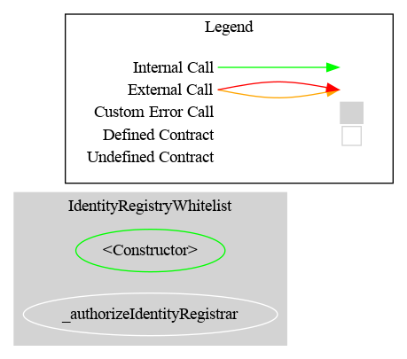
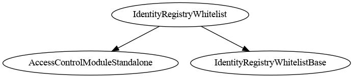

# Identity Registry Whitelist (ERC-3643)

[TOC]

`IdentityRegistryWhitelist` is a whitelist that presents itself to an **ERC-3643 token as its identity registry**. Install it with `token.setIdentityRegistry(address(this))`. `registerIdentity` whitelists a wallet, `deleteIdentity` removes it, and `isVerified` answers the question the token asks on every inbound transfer.

> **This is not a compliance rule.** It implements no `IRule` surface, has no restriction codes, and **must not be added to a `RuleEngine`**. It sits on the token's *identity registry* slot, not its *compliance* slot. Do not confuse it with [`RuleIdentityRegistry`](./RuleIdentityRegistry.md), which is the mirror image: a compliance rule that *consults* an external identity registry. This contract *is* the registry.

### Where the whitelist comes from

The address set is **not re-implemented**. The contract inherits `RuleAddressSetInternal` — the same `EnumerableSet` machinery `RuleWhitelist` and `RuleBlacklist` are built on — so the storage layout, the zero-address guard and the revert errors (`RuleAddressSet_ZeroAddressNotAllowed`, `RuleAddressSet_AddressNotFound`) are shared code rather than a second implementation. **No separate whitelist contract is deployed**: the registry *is* the list.

Only the `internal` layer is inherited, and that is deliberate: the registry exposes exactly one write API — the ERC-3643 one — rather than two overlapping ones. The two roles that gate `RuleAddressSet`'s public `addAddress` / `removeAddress` live in a separate `RuleAddressSetRolesStorage`, inherited by that public layer only, so **this registry does not advertise `ADDRESS_LIST_ADD_ROLE` / `ADDRESS_LIST_REMOVE_ROLE` at all** — it never enforces them, and exposing an inert role invites an operator to grant a privilege that authorises nothing. `testDoesNotExposeInertAddressListRoles` pins their absence from the ABI. Inheriting the public `RuleAddressSet` surface would add `addAddress` / `removeAddress` alongside `registerIdentity` / `deleteIdentity`, giving the same state change two sets of roles and two sets of events, and leaving an operator to guess which pair is authoritative.

The design goal is a **wrapper, not a registry**: it adapts the calls an ERC-3643 token makes onto a plain whitelist, and keeps **no identity state whatsoever** — no ONCHAINID, no country, no claims. `registerIdentity`'s `_identity` and `_country` arguments exist so the ERC-3643 signature matches; both are discarded. Verification means exactly one thing: is this wallet on the whitelist.

## Which ERC-3643 functions call the registry, and how

Transcribed from the reference `Token.sol` (vendored at `lib/ERC-3643/contracts/token/Token.sol`).

| Token function | Registry call | When | Effect if it returns false / reverts |
| --- | --- | --- | --- |
| `transfer(to, amount)` | `isVerified(_to)` | Before moving value | Reverts `"Transfer not possible"` |
| `transferFrom(from, to, amount)` | `isVerified(_to)` | Before moving value | Reverts `"Transfer not possible"` |
| `forcedTransfer(from, to, amount)` | `isVerified(_to)` | Before moving value | Reverts `"Transfer not possible"` |
| `mint(to, amount)` | `isVerified(_to)` | Before minting | Reverts `"Identity is not verified."` |
| `burn(user, amount)` | **none** | — | Burn never consults the registry |
| `recoveryAddress(lost, new, onchainID)` | `investorCountry(lost)`, `registerIdentity(new, …)`, `deleteIdentity(lost)` | See sequence below | Reverts `"Recovery not possible"` if the supplied ONCHAINID does not vouch for the wallet |

Every one of those calls is answered from the whitelist. `investorCountry` is the only one with nothing to answer from, and it returns a constant 0. `recoveryAddress` also calls `keyHasPurpose`, but **not on the registry** — see below.

Two consequences worth internalising:

- **Only the RECEIVER is ever screened.** ERC-3643 checks `_to`, never `_from` and never the spender. A de-listed holder can still send, which is deliberate: it lets a lapsed investor exit their position rather than being trapped. `forcedTransfer` bypasses freezes but **not** this check.
- **`burn` bypasses the registry entirely**, so an issuer can always burn a de-listed holder out.

### The `recoveryAddress` sequence

```
1. keyHasPurpose(keccak256(abi.encode(newWallet)), 1)  ── on the CALLER-SUPPLIED onchainID
   └─ false ⇒ revert "Recovery not possible"           ── NOT the registry: see below
2. investorCountry(lostWallet)                          ── always 0 here; discarded in step 3
3. registerIdentity(newWallet, onchainID, country)      ── called BY THE TOKEN; new wallet must
                                                           NOT already be registered
4. forcedTransfer(lostWallet, newWallet, balance)       ── re-enters isVerified(newWallet)
5. deleteIdentity(lostWallet)                           ── called BY THE TOKEN
```

**Step 1 does not involve this registry.** Supply the investor's ONCHAINID — or any ERC-734 contract — as `_investorOnchainID`.

An earlier revision implemented `keyHasPurpose` here so the registry could be passed as that argument, removing the ONCHAINID dependency entirely. It was **removed**, because it bought nothing: `Token.recoveryAddress` calls `keyHasPurpose` on the address the agent supplies and never cross-checks it against the registry (`Token.sol:303-305`), so an agent who wants to skip the gate simply passes a different contract. It was convenience for an honest agent, not a control — and it cost a reverse index plus two behavioural divergences from the reference registry, both of which are now gone.

Steps 3 and 5 mean **the token itself is a caller of the registry's write functions**, which drives the access-control setup below.

## Schema

### Graph



### Inheritance



## Installation

```solidity
IdentityRegistryWhitelist registry = new IdentityRegistryWhitelist(admin);
token.setIdentityRegistry(address(registry));

bytes32 role = registry.IDENTITY_REGISTRAR_ROLE();
registry.grantRole(role, operator);        // maintains the whitelist
registry.grantRole(role, address(token));  // REQUIRED for recoveryAddress
```

Then, to recover a wallet — the replacement wallet is registered **by the token**, so do not pre-register it:

```solidity
token.recoveryAddress(lostWallet, newWallet, investorOnchainId);    // a real ERC-734 identity
```

## Access Control

| Role | Description |
| --- | --- |
| `DEFAULT_ADMIN_ROLE` | Manages roles; implicitly holds every role |
| `IDENTITY_REGISTRAR_ROLE` | May call `registerIdentity` and `deleteIdentity` |

**The token must hold `IDENTITY_REGISTRAR_ROLE`**, because `recoveryAddress` makes the token call `registerIdentity` and `deleteIdentity`. Without it, every recovery reverts.

> **Warning.** Granting the role to the token means the token contract can whitelist and de-whitelist arbitrary addresses. That is inherent to ERC-3643's recovery design — the reference `IdentityRegistry` requires the token to be an `agent` for exactly the same reason — but it does widen the trust boundary: the token's agents transitively control the whitelist. Grant the role to the token only once, and treat the token's agent set as part of the registry's trust model.

## Methods

### `registerIdentity(address _userAddress, address _identity, uint16 _country)`

Adds a wallet to the whitelist. `_identity` is echoed in `IdentityRegistered` for off-chain traceability; `_country` is ignored entirely. **Neither is stored.** Reverts on the zero address. Restricted to `IDENTITY_REGISTRAR_ROLE`.

Reverts on an already-registered wallet, matching the reference registry's `"address stored already"`.

### `deleteIdentity(address _userAddress)`

Removes a wallet from the whitelist and clears its reverse-index entry. Reverts if the wallet is not registered. Restricted to `IDENTITY_REGISTRAR_ROLE`. Emits `IdentityRemoved`.

### `isVerified(address _userAddress) → bool`

Whitelist membership. **`isVerified(address(0))` is always `false`** — the zero address can never enter the registry, so the registry can never authorise a mint to it.

### `investorCountry(address _userAddress) → uint16`

**Always returns 0.** No country is stored. The function exists only because `recoveryAddress` calls it — omitting it would make every recovery revert — and the 0 it returns is handed straight back into `registerIdentity`, which ignores it. See [Limitation 3](#3-no-identity-data-is-kept).

### `registeredIdentityCount() → uint256`

How many wallets are registered. There is deliberately no full enumeration getter, matching `RuleWhitelist` and `RuleBlacklist`, which expose a count but not the member list.

## Limitations

### 1. No ERC-734 surface: `recoveryAddress` needs a real ONCHAINID

The registry implements no ERC-734 function, so `recoveryAddress` must be given an actual identity contract as `_investorOnchainID`. A deployment that has no ONCHAINID infrastructure must supply some ERC-734-compatible contract for recovery, or forgo `recoveryAddress` entirely — `forcedTransfer` plus a manual `registerIdentity` / `deleteIdentity` pair achieves the same end state under registrar control.

This is a deliberate narrowing. Answering `keyHasPurpose` from the whitelist was implemented and then removed: it added no security (the agent chooses which contract is called) while forcing the registry to keep a hash-to-wallet reverse index and to accept duplicate registrations. Trading a real limitation for an imaginary guarantee was the wrong trade.

### 2. Recovery still trusts the token agent completely

`_investorOnchainID` is agent-supplied and unvalidated by `Token.sol`, so a compromised agent can pass a contract that vouches for any wallet and move any holder's position to an address of their choosing. That is a property of ERC-3643's recovery design, not of this registry, and no registry-side check can fix it — but it belongs in the threat model of any deployment relying on `recoveryAddress`.

### 3. No identity data is kept

The contract's entire state is the inherited address set. Nothing else is stored:

| ERC-3643 concept | Here |
| --- | --- |
| ONCHAINID (`_identity`) | Echoed in `IdentityRegistered`, never stored. No `identity()` getter. |
| Investor country (`_country`) | Ignored on write; `investorCountry` is a constant `0`. |
| Claims / claim topics | Not modelled at all. |

Anything expecting `identityRegistry.identity(wallet)` to return a usable ONCHAINID will not work against this registry.

#### How much does the missing country actually matter?

Less than it sounds, because the token barely uses it. Auditing the reference implementation (`lib/ERC-3643/`) for every consumer of `investorCountry`:

| Location | Role |
| --- | --- |
| `token/Token.sol:308` (`recoveryAddress`) | **The only use in the token.** A pure pass-through: reads the lost wallet's country and hands it straight to `registerIdentity` for the new wallet. The token never branches on the value, never stores it, and exposes no getter — `IToken.sol` does not mention country at all. |
| `registry/implementation/IdentityRegistryStorage.sol:91,112,177` | Storage plumbing — writes and reads the field. |
| `registry/implementation/IdentityRegistry.sol:132,226` | Forwards to storage. |
| `compliance/legacy/BasicCompliance.sol:175` | `_getCountry()` — the only place country drives *logic*, and it has **no caller** in the vendored tree; it exists for country-restriction modules built on top. Note the path: `legacy`. |
| `_testContracts/` | `MockContract`, `LegacyToken_3_5_2`. |

Two things follow:

- **The token is genuinely unaffected.** Its single use is a round trip that starts and ends in the registry, so a constant `0` in and a discarded `0` out changes nothing. Recovery works exactly as it does with a full registry.
- **The current modular compliance framework has no country module.** `compliance/modular/modules/` contains only `AbstractModule`, `AbstractModuleUpgradeable`, `IModule`, `ModuleProxy` and `TestModule` — none reference country.

So the real exposure is narrow and specific: **a custom compliance module that calls `investorCountry` will see every investor as country 0**, and will therefore apply whatever rule it has for country 0 to everyone. Nothing shipped in ERC-3643 does this, but a jurisdiction-restriction module is a plausible thing to write. If that is on your roadmap, this registry is the wrong base — use the full ERC-3643 registry stack, which stores the country properly.

If you need investor metadata on-chain generally, the same conclusion applies: this is a whitelist wearing the registry interface, nothing more.

### 4. No claim topics, no trusted issuers

`IClaimTopicsRegistry` and `ITrustedIssuersRegistry` are not implemented and are not referenced. Whether an investor qualifies is an off-chain decision, expressed on-chain by the registrar's `registerIdentity` call. If you need on-chain claim verification, this is the wrong contract — use the full ERC-3643 registry stack.

### 5. Only the token-facing interface exists

`contains`, `identity`, `updateIdentity`, `updateCountry`, `batchRegisterIdentity`, `identityStorage`, `issuersRegistry` and `topicsRegistry` are **not** implemented. None are called by `Token.sol`, so the registry is a complete drop-in for a token, but it is **not** a complete `IIdentityRegistry`: third-party tooling that expects the full interface will revert. To update a country, call `registerIdentity` again (see Limitation 2).

## Tests

| File | Covers |
| --- | --- |
| `test/IdentityRegistryWhitelist/IdentityRegistryWhitelistUnit.t.sol` | Registration, deletion, duplicate and zero-address rejection, access control, and that no identity data is stored |
| `test/IdentityRegistryWhitelist/IdentityRegistryWhitelistERC3643.t.sol` | End-to-end against an ERC-3643 token: `mint`, `transfer`, `transferFrom`, `forcedTransfer`, `burn`, `recoveryAddress` |
| `test/ERC3643Compliance/ERC3643RuleEngineWhitelist.t.sol` | The **other** slot: an ERC-3643 token with a `RuleEngine` as its compliance contract, enforcing `RuleWhitelist`, alongside this registry on the identity slot |

The integration tests use `ERC3643TokenMock` plus `OnchainIdMock` (a minimal ERC-734 stub standing in for the investor's identity), whose registry call sequences and revert strings are transcribed from the reference `Token.sol`. The real implementation is not used because it imports the ONCHAINID Solidity package (not vendored) and targets OpenZeppelin v4 upgradeable contracts, while this repository vendors OZ v5 — it does not compile in this build. The mock keeps the registry interaction faithful and omits what is orthogonal to it (compliance module, pausing, partial-freeze accounting).
