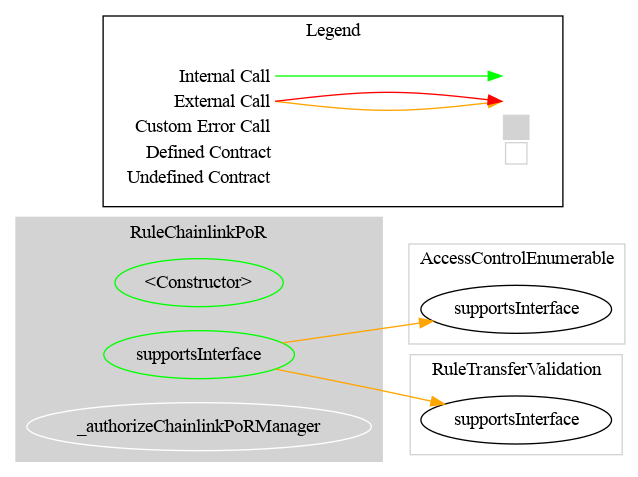

# Rule Chainlink Proof of Reserve

[TOC]

`RuleChainlinkPoR` ensures the total supply of a token never exceeds the reserves actually backing it. Before every mint it reads the latest reserve value from a [Chainlink Proof of Reserve](https://docs.chain.link/data-feeds/proof-of-reserve) data feed and checks whether the new total supply (current supply plus the requested mint amount) would exceed what the reserves can back. If it would, the mint is rejected.

The maximum mintable supply equals the reported reserves **exactly**: there is no margin, buffer or headroom parameter. If you need a safety cushion, express it upstream (report conservative reserves on the feed) or compose with `RuleMaxTotalSupply` for a static ceiling.

Only mint operations (`from == address(0)`) are gated. Plain transfers do not change the total supply, and burns only reduce it, so both always pass — including while the feed is stale or unavailable. This is deliberate: a lapsed feed must never trap holders in their position.

The rule is modelled on Chainlink's [`SecureMintPolicy`](https://docs.chain.link/ace/reference/policy-library/secure-mint-policy) from the ACE policy library, re-expressed as an ERC-1404 / ERC-3643 compliance rule for this library and deliberately simplified: the ACE policy's configurable reserve margin is not carried over.

## Token compatibility: ERC-20 only

`RuleChainlinkPoR` is **not usable with an ERC-721 or ERC-1155 token**, for two independent reasons:

- **No ERC-7943 entrypoints.** The rule inherits `RuleTransferValidation` directly, not `RuleNFTAdapter`, so the `tokenId`-carrying overloads (`detectTransferRestriction(from, to, tokenId, amount)`, `transferred(from, to, tokenId, value)`, …) and the `ITransferContext` struct entrypoints do not exist on it, and it does not advertise `IERC7943NonFungibleComplianceExtend` through ERC-165. See the overload matrix in [`RULE_SEMANTICS.md`](./RULE_SEMANTICS.md#3-overload-surface-erc-7943-tokenid--itransfercontext).
- **An aggregate `totalSupply()` is mandatory.** Configuration probes it and reverts with `RuleChainlinkPoR_TokenTotalSupplyUnavailable` when it is absent. Plain ERC-721 has no `totalSupply()` — only `ERC721Enumerable` does — and ERC-1155 supply is per token id (`ERC1155Supply.totalSupply(id)`), so an aggregate figure mixes every id together and a reserve cap derived from it means nothing for a multi-id collection.

This is a design choice, not an omission: the rule caps a *fungible supply* against a reserve figure, so a `tokenId` dimension carries no information for it. `RuleMaxTotalSupply` is ERC-20 only for the same reason. To cap issuance of a non-fungible asset, screen the participants with an address-based validation rule (`RuleWhitelist`, `RuleReceiverWhitelist`, …), all of which do expose the ERC-7943 overloads.

## Schema

### Graph



### Inheritance


## Configuration

### Constructor parameters

| Parameter | Description |
| --- | --- |
| `admin` / `owner` | Address granted `DEFAULT_ADMIN_ROLE` (AccessControl variant) or set as owner (Ownable2Step variant) |
| `tokenContract_` | Address of the protected token; must expose `totalSupply()` and be non-zero |
| `tokenDecimals_` | Decimals of that token, `0` to `18`; validated against `decimals()` when the token exposes it |
| `reservesFeed_` | Proof of Reserve data feed implementing `AggregatorV3Interface`; must be a contract |
| `maxStalenessSeconds_` | Maximum accepted age of the reserve data, in seconds; `0` disables the check |

Every value can be updated after deployment by the rule manager.

### Proof of Reserve feed

Any contract implementing `AggregatorV3Interface` works; in practice this is a Chainlink Proof of Reserve feed (see the [Data Feeds addresses page](https://docs.chain.link/data-feeds/smartdata/addresses)). Each rule instance supports **one** feed. If the token is backed by several reserve sources, deploy one `RuleChainlinkPoR` per feed and add them all to the same `RuleEngine` — the engine applies them conjunctively, so every feed must back the mint.

Configuration reverts if the feed's `decimals()` call fails (`RuleChainlinkPoR_FeedDecimalsUnavailable`) or reports more than `MAX_FEED_DECIMALS` (36), so a misconfigured feed is rejected up front rather than silently blocking every mint later.

#### Why the decimals are read live, and what it costs

The feed's `decimals()` is read **on every check** and never cached. The value validated at configuration time is only used to reject a bad feed early; it is not stored.

**The risk this avoids.** Caching is the obvious optimisation, since decimals are a near-immutable property of a feed, so re-reading them looks wasteful. The problem is the failure mode when that assumption breaks. Chainlink feeds are proxies (`EACAggregatorProxy`) that delegate `decimals()` to whichever aggregator is currently installed. If an aggregator migration changed the reported decimals and the rule were still using a cached value, every subsequent reserve reading would be mis-scaled by `10 ** delta` — with **no revert, no event and no other on-chain signal**. In the direction that overstates reserves, an 8→18 migration against a cached `8` inflates the apparent backing by `10 ** 10`, which authorises essentially unlimited unbacked minting. That is precisely the outcome this rule exists to prevent, so it is not a risk worth trading for gas.

**The cost.** One extra `STATICCALL` per restriction check:

| Measurement | Cached | Live | Delta |
| --- | --- | --- | --- |
| End-to-end CMTAT mint through a RuleEngine | 111,184 | 114,106 | **+2,922** (+2.6%) |
| Single `detectTransferRestriction` (cold feed account) | 56,029 | 59,075 | +3,046 |
| Each further check in the same transaction (warm account) | — | — | ≈ +900 |

Roughly 2.6% of a mint, paid only on the mint path; transfers and burns short-circuit before any feed access and are completely unaffected.

**Why this is safe for a MUST-NOT-revert view.** Reading live adds a second external call that could fail, so both feed calls are guarded identically: the `code.length` check covers both (a `try` to a codeless address reverts *uncatchably*, so `try/catch` alone would not be enough — see the deployment-precondition section for why, and why the mechanism is the ABI decoder rather than `extcodesize`), and a reverting `decimals()` returns `CODE_RESERVES_ANSWER_INVALID`. The `MAX_FEED_DECIMALS` bound is additionally **re-checked at read time**, not just at configuration — otherwise a feed that raised its decimals past the bound would overflow the scaling exponent and revert the view.

**Residual risk.** The scaling now always agrees with what the feed reports *at the moment of the check*, so there is no stale-cache window. What remains is that a feed changing decimals mid-life still changes the meaning of the reserve figure between one block and the next; the rule follows it faithfully rather than silently using an outdated scale, but an operator monitoring a feed migration should still confirm the new aggregator reports the reserve they expect.

### Token metadata

`tokenContract` is called with `totalSupply()` on every mint; `tokenDecimals` is used to scale the feed answer into token units. When the token exposes `decimals()`, the configured value is checked against it and a mismatch reverts. `0` decimals is accepted and is the common case for CMTAT equity tokens.

Configuration validates the token in three ways: it must not be the zero address, it must have code (`RuleChainlinkPoR_TokenIsNotAContract`), and `totalSupply()` must be callable (`RuleChainlinkPoR_TokenTotalSupplyUnavailable`). `decimals()` remains **optional** — a token without it is accepted and the configured value is used as-is — but `totalSupply()` is mandatory, because the restriction check cannot work without it. Probing at configuration turns what would otherwise be a silent read-path failure into an immediate, named configuration error.

> **Warning: decimal scaling.** For a token that does **not** expose `decimals()`, the configured value is used as-is. An incorrect value skews the reserve comparison in either direction, allowing over-minting or blocking valid mints. Verify the token's real decimals before configuring.

#### Truncation when the feed is finer-grained than the token

When `feedDecimals > tokenDecimals` the answer is divided, and the division **truncates**. Truncation always rounds the backed supply *down*, so the rule can under-mint but never over-mint — the safe direction for a reserve check.

This is most visible at `tokenDecimals == 0` (CMTAT equity tokens), where the divisor is the largest it can be for a given feed:

| Feed answer (8 decimals) | Backed supply, `tokenDecimals = 0` |
| --- | --- |
| `1000.99999999` | 1000 |
| `1000.00000000` | 1000 |
| `0.99999999` | 0 — every non-zero mint rejected |

The last row is the case to be aware of operationally: with a 0-decimals token, reserves below one whole unit back nothing at all. That is arithmetically correct — you cannot issue a whole share against a fractional reserve — but it means a feed reporting a small residual balance blocks issuance entirely rather than allowing a token or two.

Behaviour across the decimals domain is pinned by [`test/RuleChainlinkPoR/RuleChainlinkPoRDecimals.t.sol`](../../test/RuleChainlinkPoR/RuleChainlinkPoRDecimals.t.sol), which includes a fuzz cross-checking the implementation against `answer * 10**tokenDecimals / 10**feedDecimals` computed with full-precision `mulDiv`.

### Staleness threshold

`maxStalenessSeconds` is the maximum age of the reserve data before the rule rejects mints. Choose it from the **heartbeat** of the Proof of Reserve feed: the threshold should match or slightly exceed the heartbeat. A feed whose `updatedAt` is exactly `maxStalenessSeconds` old is still accepted; older is rejected.

Setting the threshold to `0` disables the check, so the rule then accepts reserve data of any age. Do this only when the feed's freshness is guaranteed by other means.

## Restriction codes

| Constant | Code | Meaning |
| --- | --- | --- |
| `CODE_RESERVES_EXCEEDED` | 75 | `totalSupply + value` would exceed the backed supply |
| `CODE_RESERVES_FEED_STALE` | 76 | The feed has not been updated within `maxStalenessSeconds` |
| `CODE_RESERVES_ANSWER_INVALID` | 77 | A round **was** returned but cannot be used: a negative reserve, or an incomplete round (`updatedAt == 0`) |
| `CODE_RESERVES_FEED_UNAVAILABLE` | 79 | **No usable response** could be obtained: `decimals()` or `latestRoundData()` reverted, or the feed reports more than `MAX_FEED_DECIMALS` |
| `CODE_TOTAL_SUPPLY_UNAVAILABLE` | 78 | `tokenContract.totalSupply()` reverted, or the token has lost its code |

## Access Control

| Variant | Gate |
| --- | --- |
| `RuleChainlinkPoR` | `DEFAULT_ADMIN_ROLE` (the default admin implicitly holds all roles) |
| `RuleChainlinkPoROwnable2Step` | Contract owner, with two-step ownership transfer |

All three setters are gated on `_authorizeChainlinkPoRManager()`.

## Methods

### `setReservesFeed(AggregatorV3Interface newReservesFeed)`

Replaces the data feed. Reverts on the zero address, on an address with no code, when `decimals()` reverts, or when it reports more than 36. Validation only, the value is not stored. Emits `ReservesFeedUpdated`, whose `feedDecimals` argument records what the feed reported at configuration time.

### `setTokenMetadata(address newTokenContract, uint8 newTokenDecimals)`

Replaces the protected token and its decimals. Reverts on the zero address, on decimals above 18, and on a mismatch with the token's own `decimals()` when exposed. Emits `TokenMetadataUpdated`.

### `setMaxStalenessSeconds(uint256 newMaxStalenessSeconds)`

Updates the staleness threshold. Emits `MaxStalenessSecondsUpdated`.

### `maxBackedSupply() → (uint8 restrictionCode, uint256 backedSupply)`

Previews the limit a mint is measured against, without simulating one. `restrictionCode` is `0` when the feed answer is usable, otherwise it is the code a mint would return (76 or 77) and `backedSupply` is `0`. Never reverts.

### `feedDecimals() → uint8`

Forwards the feed's current `decimals()`, so it always agrees with what the restriction checks use. Unlike the ERC-1404 views this getter is allowed to revert: it propagates whatever the feed does, which is the honest answer for a diagnostic accessor.

### View getters

`reservesFeed()`, `tokenContract()`, `tokenDecimals()`, `maxStalenessSeconds()`.

## Transfer restriction logic

For a mint (`from == address(0)`):

1. Read `decimals()` and then `latestRoundData()` from `reservesFeed`.
2. Reject with `CODE_RESERVES_FEED_UNAVAILABLE` if either call reverts or the feed reports more than `MAX_FEED_DECIMALS`: there is no answer to judge.
3. Reject with `CODE_RESERVES_ANSWER_INVALID` if a round was returned but `answer < 0` or `updatedAt == 0`.
4. Reject with `CODE_RESERVES_FEED_STALE` if `maxStalenessSeconds != 0` and `block.timestamp - updatedAt > maxStalenessSeconds`.
5. Scale the answer from the feed's live decimals to `tokenDecimals` to obtain `backedSupply`.
6. Read `tokenContract.totalSupply()`; reject with `CODE_TOTAL_SUPPLY_UNAVAILABLE` if it reverts or the token has lost its code.
7. Reject with `CODE_RESERVES_EXCEEDED` if `totalSupply + value > backedSupply`.

Anything else returns `TRANSFER_OK`. `detectTransferRestrictionFrom` delegates to the same logic and **ignores the spender**: this rule caps supply, it does not screen the minter.

### Read-path safety

`detectTransferRestriction*` and `canTransfer*` are ERC-1404 / ERC-3643 views that MUST NOT revert. The implementation therefore:

- wraps `decimals()` and `latestRoundData()` in `try/catch`;
- re-checks the `MAX_FEED_DECIMALS` bound against the live value, so the scaling exponent cannot overflow even if the feed changes;
- saturates instead of overflowing when scaling up (`answer * 10 ** (tokenDecimals - feedDecimals)`);
- bounds `tokenDecimals` at 18 at configuration time, so the scale-up factor is at most `10 ** 18`;
- compares against the remaining headroom (`value > backedSupply - currentSupply`) instead of computing `currentSupply + value`, which could overflow;
- wraps `tokenContract.totalSupply()` in `try/catch`, yielding code `78` instead of reverting.

#### Why two feed-failure codes

`79` and `77` both block the mint, so the *token* behaves identically. They are separated because they tell an
operator different things, and the restriction code is the only channel available, because the read path cannot revert
with data, and a view cannot emit an event.

| Code | Meaning | What an operator checks |
| --- | --- | --- |
| `79` | The feed could not be read at all | Feed liveness; is the configured address a compatible `AggregatorV3Interface`? |
| `77` | A round came back and its contents are unusable | Is this really a Proof of Reserve feed (a price feed can legitimately go negative)? Or wait for the round to complete. |

`80` is left reserved. Splitting `79` further into "reverted" versus "decimals out of range" was considered and
rejected: both mean the configured feed cannot be used, so the remedy is the same.

#### Deployment precondition: EIP-6780 (Cancun or later)

`try/catch` does **not** catch a call to an address with no code, and the reason is not the one usually quoted.
`catch` handles a revert raised by the *callee*; it cannot handle a failure in this contract's own frame.

For a call that returns data (`totalSupply()`, `decimals()`, `latestRoundData()`), **Solidity 0.8.10 and later
skip the `EXTCODESIZE` check entirely** and rely on the ABI decoder instead. The `CALL` to a codeless account
*succeeds*, returning 0 bytes; the decoder then fails to read the expected values from nothing, in the caller's
frame, after the call has already returned. There is no callee revert for `catch` to attach to. (For a call
returning *nothing*, the `EXTCODESIZE` check is still emitted and reverts before any call is made. Also
uncatchable, different mechanism.)

Confirm it in one step: point the rule at a contract that *has* code whose fallback succeeds and returns zero
bytes. `EXTCODESIZE` passes, the `CALL` succeeds, and the view still reverts uncatchably.

The revert-free guarantee therefore rests on `reservesFeed` and `tokenContract` still having code at read time —
**and on their returning well-formed data**. Code alone is not sufficient: a proxy upgraded to an implementation
whose fallback returns empty data keeps its code and still breaks the read path. Both are trusted inputs for
this reason.

That holds because the setters require code at configuration time (`RuleChainlinkPoR_FeedIsNotAContract`, `RuleChainlinkPoR_TokenIsNotAContract`), every write to either field goes through a validated setter, and **EIP-6780** (Cancun) restricts `SELFDESTRUCT` to accounts created in the same transaction — so a contract that exists across transactions can no longer be removed. A validated address stays a contract.

There is deliberately **no runtime code-length re-check**: it would be unreachable code on any supported chain, and unreachable defensive code misrepresents the threat model. It is recorded here as a deployment precondition instead. `foundry.toml` targets `prague`, which is post-Cancun.

> **If you deploy to a chain without EIP-6780** (post-Shanghai but pre-Cancun, as some L2s were for a period), this guarantee does not hold: a `SELFDESTRUCT`ed feed or token would make the ERC-1404 views revert instead of returning a code. Re-introduce an `address(x).code.length == 0` guard before each `try` if you target such a chain — it costs about 100 gas per call site, not the 2,600 a cold `EXTCODESIZE` suggests, because the account is warmed either way.

The trust placed in `tokenContract` is narrower than it looks: it is trusted to report an **accurate** supply, which nothing on-chain can verify, but it is **not** trusted to stay callable. A token that is upgraded to something that reverts, or that reverts while paused, degrades to a restriction code rather than breaking the ERC-1404 contract. This is stricter than `RuleMaxTotalSupply`, which calls `totalSupply()` unguarded.

### Failure modes are fail-closed for mints only

A broken or stale feed blocks **minting**, never transfers or burns. This is the safe direction: the rule's purpose is to prevent unbacked issuance, and issuance can wait for the feed to recover. Holders retain full mobility of their existing balance throughout.

## Usage scenario

An issuer runs a tokenized commodity with a Chainlink Proof of Reserve feed reporting the custodian's holdings with 8 decimals; the token has 18 decimals and a 24 h feed heartbeat. They deploy:

```solidity
RuleChainlinkPoR rule = new RuleChainlinkPoR(
    admin,
    address(token),
    18,                    // token decimals
    AggregatorV3Interface(porFeed),
    1 days + 1 hours       // heartbeat plus slack
);
ruleEngine.addRule(rule);
token.setRuleEngine(ruleEngine);
```

With reserves reported at 1 000 units, at most 1 000 tokens may exist. A mint that would push the supply past 1 000 reverts with code 75; a mint attempted more than 25 h after the last feed update reverts with code 76. When the custodian deposits more and the feed updates, the headroom reopens automatically — no rule reconfiguration needed.

## Relationship to Chainlink's `SecureMintPolicy`

This rule implements the same core idea as [`SecureMintPolicy`](https://github.com/smartcontractkit/chainlink-ace/blob/main/packages/policy-management/src/policies/SecureMintPolicy.sol) from the Chainlink ACE policy library (compared against `SecureMintPolicy 1.2.0`, vendored at `lib/chainlink-ace/`): read a Proof of Reserve feed before every mint and reject issuance the reserves cannot back. It is **not a port**. The two live in different execution models, and that drives most of the differences below.

The decisive difference is **how a rejection is signalled**. `SecureMintPolicy.run()` reverts with `PolicyRejected`; it is called by an ACE `PolicyEngine` that only ever needs a yes/no at execution time. `RuleChainlinkPoR` must additionally satisfy the ERC-1404 / ERC-3643 read path, where `detectTransferRestriction` / `canTransfer` are views that **MUST NOT revert** and must return a numeric reason code. Every "returns a code where ACE reverts" row below follows from that one constraint.

### Summary

| Dimension | Chainlink `SecureMintPolicy` 1.2.0 | `RuleChainlinkPoR` |
| --- | --- | --- |
| Integration model | ACE `PolicyEngine`, bound to one selector | ERC-1404 / ERC-3643 rule, via `RuleEngine` or bound directly |
| Rejection signalling | Reverts (`PolicyRejected`) | Returns restriction code `75` / `76` / `77`; reverts only on the write path |
| Feed decimals | Read **live** on every `run()` | Read **live** on every check (same approach) |
| Feed decimals bound | Unbounded (`uint8`) | `<= MAX_FEED_DECIMALS` (36), checked at configuration **and** at read time |
| Feed call reverts (`decimals` or `latestRoundData`) | Propagates — mint reverts | `try/catch` → code `77` |
| Incomplete round (`updatedAt == 0`) | Not checked | Code `77` |
| Staleness arithmetic | `block.timestamp - updatedAt` — underflow-panics on a future timestamp | Guarded with `block.timestamp > updatedAt` |
| Token decimals accepted | `1` to `18` | `0` to `18` (CMTAT equity tokens report 0) |
| Reserve margin | 5 modes (percentage / absolute, positive / negative) | None — limit equals reserves exactly |
| Scale-up overflow | Checked arithmetic → revert | Saturates at `type(uint256).max` |
| Supply source | `subject`, supplied by the engine at call time | `tokenContract`, set in configuration |
| Token validated at configuration | Zero-address check only | Zero-address, has-code, and `totalSupply()` probe |
| `totalSupply()` reverting at run time | Propagates — mint reverts | Code `78` |
| Single-token binding | Enforced — `onInstall` reverts with `PolicyAlreadyBound` | Not enforced (see below) |
| Pre-flight preview | None | `maxBackedSupply()` |
| Upgradeability | Upgradeable (ERC-7201 storage, initializers) | Non-upgradeable |
| Access control | `onlyOwner` | `DEFAULT_ADMIN_ROLE` or `Ownable2Step` |
| Setter no-op guards | Reverts if the new value equals the current one | No such guard |

### Where this rule is stricter

- **Feed failures degrade to a code, not a revert.** A feed with no code, a reverting `latestRoundData()`, a negative answer or an incomplete round all yield code `77`. ACE has no `updatedAt == 0` check at all, so with `maxStalenessSeconds == 0` an incomplete round is accepted at face value.
- **No underflow on a future `updatedAt`.** ACE computes `block.timestamp - updatedAt` unguarded; a feed reporting a timestamp ahead of the block panics the whole call. Fail-closed for ACE, but a panic rather than a clean rejection.
- **Feed decimals are bounded at configuration time**, so the scaling exponent can never overflow. ACE accepts any `uint8`, where a feed reporting e.g. 78 decimals makes `10 ** 78` revert on every mint.
- **`0`-decimals tokens are supported.** ACE requires `decimals > 0`, which excludes CMTAT equity tokens outright.

### Where ACE is stricter, and what this rule does instead

- **One policy instance is pinned to one token.** `onInstall` records the `subject` and reverts with `PolicyAlreadyBound` on reuse, and `run()` rejects a call from any other subject. `RuleChainlinkPoR` has no equivalent guard — see [One instance per protected token](#one-instance-per-protected-token) for exactly what goes wrong and why the guard is absent.

  In exchange, this rule avoids ACE's documented `subject` vs `tokenMetadata.tokenAddress` split, where the supply is read from one address while the decimals are validated against another and nothing enforces that they agree. Here `setTokenMetadata` sets the address and the decimals together and cross-checks the decimals against that same address.

## Interaction with other rules

- `RuleMaxTotalSupply` caps supply at a **static** value; `RuleChainlinkPoR` caps it at a **live, oracle-reported** one. They compose: add both to the same `RuleEngine` and the stricter one binds. This is also how you get a conservative buffer under the reserves, now that the rule itself has no margin parameter.
- `RuleMintAllowance` limits how much **each minter** may issue; `RuleChainlinkPoR` limits how much **the token as a whole** may exist. Together they give a per-minter quota inside a reserve-backed ceiling.

## Deployment topology

The rule never reads `msg.sender` and holds no per-token binding, so it behaves identically in RuleEngine mode (Topology A) and direct mode (Topology B). See the topology section of `CLAUDE.md`.

### One instance per protected token

> **Warning.** A `RuleChainlinkPoR` instance protects exactly **one** token: the one in `tokenContract`. Nothing on-chain enforces that. Deploy a separate instance per token.

**What the rule actually checks.** On every mint the rule reads `totalSupply()` from the **configured `tokenContract`**, never from whichever token triggered the check. It has no way to learn that identity: in Topology A the caller is the RuleEngine, and the `transferred(spender, from, to, value)` payload carries no token address.

**What goes wrong.** Suppose one instance `R` is configured with `tokenContract = X` and added to both token X's RuleEngine and token Y's RuleEngine. A mint of `value` on **Y** is then evaluated as:

```
Y_mint_allowed  ⟺  value ≤ backedSupply(X's feed) − totalSupply(X)
```

Y's own supply and Y's own reserves never enter the calculation. Both failure directions are live:

- **Over-mint.** If X's supply sits far below what X's feed backs, the leftover headroom is silently handed to Y. Y can be minted against reserves that do not back it — the exact outcome this rule exists to prevent.
- **Freeze.** If X is already at its cap, every Y mint is rejected with code `75` even when Y is fully backed.

**Why it is easy to miss.** There is no revert, no event and no divergence in any getter. `maxBackedSupply()` faithfully reports the limit *for the configured token*, so a pre-flight check against the wrong instance looks perfectly healthy. The misconfiguration only surfaces as mints that are wrongly allowed or wrongly blocked.

**Why there is no guard.** Adding one would mean giving a validation rule a binding and a stateful install/uninstall lifecycle, which is how the *operation* rules (`RuleConditionalTransferLight`, `RuleMintAllowance`) work but not the validation rules — those are deliberately stateless and shareable. `RuleMaxTotalSupply` has the identical exposure for the same reason. Changing that is a library-wide decision about whether supply-capping validation rules should be bindable, not something to special-case here.

**Operational rule.** One `RuleChainlinkPoR` instance per protected token, and re-verify `tokenContract` whenever an instance is added to an additional RuleEngine or bound to an additional token. If a token is backed by several reserve sources, deploying one instance per feed (as described under [Proof of Reserve feed](#proof-of-reserve-feed)) is safe — those instances all share the same `tokenContract`, which is the intended configuration.
