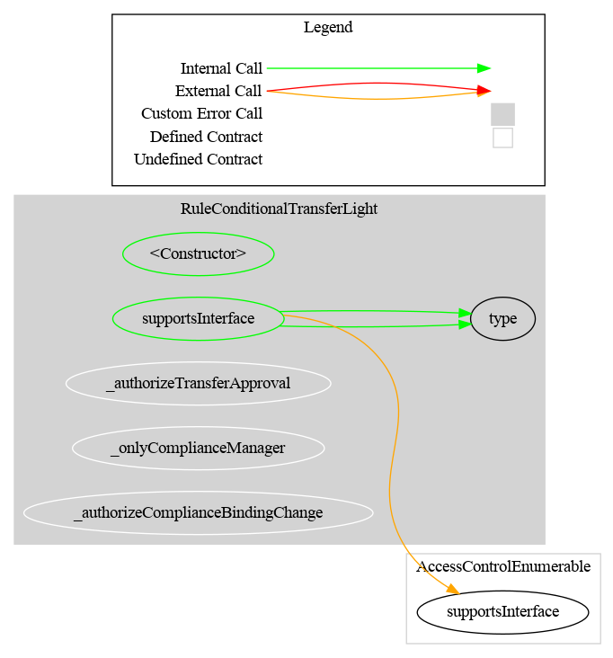
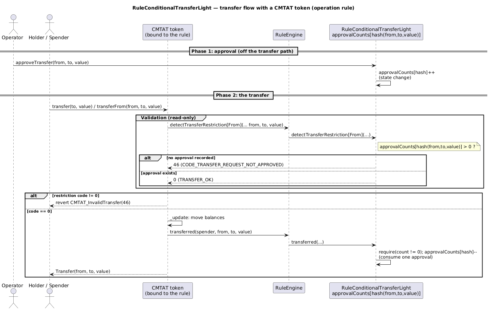

# Rule Conditional Transfer Light

[TOC]

This rule requires that each transfer be explicitly approved by an operator before it can execute. It is an **operation rule**: it modifies state during the transfer call (consuming one approval count), unlike validation rules which are read-only.

Each approval is tracked by a hash of `(from, to, value)`. The same transfer tuple can be approved multiple times (approval count > 1) to allow repeated transfers between the same parties for the same amount.

Mints (`from == address(0)`) and burns (`to == address(0)`) are **exempt**: they always pass without requiring an approval. `created` and `destroyed` follow the same path as `transferred` and return immediately for those cases.

## Schema

### Graph



### Inheritance


### Flow with a CMTAT token

The sequence below shows the two-phase flow: an operator first approves a `(from, to, value)` transfer, then the CMTAT token (with this rule configured in its RuleEngine) validates and consumes that approval during the transfer.



_Diagram source: doc/img/rule-conditional-transfer-light-flow.puml._

## Restriction codes

| Constant | Code | Meaning |
| --- | --- | --- |
| `CODE_TRANSFER_REQUEST_NOT_APPROVED` | 46 | No approval exists for this `(from, to, value)` tuple |

## Access Control

| Role | Description |
| --- | --- |
| `DEFAULT_ADMIN_ROLE` | Manages all roles; implicitly holds all roles below |
| `OPERATOR_ROLE` | May approve or cancel transfer approvals, and call `approveAndTransferIfAllowed` |
| `COMPLIANCE_MANAGER_ROLE` | May bind and unbind token contracts (`bindToken`, `unbindToken`) |

Token execution (`transferred`) is restricted to bound token contracts only.


## Methods

### `approveTransfer(address from, address to, uint256 value)`

Increments the approval count for the `(from, to, value)` hash by 1. Restricted to `OPERATOR_ROLE`. Emits `TransferApproved`.

### `cancelTransferApproval(address from, address to, uint256 value)`

Decrements the approval count for the `(from, to, value)` hash by 1. Reverts if no approval exists. Restricted to `OPERATOR_ROLE`. Emits `TransferApprovalCancelled`.

### `resetApproval(address from, address to, uint256 value) → uint256`

Discards **every** outstanding approval for the `(from, to, value)` hash in one call and returns the count that was cleared. Reverts if no approval exists. Restricted to `OPERATOR_ROLE`. Emits `TransferApprovalReset`.

Unlike `approveTransfer`, this deliberately does **not** require a token to be bound — its main use is discarding approvals that survived an `unbindToken` (see below), at which point nothing is bound.

### `approveAndTransferIfAllowed(address from, address to, uint256 value) → bool`

Approves the transfer and immediately calls `SafeERC20.safeTransferFrom` on the bound token, using this rule contract as the spender. Requires `from` to have previously approved this contract for at least `value` tokens. Restricted to `OPERATOR_ROLE`.

Works in **both** topologies, provided the bindings are set correctly — see [Binding: token vs RuleEngine](#binding-token-vs-ruleengine).

### `approvedCount(address from, address to, uint256 value) → uint256`

Returns the current approval count for the `(from, to, value)` tuple.

### Binding: token vs RuleEngine

The rule keeps **two independent bindings**, because they answer two different questions:

| Binding | Answers | Used for |
| --- | --- | --- |
| `bindToken(token)` | *Which ERC-20 does this rule act on?* | the token `approveAndTransferIfAllowed` calls `safeTransferFrom` on — and, in direct-binding mode, an authorized caller of `transferred` |
| `bindRuleEngine(engine)` | *Who else may call `transferred`?* | under the RuleEngine topology the **engine**, not the token, is the caller of the compliance hooks |

`transferred` accepts a call from **either** the bound token **or** the bound RuleEngine (`isTransferExecutor(caller)`).

**Wire it like this:**

```solidity
// Direct binding (token calls the rule itself)
cmtat.setRuleEngine(address(rule));
rule.bindToken(address(cmtat));

// Behind a RuleEngine (the engine calls the rule)
cmtat.setRuleEngine(address(ruleEngine));
ruleEngine.addRule(rule);
rule.bindToken(address(cmtat));          // the ERC-20 target
rule.bindRuleEngine(address(ruleEngine)); // the authorized caller
```

> **Why two bindings?** They were originally one slot, which had to be *both* the ERC-20 target and the authorized caller. In direct mode those coincide, so it worked. Behind a RuleEngine they are different addresses, and a single slot could only hold one: binding the engine broke `approveAndTransferIfAllowed` (the engine is not an ERC-20), while binding the token left the engine unauthorized and reverted **every** transfer and mint. Splitting the roles fixes both. See `CLAUDE_AUDIT.md` finding **F-3**.

Always bind the **token** with `bindToken` — putting the RuleEngine there instead makes `getTokenBound()` a non-ERC-20 and `approveAndTransferIfAllowed` will revert.

### `bindToken(address token)` / `unbindToken(address token)`

Binds or unbinds the ERC-20 token. Restricted to `COMPLIANCE_MANAGER_ROLE`. A second `bindToken` reverts until the current token is unbound.

> ⚠️ **`unbindToken` does not clear `approvalCounts`.** Approvals recorded while the previous token was bound remain in storage and become consumable by the next token that is bound. The operator who controls rebinding also controls approvals, so the trust model is preserved — but when migrating to a different token, call `resetApproval` for each affected `(from, to, value)` **before** rebinding if the old approvals must not carry over.

### `bindRuleEngine(address ruleEngine)` / `unbindRuleEngine()`

Authorises (or revokes) a `RuleEngine` to call the transfer execution hooks. Restricted to `COMPLIANCE_MANAGER_ROLE`. Reverts on the zero address, and on a second binding until `unbindRuleEngine` is called. Emits `RuleEngineBound` / `RuleEngineUnbound`.

Like `unbindToken`, `unbindRuleEngine` does **not** clear `approvalCounts`.

### `isTransferExecutor(address caller) → bool`

Returns `true` if `caller` is the bound token or the bound RuleEngine — i.e. whether it may call `transferred`.

## Workflow

### Token holder initiates

1. The token holder calls the CMTAT `transfer(to, value)`.
2. The CMTAT calls `detectTransferRestriction` via the RuleEngine — returns code 46 if no approval exists.
3. The operator (off-chain or via contract) calls `approveTransfer(from, to, value)`.
4. The token holder retries the transfer. `detectTransferRestriction` returns 0 (OK).
5. The CMTAT calls `transferred(from, to, value)` which consumes one approval count.

### Operator initiates

1. The operator calls `approveTransfer(from, to, value)` (or `approveAndTransferIfAllowed` for immediate execution).
2. If using `approveAndTransferIfAllowed`, the token holder must have previously called `approve(ruleAddress, value)` on the token.

## Approval counting

Each call to `approveTransfer` increments the counter by 1. Each successful transfer via `transferred` decrements it by 1. This allows the same `(from, to, value)` tuple to be approved multiple times for repeated transfers.

## Notes

### `transferFrom` spender ignored

For `transferred(spender, from, to, value)`, the spender address is ignored. Approval lookup is based solely on `(from, to, value)`.

### Zero-value transfers are not treated as no-ops

**Open conformance gap against CMTAT `v3.3.0-rc3`.** That release added a normative requirement to
`IRuleEngine`'s NatSpec:

> Zero-value calls are permissionless. ERC-20 requires transfers of `0` to be treated as normal transfers, and
> OpenZeppelin's `_spendAllowance` consumes no allowance when `value == 0`, so any address can call
> `transferFrom(victim, anyone, 0)` and reach this callback for an arbitrary `from`, with itself as `spender`,
> without ever having been approved. *"Implementations MUST therefore treat `value == 0` as carrying no
> economic meaning: any stateful rule ... MUST be a no-op for a zero value."*

This rule keys approvals on `(from, to, value)` with no special case for `value == 0`, so it does not yet
satisfy that. Measured against the rule as shipped:

| Call | Behaviour today |
| --- | --- |
| `transferred(attacker, victim, anyone, 0)` with no matching approval | **Reverts** — so a zero-value transfer that ERC-20 says should succeed is rejected |
| An approval recorded for `(from, to, 0)` | **Consumable by any caller**, since the spender is not part of the key |

Neither moves value, and the second requires an operator to have approved a zero-value transfer in the first
place, which is a degenerate thing to do. The practical exposure is therefore low. The correct fix is to make
`transferred` return early when `value == 0`, before any approval lookup or state change, on this rule,
[`RuleConditionalTransferLightMultiToken`](./RuleConditionalTransferLightMultiToken.md) and
`RuleMintAllowance`. It is a **behaviour change** to shipped compliance logic — a zero-value transfer would
stop reverting — so it is recorded here rather than applied silently.

### Duplicate approvals

Multiple approvals for the same `(from, to, value)` tuple are allowed and stack. This enables scenarios where the same transfer is expected to occur multiple times.

## Usage scenario

The issuer deploys `RuleConditionalTransferLight`, grants `OPERATOR_ROLE` to a compliance officer, and calls `bindToken(cmtat)` with `COMPLIANCE_MANAGER_ROLE`. Investor Alice wants to transfer 1,000 tokens to Bob. The compliance officer reviews the request off-chain and calls `approveTransfer(alice, bob, 1000)`. Alice's transfer then succeeds, and the approval is consumed. A subsequent transfer of the same amount requires a new approval.
