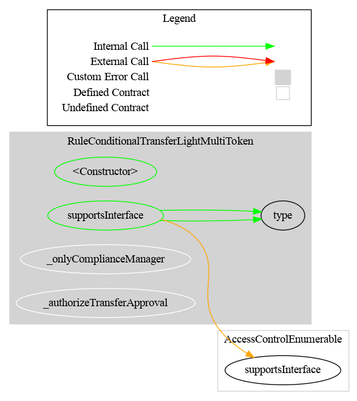
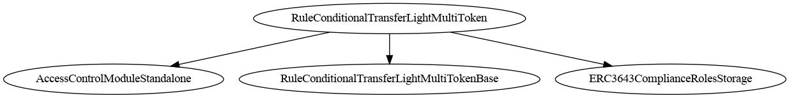
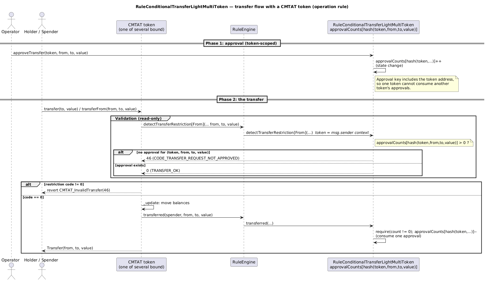

# Rule Conditional Transfer Light MultiToken

[TOC]

`RuleConditionalTransferLightMultiToken` is an operation rule that requires explicit operator approval before each transfer, with approvals scoped per token.

Approval key:

- `keccak256(token, from, to, value)`

This prevents approval reuse across tokens — **provided the rule receives token-specific caller context, which only happens when each token calls the rule directly.**

> ## ⚠️ Deployment requirement: bind this rule **directly to each token**
>
> **Do not add this rule to a `RuleEngine`.** Wire it with `CMTAT.setRuleEngine(rule)` on every token, and bind each token with `bindToken(tokenA)`, `bindToken(tokenB)`, …
>
> The reason is structural: approvals are **recorded** under the `token` argument you pass to `approveTransfer`, but **consumed** under `msg.sender`. Those two keys agree only when the caller *is* the token. Behind a `RuleEngine` the caller is the engine, and the rule cannot do its job — see [Deployment topology](#deployment-topology--why-a-ruleengine-does-not-work) for the exhaustive case analysis.
>
> "MultiToken" means *several tokens each pointing directly at one shared rule* — not *one RuleEngine serving several tokens*.

## Deployment topology — why a RuleEngine does not work

Two guards determine what is possible:

- `_authorizeTransferExecution()` — `require(isTokenBound(msg.sender))`: **the caller must be bound.**
- `_approveTransfer()` — `require(isTokenBound(token))`: **the `token` argument must be bound.**

Behind a `RuleEngine` (`CMTAT.setRuleEngine(engine)` + `engine.addRule(rule)`), the engine — not the token — is the `msg.sender` of every `transferred()` call. Every possible wiring then fails:

| # | Wiring | Outcome |
| --- | --- | --- |
| A | Nothing bound | Engine calls `transferred` → not bound → reverts `TransferExecutorUnauthorized`. Every transfer fails. |
| B | Bind the **token** | The engine is still the caller and is not bound → same revert. Binding the token achieves nothing, because the token never calls the rule. |
| C | Bind the **engine**, approve with the **token** address | `approveTransfer(token, …)` → `token` is not bound → reverts `RuleConditionalTransferLightMultiToken_InvalidToken`. The approval cannot even be recorded. |
| C′ | Bind **both**, approve with the **token** address | Approval stored under `H(token, …)`; the engine consumes under `H(engine, …)` → reverts `TransferNotApproved`, and the approval is **stranded in storage permanently**. |
| D | Bind the **engine**, approve with the **engine** address | The only configuration that runs — and it defeats the rule's purpose (see below). |

Case D "works" but is not a valid deployment:

1. **No per-token isolation.** The approval key is the engine, not the token. An approval recorded for `(alice → bob, 100)` intending token A is equally consumable on token B. This is exactly the cross-token approval reuse this rule exists to prevent.
2. **The `token` parameter becomes misleading.** The operator must pass the *engine* address into a parameter named `token`. Reading the API as written lands you in case C′ and strands approvals.
3. **`approveAndTransferIfAllowed` cannot work.** It calls `IERC20(token).allowance(...)` on what is actually the engine → revert.
4. **It is strictly worse than the single-token rule.** Case D is only safe when the engine serves exactly one token — and in that situation [`RuleConditionalTransferLight`](./RuleConditionalTransferLight.md) does the same job with an honest API and a working `approveAndTransferIfAllowed`.

**Correct deployment (direct binding).** Each token calls the rule itself, so `msg.sender == tokenX`, the approve key and the consume key are both `H(tokenX, …)`, and approvals are genuinely isolated per token:

```
CMTAT_A.setRuleEngine(rule);   rule.bindToken(address(CMTAT_A));
CMTAT_B.setRuleEngine(rule);   rule.bindToken(address(CMTAT_B));

rule.approveTransfer(address(CMTAT_A), alice, bob, 100);  // usable on CMTAT_A only
```

Supporting true per-token scoping behind a `RuleEngine` would require the token address to be threaded into `IRuleEngine.transferred(...)`, which is an upstream RuleEngine interface change and is not possible from this repository. See `RESULT.md` finding **F-4**.

## Schema

### Graph



### Inheritance



### Flow with a CMTAT token

The sequence below shows the two-phase flow with token-scoped approvals in the supported topology (**the rule bound directly to the token**): an operator approves a `(token, from, to, value)` transfer, then the CMTAT token validates and consumes that approval.



_Diagram source: doc/img/rule-conditional-transfer-light-multitoken-flow.puml._

## Restriction codes

| Constant | Code | Meaning |
| --- | --- | --- |
| `CODE_TRANSFER_REQUEST_NOT_APPROVED` | 46 | No approval exists for this `(token, from, to, value)` tuple |

## Access control

| Role | Description |
| --- | --- |
| `DEFAULT_ADMIN_ROLE` | Manages all roles (AccessControl variant) |
| `OPERATOR_ROLE` | Approve/cancel approvals and call `approveAndTransferIfAllowed` |
| `COMPLIANCE_MANAGER_ROLE` | Bind/unbind token contracts |

## Methods

### `approveTransfer(address token, address from, address to, uint256 value)`

Approves one transfer for a specific token key.

### `cancelTransferApproval(address token, address from, address to, uint256 value)`

Removes one approval for a specific token key. Reverts if none exists.

### `resetApproval(address token, address from, address to, uint256 value) -> uint256`

Discards **every** outstanding approval for the `(token, from, to, value)` key in one call and returns the count that was cleared. Reverts if none exists. Restricted to `OPERATOR_ROLE`. Emits `TransferApprovalReset`.

Unlike `approveTransfer`, this deliberately does **not** require the token to be bound. That is what makes it usable for the two cleanup cases: approvals left behind by an `unbindToken`, and approvals stranded under a key that can never be consumed (see finding **F-4** and the [Deployment topology](#deployment-topology--why-a-ruleengine-does-not-work) section).

### `approvedCount(address token, address from, address to, uint256 value) -> uint256`

Returns the remaining count for a specific token key.

### `approveAndTransferIfAllowed(address token, address from, address to, uint256 value) -> bool`

Approves and executes `safeTransferFrom` on the specified token, requiring allowance for this rule as spender.

### `transferred(...)`

Only bound tokens can call transfer execution hooks. Approval consumption uses the **caller** (`msg.sender`) as the token key — which is why the rule must be bound directly to each token. See [Deployment topology](#deployment-topology--why-a-ruleengine-does-not-work).

### `detectTransferRestriction(from, to, value)`

⚠️ **Caller-dependent.** This view derives the token key from `msg.sender`, so it only returns a meaningful answer when invoked *by the bound token*. Any other caller — an off-chain `eth_call` from a wallet, explorer, or aggregator — always receives `CODE_TRANSFER_REQUEST_NOT_APPROVED` (46), even for a transfer that is approved and will succeed. It is fail-closed, but it carries no signal for third-party pre-flight. See `RESULT.md` finding **F-8**.

## Notes

- Mints and burns are exempt from approval consumption (`from == address(0)` or `to == address(0)`).
- This rule is ERC-20 operation-focused, like `RuleConditionalTransferLight`.
- **Do not deploy this rule behind a `RuleEngine`.** Approvals are consumed under `msg.sender`, so token scoping is lost (or the rule breaks outright) in that topology — the full case analysis is in [Deployment topology](#deployment-topology--why-a-ruleengine-does-not-work). If you need a conditional-transfer rule for a single token behind a RuleEngine, use [`RuleConditionalTransferLight`](./RuleConditionalTransferLight.md) instead.
- `unbindToken` does **not** clear `approvalCounts`. Approvals recorded for a previously bound token remain in storage and become consumable again if that token is rebound. Use `resetApproval(token, from, to, value)` to discard them before rebinding — it works on an unbound token precisely for this reason.
