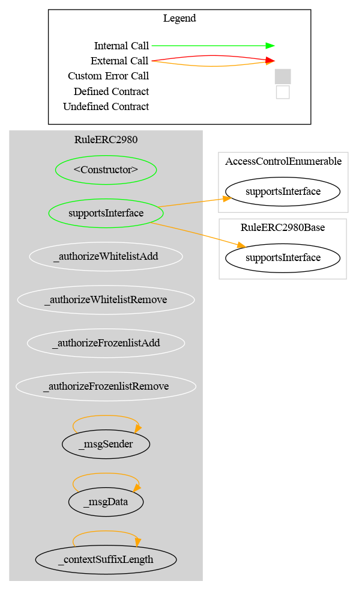
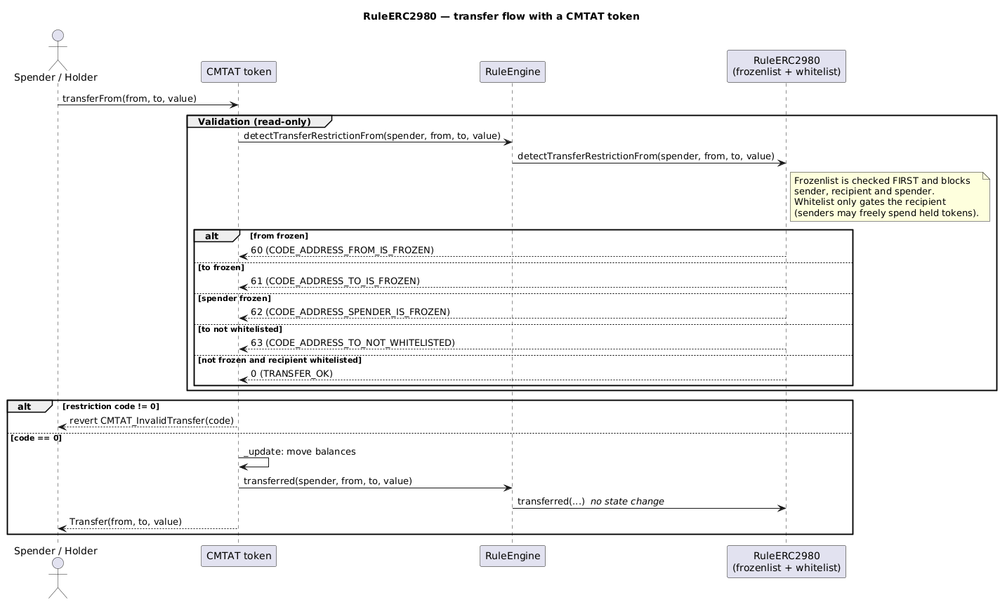

# Rule ERC-2980

[TOC]

This rule implements the [ERC-2980](https://eips.ethereum.org/EIPS/eip-2980) Swiss Compliant Asset Token transfer restriction. It combines two independent address lists managed within a single contract:

- **Whitelist**: only whitelisted addresses may **receive** tokens. Senders do not need to be whitelisted and may freely transfer tokens they already hold.
- **Frozenlist**: frozen addresses are completely blocked — they can neither send nor receive tokens.
- **Priority**: the frozenlist is checked first. If `from`, `to`, or `spender` is frozen, the transfer is rejected regardless of whitelist membership.

## Schema

### Graph

### Inheritance

### Flow with a CMTAT token

The sequence below shows how the rule participates when a CMTAT token (with this rule configured in its RuleEngine) processes a transfer. The frozenlist is evaluated before the recipient whitelist.

_Diagram source: doc/img/rule-erc2980-flow.puml._

## Restriction codes

| Constant | Code | Meaning |
| --- | --- | --- |
| `CODE_ADDRESS_FROM_IS_FROZEN` | 60 | Sender is frozen |
| `CODE_ADDRESS_TO_IS_FROZEN` | 61 | Recipient is frozen |
| `CODE_ADDRESS_SPENDER_IS_FROZEN` | 62 | Spender is frozen |
| `CODE_ADDRESS_TO_NOT_WHITELISTED` | 63 | Recipient is not whitelisted |
| `CODE_MINT_NOT_ALLOWED` | 64 | Minting is disabled (`allowMint == false`) |
| `CODE_BURN_NOT_ALLOWED` | 65 | Burning is disabled (`allowBurn == false`) |

## Access Control

| Role | Description |
| --- | --- |
| `DEFAULT_ADMIN_ROLE` | Manages all roles; implicitly holds all roles below |
| `WHITELIST_ADD_ROLE` | May add addresses to the whitelist |
| `WHITELIST_REMOVE_ROLE` | May remove addresses from the whitelist |
| `FROZENLIST_ADD_ROLE` | May add addresses to the frozenlist |
| `FROZENLIST_REMOVE_ROLE` | May remove addresses from the frozenlist |

## Constructor burn configuration

- `RuleERC2980(address admin, address forwarderIrrevocable, bool allowMintBurn)`
- `RuleERC2980Ownable2Step(address owner, address forwarderIrrevocable, bool allowMintBurn)`

`allowMintBurn` sets **both** `allowMint` and `allowBurn`; they are independently settable afterwards via
`setAllowMint(bool)` / `setAllowBurn(bool)`.

Mint/burn permission is an **explicit flag** — the constructor does **not** whitelist `address(0)`, and the zero
address can never enter either list (`addWhitelistAddress(address(0))` / `addFrozenlistAddress(address(0))` revert).
That keeps the **mandatory ERC-2980 getters** truthful: `whitelist(address(0))` and `frozenlist(address(0))` always
return `false`.

- `allowMintBurn = false` (default-safe): mint is refused with `CODE_MINT_NOT_ALLOWED` (`64`), burn with
  `CODE_BURN_NOT_ALLOWED` (`65`) — dedicated codes, not the misleading "recipient not whitelisted" (`63`).
- `allowMintBurn = true`: both permitted. A permitted mint still requires the recipient to be whitelisted and not
  frozen; a permitted burn still requires the sender not to be frozen.

## Whitelist methods

### `addWhitelistAddress(address targetAddress)`

Adds a single address to the whitelist. Reverts with `RuleERC2980_AddressAlreadyWhitelisted` if already listed.

### `addWhitelistAddresses(address[] calldata targetAddresses)`

Batch-adds addresses to the whitelist. Silently skips duplicates, but **reverts** on `address(0)` (the mint/burn sentinel is never a list member — skipping it would make the emitted event report it as one).

### `removeWhitelistAddress(address targetAddress)`

Removes a single address from the whitelist. Reverts with `RuleERC2980_AddressNotWhitelisted` if not listed.

### `removeWhitelistAddresses(address[] calldata targetAddresses)`

Batch-removes addresses from the whitelist. Silently skips addresses not listed.

### `isWhitelisted(address targetAddress) → bool`

Returns `true` if the address is whitelisted.

### `areWhitelisted(address[] memory targetAddresses) → bool[]`

Returns a boolean array for batch whitelist membership check.

### `whitelistAddressCount() → uint256`

Returns the total number of whitelisted addresses.

### `whitelist(address _operator) → bool`

ERC-2980 interface getter. Equivalent to `isWhitelisted`.

## Frozenlist methods

### `addFrozenlistAddress(address targetAddress)`

Adds a single address to the frozenlist. Reverts with `RuleERC2980_AddressAlreadyFrozen` if already listed.

### `addFrozenlistAddresses(address[] calldata targetAddresses)`

Batch-adds addresses to the frozenlist. Silently skips duplicates, but **reverts** on `address(0)` (see above).

### `removeFrozenlistAddress(address targetAddress)`

Removes a single address from the frozenlist. Reverts with `RuleERC2980_AddressNotFrozen` if not listed.

### `removeFrozenlistAddresses(address[] calldata targetAddresses)`

Batch-removes addresses from the frozenlist. Silently skips addresses not listed.

### `isFrozen(address targetAddress) → bool`

Returns `true` if the address is frozen.

### `areFrozen(address[] memory targetAddresses) → bool[]`

Returns a boolean array for batch frozenlist membership check.

### `frozenlistAddressCount() → uint256`

Returns the total number of frozen addresses.

### `frozenlist(address _operator) → bool`

ERC-2980 interface getter. Equivalent to `isFrozen`.

## Notes

### Sender whitelist exemption

Under ERC-2980, the sender is explicitly exempt from the whitelist check. An address that already holds tokens may always send them, even if it is not whitelisted. However, frozen senders are still blocked.

### Deviation from ERC-2980 example interface

The ERC-2980 example `Whitelistable` and `Freezable` interfaces return `false` on duplicate/missing operations. This implementation follows the codebase convention of reverting for single-item operations, while batch operations silently skip *duplicates*. The zero address is the one input a batch does **not** skip — it reverts, so the emitted event can never report a member that is not in the set.

### `isVerified` semantics

`isVerified(address)` reflects whitelist membership only. A frozen address that is also whitelisted returns `true` for `isVerified`, because freezing is a temporary enforcement action and does not revoke identity verification.

## Usage scenario

The compliance manager deploys `RuleERC2980` and grants separate roles for whitelist and frozenlist management. Investor Alice is added to the whitelist. Bob, a sanctioned actor, is added to the frozenlist. When Bob tries to send tokens, the frozenlist check fires first and rejects with code 60. When an unlisted address tries to receive tokens, the whitelist check rejects with code 63.
