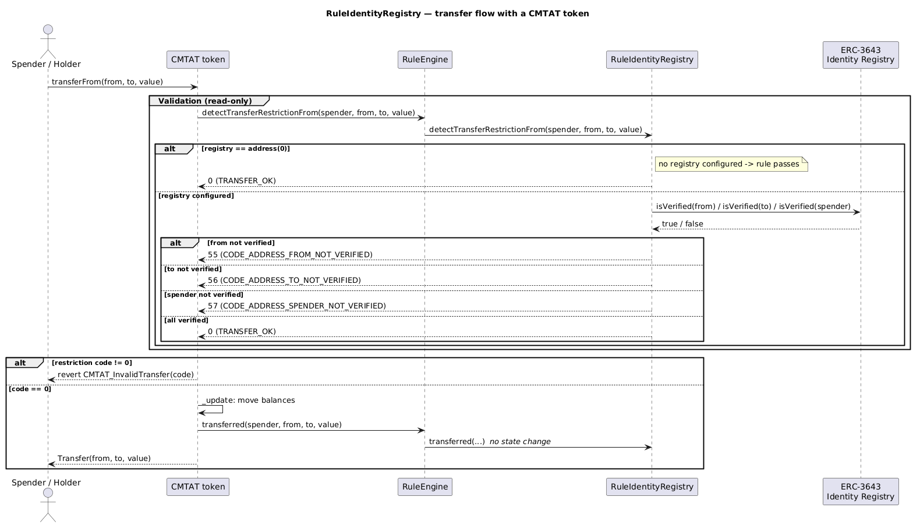

# Rule Identity Registry

[TOC]

This rule checks an [ERC-3643](https://eips.ethereum.org/EIPS/eip-3643) Identity Registry to verify that transfer participants are registered and verified.

> ### When this rule is the right tool
>
> Reach for it when the token **cannot consult a registry itself**.
>
> - **CMTAT has no identity registry slot.** `setIdentityRegistry` is an ERC-3643 concept with no CMTAT
>   equivalent, so this rule behind a `RuleEngine` is the *only* way to apply identity-registry screening to a
>   CMTAT token. It consults whichever registry you point it at — an ONCHAINID-backed ERC-3643 registry, or
>   [`IdentityRegistryWhitelist`](./IdentityRegistryWhitelist.md) if you have no ONCHAINID deployment.
> - **On an ERC-3643 token, prefer the token's own slot.** That token already calls `isVerified` on the
>   registry for every transfer. Adding this rule on top screens the same wallets a second time and adds no
>   restriction, so install the registry with `setIdentityRegistry` instead.

> ## ✅ ERC-3643 conformant: only the RECEIVER is verified
>
> The specification mandates exactly one identity check:
>
> - *"The **receiver** MUST be whitelisted on the Identity Registry and verified"* (§ Transfer)
> - *"`transferFrom` **works the same way**"*: receiver only
> - *"`mint` and `forcedTransfer` **only require the receiver** to be whitelisted and verified"*
> - *"The `burn` function **bypasses all checks** on eligibility"*
>
> The **sender**, the **spender** and the **minter** are therefore **not** verified by default.
>
> **Why the sender is deliberately not checked:** ERC-3643 screens only the receiver precisely so that an investor whose identity lapses (expired claim, revoked identity) can still **exit their position** by sending to a verified counterparty. Screening the sender would trap them — unable to receive *and* unable to send.
>
> Stricter screening is available as an **explicit opt-in** (`checkSender`, `checkSpender`), never as a silent default.

## Configuration

### Constructor parameters

| Parameter | Description |
| --- | --- |
| `admin` | Address granted `DEFAULT_ADMIN_ROLE` (implicitly holds all roles) |
| `identityRegistry_` | Address of the identity registry contract (`address(0)` to start without a registry) |
| `checkSender_` | If `true`, ALSO verify the sender. **Stricter than ERC-3643** — pass `false` for the conformant default. Traps de-listed holders (see above). |
| `checkSpender_` | If `true`, ALSO verify the spender on `transferFrom`. **Stricter than ERC-3643** — pass `false` for the conformant default. Mint/burn stay exempt regardless. |

### Behaviour when no registry is set

If no identity registry is configured (`address(0)`), all transfers pass this rule. The registry can be set post-deployment with `setIdentityRegistry`.

## Schema

### Graph

### Inheritance

### Flow with a CMTAT token

The sequence below shows how the rule participates when a CMTAT token (with this rule configured in its RuleEngine) processes a transfer, including the ERC-3643 identity registry `isVerified` lookups and the no-registry pass-through case.

_Diagram source: doc/img/rule-identity-registry-flow.puml._

## Restriction codes

| Constant | Code | Meaning |
| --- | --- | --- |
| `CODE_ADDRESS_FROM_NOT_VERIFIED` | 55 | Sender is not verified in the identity registry |
| `CODE_ADDRESS_TO_NOT_VERIFIED` | 56 | Recipient is not verified in the identity registry |
| `CODE_ADDRESS_SPENDER_NOT_VERIFIED` | 57 | Spender is not verified in the identity registry |

## Access Control

| Role | Description |
| --- | --- |
| `DEFAULT_ADMIN_ROLE` | May set or clear the identity registry address |

## Methods

### `setIdentityRegistry(address newRegistry)`

Sets the identity registry contract. Reverts if the address is zero. Restricted to `DEFAULT_ADMIN_ROLE`. Emits `IdentityRegistryUpdated`.

### `clearIdentityRegistry()`

Removes the identity registry (sets it to `address(0)`), disabling verification checks. Restricted to `DEFAULT_ADMIN_ROLE`. Emits `IdentityRegistryUpdated`.

### `identityRegistry() → IIdentityRegistryVerified`

Returns the current identity registry address. Returns `address(0)` if none is set.

## Transfer restriction logic

- If no registry is set → all transfers pass.
- **Burns (`to == address(0)`) always pass**. ERC-3643: *"The `burn` function bypasses all checks on eligibility."*
- For all other transfers, including **mint**:
  - **`to` is ALWAYS checked.** This is the only check ERC-3643 mandates.
  - `from` is checked **only if `checkSender` is enabled** (off by default, stricter than the spec).
  - `spender` is checked **only if `checkSpender` is enabled** (off by default, stricter than the spec), and mint
    and burn are exempt from it regardless: the minter/burner acts on its own authority, not as a delegated spender.
    This is what lets an **unverified minter** mint to a verified recipient, exactly as ERC-3643 requires
    (*"`mint` … only require[s] the receiver to be whitelisted and verified"*).

## Usage scenario

The operator deploys `RuleIdentityRegistry` and calls `setIdentityRegistry(registry)`. The registry is maintained by a compliance provider who verifies investor identities. When Alice (unverified) attempts to receive tokens, `isVerified(alice)` returns `false` and the transfer is rejected with code 56. After the registry marks Alice as verified, the transfer succeeds. Calling `clearIdentityRegistry()` disables checks entirely.
