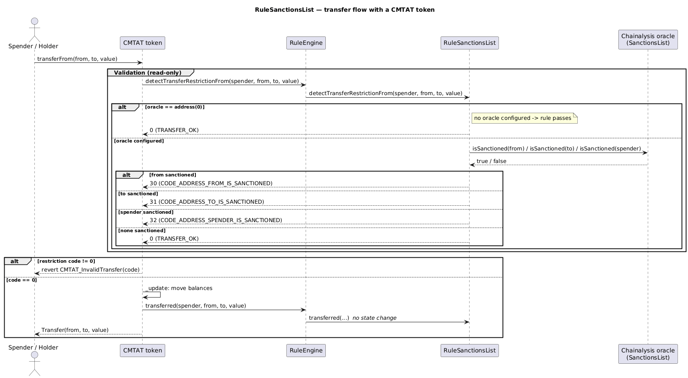

# Rule SanctionsList

[TOC]

This rule uses the [Chainalysis](https://www.chainalysis.com/) on-chain oracle to block transfers involving sanctioned addresses. It checks the US, EU, and UN sanctions lists maintained by the oracle.

## How to use

Deploy the contract pointing to the Chainalysis oracle address. If either the sender (`from`), recipient (`to`), or spender (in `transferFrom`) is flagged by the oracle, the transfer is rejected.

The oracle address and documentation are available here: [Chainalysis oracle for sanctions screening](https://go.chainalysis.com/chainalysis-oracle-docs.html).

The oracle can be updated with `setSanctionListOracle` or disabled with `clearSanctionListOracle`. When no oracle is set (`address(0)`), all transfers pass this rule.

## Schema

### Graph

### Inheritance

### Flow with a CMTAT token

The sequence below shows how the rule participates when a CMTAT token (with this rule configured in its RuleEngine) processes a transfer, including the Chainalysis oracle lookup and the no-oracle pass-through case.

_Diagram source: doc/img/rule-sanctionslist-flow.puml._

## Restriction codes

| Constant | Code | Meaning |
| --- | --- | --- |
| `CODE_ADDRESS_FROM_IS_SANCTIONED` | 30 | Sender is sanctioned |
| `CODE_ADDRESS_TO_IS_SANCTIONED` | 31 | Recipient is sanctioned |
| `CODE_ADDRESS_SPENDER_IS_SANCTIONED` | 32 | Spender is sanctioned |

## Who is screened

Only **real participants** are sent to the oracle. The zero address is the ERC-20 mint/burn sentinel, not a wallet, so it is never queried:

| Operation | `from` | `to` | `spender` |
| --- | --- | --- | --- |
| Transfer | screened | screened | — |
| `transferFrom` | screened | screened | screened |
| Mint (`from == address(0)`) | **not screened** | screened | screened — this is the **minter** |
| Burn (`to == address(0)`) | screened | **not screened** | screened |

The mint/burn exemptions cover the sentinel only, never a real address: a mint to a sanctioned recipient is still rejected with code `31`, and a burn from a sanctioned holder still with code `30`.

This matters beyond tidiness. Forwarding `address(0)` to the oracle would delegate the rule's mint and burn behaviour to a third-party contract's handling of an input it has never been asked about — an oracle answering `true` for the zero address would block **all issuance and all redemption** on every token using this rule, and the restriction code would blame a "sanctioned sender" that is not an address. Chainalysis returns `false` today; the guard means the rule does not depend on that.

The **minter is still screened**, as the `spender` on the 4-argument mint path — that is deliberate and unchanged (see `CLAUDE.md`, the mint/burn `spender` convention). Skipping the sentinel does not weaken it.

Pinned by [`test/RuleSanctionsList/RuleSanctionsListMintBurnSentinel.t.sol`](../../test/RuleSanctionsList/RuleSanctionsListMintBurnSentinel.t.sol), which configures an oracle that *does* sanction `address(0)` and asserts mint and burn still pass.

Side effect on gas: a mint or burn now makes one oracle call instead of two.

| Path | Before | After | Delta |
| --- | --- | --- | --- |
| Mint (`from == address(0)`) | 5 308 | 2 478 | **−2 830** |
| Burn (`to == address(0)`) | 5 308 | 2 478 | **−2 830** |
| Plain transfer | 3 309 | 3 405 | +96 |

**Why the saving is 2 830 and not "half of one call".** Removing one of two oracle calls sounds like it should
save about half the screening cost, and the first version of this note said ~900 gas on exactly that reasoning.
It is wrong, because not all storage reads cost the same.

Since **EIP-2929** (Berlin), reading a storage slot costs **2 100 gas the first time it is touched in a
transaction** (*cold*) and **100 gas** on every subsequent read (*warm*). The oracle stores its list as
`mapping(address => bool)`, so `isSanctioned(x)` is one `SLOAD` of the slot for `x`.

Now compare what the two removed-versus-kept calls actually touch:

- `isSanctioned(address(0))` — the sentinel. **Nothing else in the system ever reads that slot.** Not the
  recipient check, not a previous transfer, not another rule. So on every mint it was **cold**: 2 100 gas for
  the `SLOAD`, plus ~700 for the `STATICCALL` and ABI encode/decode around it. That is the ~2 830 that
  disappeared.
- `isSanctioned(alice)` on a plain transfer — real addresses are touched repeatedly by real activity, so these
  slots are frequently already warm within a transaction, at 100 gas.

That asymmetry inverted the usual ordering: **before the fix, a mint cost *more* than a transfer**
(5 308 vs 3 309) while screening one *fewer* real participant. A mint has only one real party, yet it was the
more expensive operation — the extra cost was entirely the cold lookup of an address that is not a wallet.
That inversion is the clearest symptom of the bug this fix removes, and it is also what makes the naive
"one call out of two ≈ 900 gas" estimate wrong by roughly 3×.

**The cost side.** The two `!= address(0)` guards are evaluated on every plain transfer, where they are always
true, adding **96 gas**. So the trade is: each transfer pays 96 so that each mint and burn saves 2 830. For any
token that is not almost entirely issuance, that is strongly positive — and the gas was never the point. The
reason for the change is that the rule no longer delegates its mint/burn behaviour to a third party's handling
of a non-wallet.

## Access Control

The default admin is the address passed as `admin` in the constructor. It is granted `DEFAULT_ADMIN_ROLE`, which implicitly holds all roles.

| Role | Description |
| --- | --- |
| `DEFAULT_ADMIN_ROLE` | Manages all roles; can call all privileged functions |
| `SANCTIONLIST_ROLE` | May update or clear the oracle address (`setSanctionListOracle`, `clearSanctionListOracle`) |

## Methods

### `setSanctionListOracle(ISanctionsList sanctionContractOracle_)`

Sets the Chainalysis oracle contract. Reverts if the address is zero. Restricted to `SANCTIONLIST_ROLE`.

### `clearSanctionListOracle()`

Removes the oracle (sets it to `address(0)`), effectively disabling sanctions checks. Restricted to `SANCTIONLIST_ROLE`.

### `sanctionsList() → ISanctionsList`

Returns the current oracle address. Returns `address(0)` if no oracle is set.

## Usage scenario

The operator deploys `RuleSanctionsList` with the Chainalysis oracle address and registers it in the `RuleEngine`. When the CMTAT token triggers a transfer, the rule calls `isSanctioned(from)` and `isSanctioned(to)` on the oracle. If either returns `true`, the transfer is rejected. The operator can later point to an updated oracle by calling `setSanctionListOracle`.
