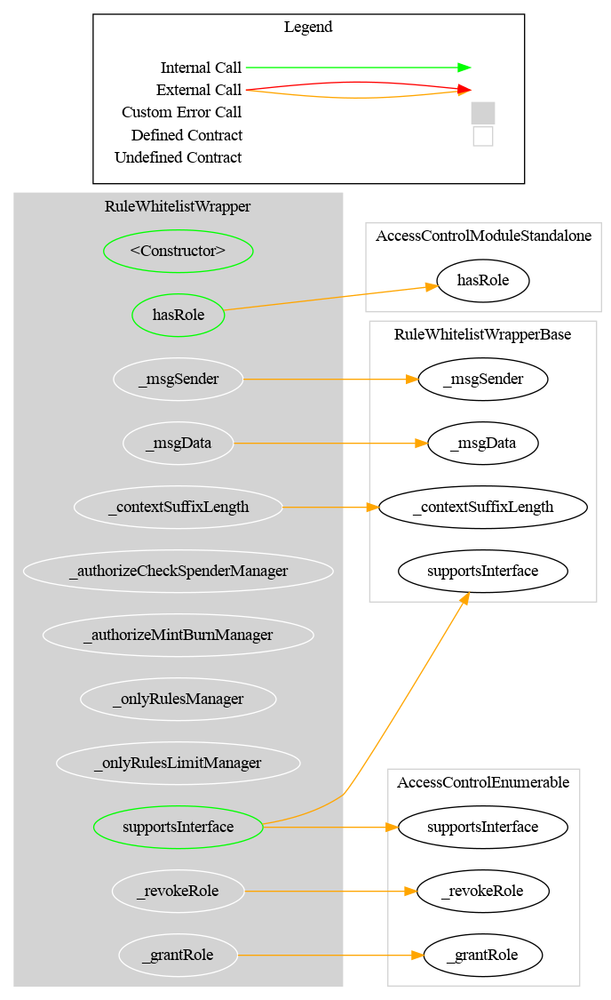
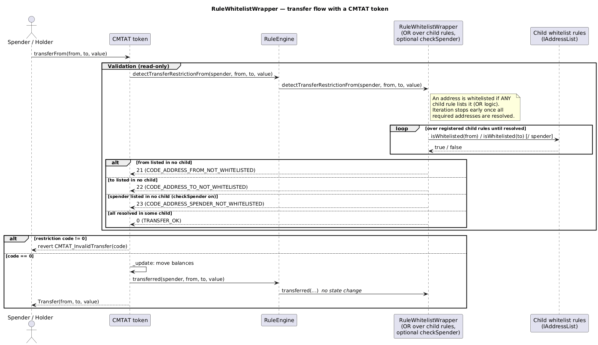

# Rule Whitelist Wrapper

[TOC]

This rule aggregates multiple child whitelist rules using OR logic. An address is considered whitelisted if it appears in **any** of the registered child rules. This enables a multi-operator model where each operator manages their own whitelist independently.

## Architecture

Each child rule must implement `IAddressList`. The wrapper iterates through all registered rules and returns `true` for an address as soon as one rule lists it. Iteration stops early once all required addresses are resolved.


## Schema

### Graph



### Inheritance


### Flow with a CMTAT token

The sequence below shows how the wrapper aggregates its child whitelist rules when a CMTAT token (with this rule configured in its RuleEngine) processes a transfer.



_Diagram source: doc/img/rule-whitelist-wrapper-flow.puml._

## Configuration

### Constructor parameters

| Parameter | Description |
| --- | --- |
| `admin` | Address granted `DEFAULT_ADMIN_ROLE` (implicitly holds all roles) |
| `forwarderIrrevocable` | ERC-2771 trusted forwarder address for meta-transactions (use `address(0)` to disable) |
| `checkSpender_` | If `true`, spender address in `transferFrom` is also validated against child rules |

### `checkSpender` flag

When enabled, the spender in `transferFrom` must be listed in at least one child rule. Toggled post-deployment by the admin with `setCheckSpender(bool)`.

## Restriction codes

The wrapper reuses restriction codes from the whitelist rule:

| Constant | Code | Meaning |
| --- | --- | --- |
| `CODE_ADDRESS_FROM_NOT_WHITELISTED` | 21 | Sender is not in any child whitelist |
| `CODE_ADDRESS_TO_NOT_WHITELISTED` | 22 | Recipient is not in any child whitelist |
| `CODE_ADDRESS_SPENDER_NOT_WHITELISTED` | 23 | Spender is not in any child whitelist (only when `checkSpender` is enabled) |

## Access Control

| Role | Description |
| --- | --- |
| `DEFAULT_ADMIN_ROLE` | Manages all roles; can call all privileged functions |
| `RULES_MANAGEMENT_ROLE` | May add, remove, or set the list of child whitelist rules |


## Methods

### Child rule management

| Function | Role required | Description |
| --- | --- | --- |
| `setRules(address[] rules_)` | `RULES_MANAGEMENT_ROLE` | Replaces the entire list of child rules |
| `addRule(address rule_)` | `RULES_MANAGEMENT_ROLE` | Adds a single child rule |
| `removeRule(address rule_)` | `RULES_MANAGEMENT_ROLE` | Removes a single child rule |
| `clearRules()` | `RULES_MANAGEMENT_ROLE` | Removes all child rules |

### `setCheckSpender(bool value)`

Enables or disables spender checks. Restricted to `DEFAULT_ADMIN_ROLE`.

### `isVerified(address targetAddress) → bool`

Returns `true` if the address is listed in at least one child rule.

### `rule(uint256 index) → address`

Returns the child rule at the given index.

### `rulesCount() → uint256`

Returns the number of registered child rules.

## Gas cost of the child-rule scan

`_detectTransferRestrictionForTargets` makes **one external `STATICCALL` per child rule**:

```solidity
uint256 unresolved = targetsLength;
for (uint256 i = 0; i < rulesLength; ++i) {
    bool[] memory isListed = IAddressList(rule(i)).areAddressesListed(targetAddress);  // <- external call
    for (uint256 j = 0; j < targetsLength; ++j) {
        if (isListed[j] && !result[j]) { result[j] = true; --unresolved; }
    }
    // early exit: stop as soon as EVERY target address has been resolved
    if (unresolved == 0) { break; }
}
```

The early-exit test is a single comparison against a counter maintained as targets are resolved. It
was previously a full rescan of `result` on every child rule; the counter form is equivalent and
saves roughly **85 gas per child scanned** (~1% of the per-child cost). The external `STATICCALL`
dominates, so the table below is essentially unchanged by it — treat those figures as a marginally
conservative upper bound.

**This is not only a `view` cost.** The wrapper's `transferred()` → `_detectTransferRestriction` path runs the same scan during **transfer execution**, so the gas is paid by the *transferring user*, on every transfer, for the life of the token.

### Measured cost

The scan is **linear** in the number of children actually scanned, at a marginal cost of **~8.8k gas per child** (`detectTransferRestriction`, 2 target addresses). Measured:

| Children | Allowed pair, resolved only by the **last** child | Rejected pair (**never** early-exits) | Marginal gas/child |
| --- | --- | --- | --- |
| 1 | ~7.0k | ~10.7k | — |
| 5 | ~42.3k | ~46.0k | ~8.8k |
| 10 (the default cap) | ~86.4k | ~90.0k | ~9.0k |
| 25 | — | ~222.3k | ~8.9k |
| 50 | — | ~442.8k | ~8.9k |
| 100 | — | ~884.2k | ~8.8k |
| 200 | — | ~1.77M | ~8.8k |

The marginal cost stays flat (8,891 → 8,855 → 8,841 → 8,841 gas/child from n=25 to n=200), so memory expansion is negligible at any realistic child count and the model `gas ≈ N × 8.8k` holds.

With `checkSpender = true` (3 target addresses instead of 2), the same 10-child wrapper costs **~116k** (allowed) to **~121k** (rejected).

**This is a cost problem, not a liveness problem.** Even 200 children (~1.77M gas) is only ~6% of a 30M block; a transfer would not fail to fit until roughly **3,400 children**. Long before that, the wrapper simply makes every transfer economically painful. Treat the numbers above as a per-holder tax, not as a safety cliff.

### Two things make the worst case the common case

1. **The early exit only fires once *every* target address is resolved.** A transfer that is going to be **rejected** — because `from`, `to` (or `spender`) is in *no* child list — never resolves, and therefore scans **all N children**. The most expensive path is the failing one, and the user pays for it before the revert.
2. **`checkSpender = true` adds a third address that must also be found** before the loop can break. It materially lowers the early-exit hit rate and pushes more transfers toward the full-N scan (≈ +35% at 10 children, per the table above).

### Operator guidance

- **Keep the child list small — stay at or below the default cap of 10.** `addRule` reverts once `rulesCount() >= maxRules`, and `maxRules` defaults to `DEFAULT_MAX_RULES = 10`. At that cap the worst case is ~90k gas of scanning per transfer: significant, but safe.
- **Raising `maxRules` is a decision with a permanent, per-transfer cost for every holder.** `setMaxRules` only rejects `0` — it accepts any other value. A rules manager who raises the cap to 100 makes the worst-case scan cost **~884k gas on every transfer**; at 200 it is ~1.77M. That is a tax on holders, not a broken token — transfers still fit in a block — but it is paid forever and cannot be refunded. Nothing untrusted can trigger this: only `RULES_MANAGEMENT_ROLE` (or the owner) can add child rules or raise the cap. **The size of the child list is the operator's responsibility.**
- **Order children by expected hit rate.** Put the whitelist that resolves the most addresses first, so the early exit fires as early as possible. This is free and materially reduces the average cost.
- **Prefer fewer, larger child lists over many small ones.** The per-child overhead is an external call; the number of addresses inside a child does not affect the scan cost.

## Notes

### Usage scenario

Three operators (A, B, C) each manage their own `RuleWhitelist`. The `RuleWhitelistWrapper` is configured with all three as child rules. A transfer between any two addresses whitelisted by any one of the operators will pass. The wrapper admin grants `RULES_MANAGEMENT_ROLE` to a coordinator who adds and removes child rules as operators join or leave.
