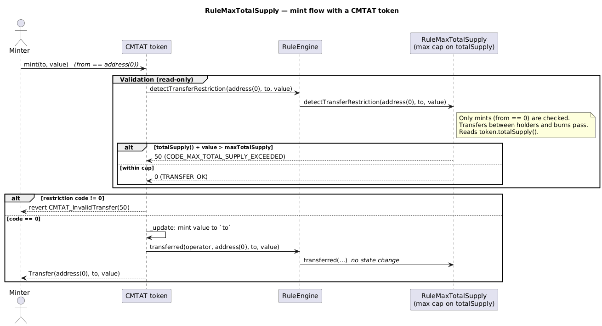

# Rule Max Total Supply

[TOC]

This rule restricts minting so that the token's total supply never exceeds a configured maximum. Only mint operations (`from == address(0)`) are checked. Regular transfers between holders and burns are not affected.

## Configuration

### Constructor parameters

| Parameter | Description |
| --- | --- |
| `admin` | Address granted `DEFAULT_ADMIN_ROLE` (implicitly holds all roles) |
| `tokenContract_` | Address of the token contract; must be non-zero, must have code, and its `totalSupply()` must be callable |
| `maxTotalSupply_` | Initial maximum total supply cap |

### Post-deployment configuration

Both the cap and the token contract address can be updated by the admin after deployment.

## Schema

### Graph

### Inheritance

### Flow with a CMTAT token

The sequence below shows how the rule participates when a CMTAT token (with this rule configured in its RuleEngine) processes a mint. Only mints (`from == address(0)`) are gated; transfers and burns pass.

_Diagram source: doc/img/rule-max-total-supply-flow.puml._

## Restriction codes

| Constant | Code | Meaning |
| --- | --- | --- |
| `CODE_MAX_TOTAL_SUPPLY_EXCEEDED` | 50 | Mint would cause total supply to exceed the maximum |
| `CODE_SUPPLY_ORACLE_UNAVAILABLE` | 51 | `tokenContract.totalSupply()` reverted, or the token has lost its code |

## Access Control

The default admin is the address passed as `admin` in the constructor. It is granted `DEFAULT_ADMIN_ROLE`, which implicitly holds all roles. All privileged operations are gated on `DEFAULT_ADMIN_ROLE`.

| Role | Description |
| --- | --- |
| `DEFAULT_ADMIN_ROLE` | May update the supply cap and token contract address |

## Methods

### `setMaxTotalSupply(uint256 newMaxTotalSupply)`

Updates the maximum total supply cap. Restricted to `DEFAULT_ADMIN_ROLE`. Emits `MaxTotalSupplyUpdated`.

### `setTokenContract(address newTokenContract)`

Updates the reference to the token contract. Reverts if the address is zero, has no code, or its `totalSupply()` is not callable. Restricted to `DEFAULT_ADMIN_ROLE`. Emits `TokenContractUpdated`.

### `maxTotalSupply() → uint256`

Returns the current maximum total supply.

### `tokenContract() → ITotalSupply`

Returns the current token contract address.

## Transfer restriction logic

The rule only acts on mint operations (i.e. `from == address(0)`). It reads `tokenContract.totalSupply()` and rejects the mint if `totalSupply + value > maxTotalSupply`. Transfers and burns always pass.

### Read-path safety

`detectTransferRestriction` / `canTransfer` are ERC-1404 / ERC-3643 views that MUST NOT revert, so the supply read is guarded: a `tokenContract` that has lost its code, or whose `totalSupply()` reverts (a proxy upgraded to something broken, or a pausable implementation reverting while paused), yields `CODE_SUPPLY_ORACLE_UNAVAILABLE` (51) rather than propagating the failure. The comparison also uses remaining headroom (`value > maxTotalSupply - currentSupply`) instead of `currentSupply + value`, which could overflow.

Configuration validates the token up front — non-zero, has code, and `totalSupply()` callable — so an unusable token fails loudly at setup instead of silently blocking every mint later. The code-length check is explicit rather than relying on the uncatchable extcodesize revert that the probe would incidentally produce.

The trust placed in `tokenContract` is therefore narrower than it looks: it is trusted to report an **accurate** supply, which nothing on-chain can verify, but it is **not** trusted to stay callable.

#### Deployment precondition: EIP-6780 (Cancun or later)

**`try/catch` cannot contain a call to a codeless address.** This is the reason the code-length check lives at
*configuration* rather than being left to the read path, and the mechanism is not the one usually quoted.

`try/catch` catches a revert **raised by the callee**. It does not catch a failure that happens in *this*
contract's frame while preparing or consuming the call. Two such failures apply here, and which one you get
depends on the signature:

| Call shape | What the compiler emits | Why `catch` never runs |
| --- | --- | --- |
| Returns data (`totalSupply() → uint256`) | Since **Solidity 0.8.10** the `EXTCODESIZE` check is *skipped*; the compiler relies on the ABI decoder instead | The `CALL` to a codeless account **succeeds** with 0 bytes of return data. The decoder then fails to read a `uint256` from nothing — in the caller's frame, *after* the call returned. Not a callee revert, so not catchable |
| Returns nothing | The `EXTCODESIZE` check is still emitted, before the call | The revert happens before any external call is made. There is nothing for `catch` to attach to |

So for `totalSupply()` the uncatchable revert comes from the **ABI decoder**, not from `extcodesize`. That is
easy to confirm: point the rule at a contract that *has* code whose fallback succeeds and returns zero bytes.
`EXTCODESIZE` passes, the `CALL` succeeds — and the view still reverts uncatchably.

Two consequences follow:

1. **A runtime code-length re-check would be pointless**, which is why there is none. `_setTokenContract`
   requires code at configuration, and **EIP-6780** (Cancun) restricts `SELFDESTRUCT` to accounts created in
   the same transaction, so a validated token cannot become codeless afterwards. On a chain *without* EIP-6780
   this does not hold and the guard should be re-introduced (~100 gas per call site; the account is warm
   either way, so it is not a full cold `EXTCODESIZE`).
2. **Having code is necessary but not sufficient.** The guarantee is that the token returns a well-formed
   `uint256`, not merely that it exists. A proxy upgraded to an implementation whose fallback returns empty
   data keeps its code and still breaks the read path — the ABI decoder reverts and `CODE_SUPPLY_ORACLE_UNAVAILABLE`
   is never reached. `try/catch` covers a token that *reverts*; it cannot cover one that returns nothing.
   `tokenContract` is a trusted input for this reason, and pointing the rule at an untrusted proxy is outside
   the model.

## Usage scenario

The operator deploys `RuleMaxTotalSupply` with `tokenContract = CMTAT_address` and `maxTotalSupply = 1_000_000`. The rule is registered in the `RuleEngine`. When the issuer mints 100,000 tokens and total supply is already 950,000, the mint is rejected with code 50. Transfers between existing holders continue unaffected.
